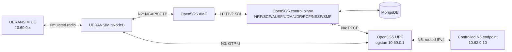
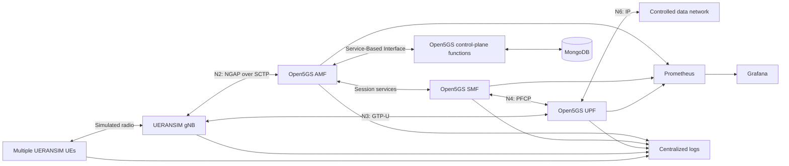

# Cloud-Native Multi-UE 5G Core Platform

## Overview

This repository is the implementation workspace for a reproducible,
containerized 5G Standalone (5G SA) Core platform. The target system will
deploy Open5GS, MongoDB, and UERANSIM on a local Kubernetes environment,
exercise multiple synthetic User Equipments (UEs), and produce measured
evidence for signalling, user-plane traffic, observability, load, failure, and
recovery behavior.

The project extends the validated protocol baseline documented in the
[5G SA Core Protocol Lab](https://github.com/abdelrahman-fawaz18/5g-sa-core-protocol-lab).
It focuses on packaging, orchestration, repeatability, operational visibility,
and reliability rather than repeating the original single-host installation.

## Current Status

The repository boundary, host preflight, and Phase 2 container baseline are
complete. Pinned images produce a healthy Compose deployment in which a
synthetic UE registers, establishes an IPv4 session, and exchanges controlled
traffic through the UPF. Persistence, recreation, scoped cleanup, and
post-cleanup host safety were verified; see the [project
status](docs/project-status.md), [container
report](reports/02_container_baseline.md), and [Compose
topology](docs/architecture/phase-02-compose-topology.md). The Kubernetes
distribution remains proposed until Phase 3 networking tests produce evidence.

## Verified Phase 2 Baseline

Phase 2 establishes the protocol-correct container reference that later
Kubernetes work must preserve. The declared topology contains 15 services on
two internal Docker networks, with the UE session subnet routed through a TUN
interface in the UPF rather than implemented as a Docker bridge.



Verified properties:

- source commits, archives, base images, runtime packages, and local output
  identities are pinned or recorded;
- health-gated startup reaches 14 healthy long-running containers plus one
  successful subscriber-initialization job;
- one synthetic UE completes authentication, registration, and an IPv4
  Protocol Data Unit session for DNN `internet` and SST `1`;
- HTTP and Internet Control Message Protocol traffic traverses the UE tunnel,
  simulated radio path, N3 GTP-U tunnel, UPF, and controlled N6 return route;
- positive receive and transmit counter deltas provide bidirectional tunnel
  evidence without publishing a raw packet capture;
- MongoDB data survives container/network recreation; and
- exact destruction removes all project containers, networks, and volumes
  while leaving host Open5GS, MongoDB, LXC, routes, and firewall structure
  intact.

The full technical model is documented in [Phase 2 Docker Compose
architecture](docs/architecture/phase-02-compose-topology.md). Reproduction,
diagnostics, persistence testing, and cleanup are covered by the [Compose
runbook](docs/runbooks/compose-baseline.md).

## Target Capabilities

- pinned and reproducible container images;
- a reversible local Kubernetes environment;
- Helm-managed Open5GS, MongoDB, and UERANSIM workloads;
- meaningful startup, readiness, and liveness checks;
- automated synthetic subscriber generation and provisioning;
- concurrent UE registration and Protocol Data Unit (PDU) sessions;
- at least two Data Network Names (DNNs) or network slices;
- Prometheus metrics and version-controlled Grafana dashboards;
- centralized, correlated operational logs;
- repeatable throughput, latency, loss, and resource measurements;
- controlled component-failure and recovery experiments;
- Continuous Integration (CI) validation for source, configuration, charts,
  tests, and container artifacts;
- concise, sanitized evidence and operational runbooks.

## Roadmap Target Architecture



The final deployment topology is intentionally not frozen yet. A networking
feasibility phase must first prove that the selected local Kubernetes approach
handles Stream Control Transmission Protocol (SCTP), Packet Forwarding Control
Protocol (PFCP), GPRS Tunnelling Protocol User Plane (GTP-U), TUN devices, and
the Linux capabilities required by the User Plane Function (UPF) and UERANSIM.

## Repository Structure

```text
cloud-native-5g-core-platform/
├── charts/                 Helm packaging
├── containers/             Container build definitions
├── configs/                Synthetic lab configuration
├── scripts/                Lifecycle, test, and cleanup automation
├── tools/                  Validation and reporting software
├── tests/                  Unit, integration, and acceptance tests
├── monitoring/             Prometheus rules and Grafana provisioning
├── logging/                Centralized logging configuration
├── benchmarks/             Reproducible experiment definitions and summaries
├── docs/                   Architecture, decisions, operation, and analysis
├── reports/                Sanitized validation and experiment reports
├── versions/               Exact tool, image, and source provenance manifests
├── captures/               Intentionally reviewed protocol evidence
├── screenshots/            Selected visual evidence
├── diagrams/               Architecture and call-flow sources
└── .github/                Continuous Integration workflows
```

## Evidence Policy

Only synthetic identities and credentials may be used. Raw logs, runtime data,
local kubeconfigs, private keys, and packet captures are ignored by default.
Selected captures may be added only after a documented content and privacy
review. Performance and reliability claims must link to reproducible commands,
machine-readable measurements, and concise reports.

## Technical Documentation

- [Current phase and gate status](docs/project-status.md)
- [Phase 2 Docker Compose architecture](docs/architecture/phase-02-compose-topology.md)
- [Container image provenance](docs/image-provenance.md)
- [Docker Engine installation runbook](docs/runbooks/docker-engine-installation.md)
- [Compose build, operation, validation, and cleanup runbook](docs/runbooks/compose-baseline.md)
- [Phase 2 validation and host-safety report](reports/02_container_baseline.md)
- [Architecture Decision Records](docs/adr/README.md)

## Authoritative References

- [Open5GS documentation](https://open5gs.org/open5gs/docs/)
- [Kubernetes concepts](https://kubernetes.io/docs/concepts/)
- [kind documentation](https://kind.sigs.k8s.io/docs/user/quick-start/)
- [Helm documentation](https://helm.sh/docs/)
- [Prometheus documentation](https://prometheus.io/docs/introduction/overview/)
- [Grafana documentation](https://grafana.com/docs/grafana/latest/)
- [GitHub Actions documentation](https://docs.github.com/en/actions)
