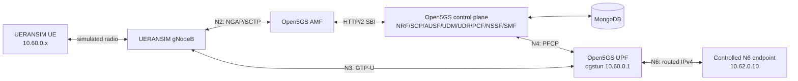
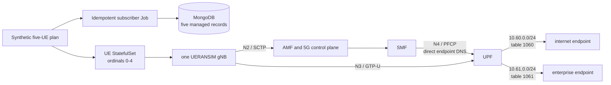
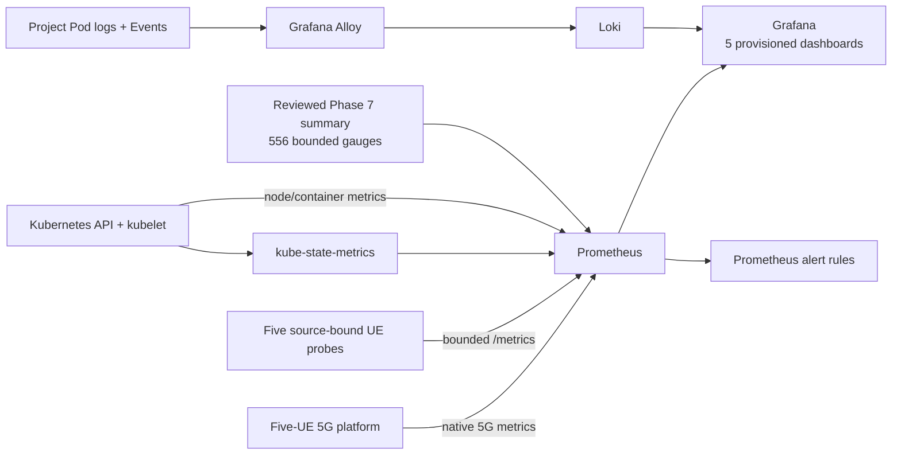
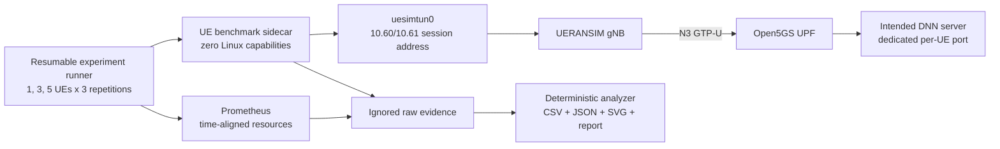
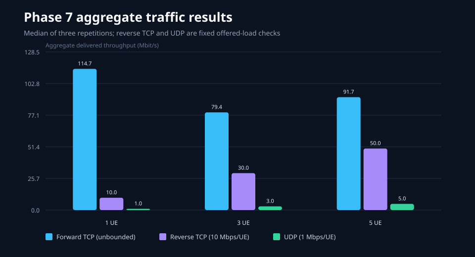
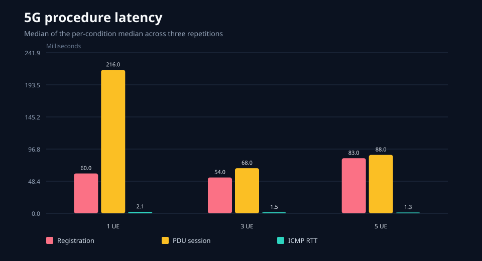
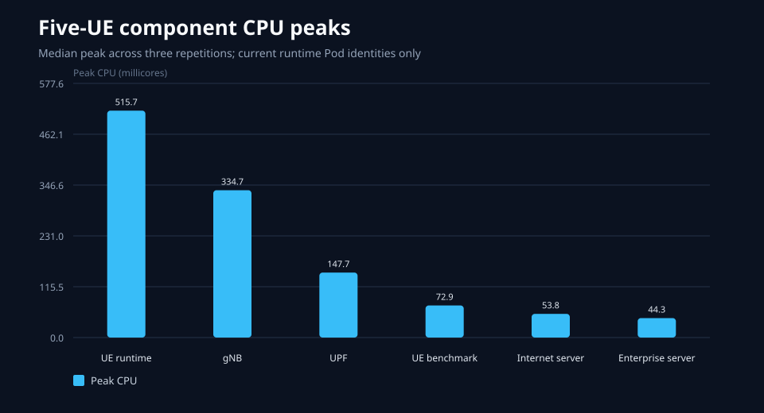
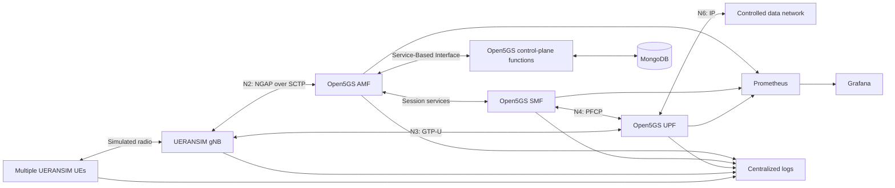

# Cloud-Native Multi-UE 5G Core Platform

## Overview

This repository implements a reproducible, containerized 5G Standalone (5G
SA) Core platform. It deploys Open5GS, MongoDB, and UERANSIM on a local
Kubernetes environment, exercises multiple synthetic User Equipments (UEs),
and preserves measured evidence for signalling, user-plane traffic, lifecycle,
isolation, recovery, metrics, logs, dashboards, alert behavior, and controlled
load. Controlled component-failure experiments remain in later roadmap phases.

The project extends the validated protocol baseline documented in the
[5G SA Core Protocol Lab](https://github.com/abdelrahman-fawaz18/5g-sa-core-protocol-lab).
It focuses on packaging, orchestration, repeatability, operational visibility,
and reliability rather than repeating the original single-host installation.

## Current Status

Phases 0-7 are complete. Phase 7 retained its exploratory failures, passed a
route-enforced pilot, completed all nine repeated 1/3/5-UE matrix conditions,
produced deterministic reviewed summaries and plots, and passed its scoped
rollback with the Phase 5/6 regression gates intact. The accepted runtime has
therefore returned to the non-benchmark Phase 6 configuration: Open5GS,
MongoDB, one
UERANSIM gNodeB, five concurrent UERANSIM UEs, and two isolated controlled
data endpoints in a disposable single-node kind cluster. A separate
observability release provides Prometheus metrics and alert evaluation,
Grafana dashboards, Loki logs, Grafana Alloy collection, and Kubernetes
object/resource telemetry. The platform has passed real N2 SCTP/NGAP, 5G-AKA,
NAS security, per-UE registration and PDU sessions, N4 PFCP, N3 GTP-U,
bidirectional N6 traffic, two-DNN selection/isolation, negative access,
partial-provisioning recovery, persistence, rollback/rerun, least-privilege,
bounded-cardinality, centralized-log, dashboard-provisioning, and alert-
lifecycle gates. See the [project
status](docs/project-status.md), [container report](reports/02_container_baseline.md),
and [architecture decisions](docs/adr/README.md).

## Verified Phase 2 Baseline

Phase 2 establishes the protocol-correct container reference that later
Kubernetes work must preserve. The declared topology contains 15 services on
two internal Docker networks, with the UE session subnet routed through a TUN
interface in the UPF rather than implemented as a Docker bridge.



Verified properties:

- source commits, archives, base images, runtime packages, and local output
  identities are pinned or recorded;
- health-gated startup reaches 14 healthy long-running containers plus one
  successful subscriber-initialization job;
- one synthetic UE completes authentication, registration, and an IPv4
  Protocol Data Unit session for DNN `internet` and SST `1`;
- HTTP and Internet Control Message Protocol traffic traverses the UE tunnel,
  simulated radio path, N3 GTP-U tunnel, UPF, and controlled N6 return route;
- positive receive and transmit counter deltas provide bidirectional tunnel
  evidence without publishing a raw packet capture;
- MongoDB data survives container/network recreation; and
- exact destruction removes all project containers, networks, and volumes
  while leaving host Open5GS, MongoDB, LXC, routes, and firewall structure
  intact.

The full technical model is documented in [Phase 2 Docker Compose
architecture](docs/architecture/phase-02-compose-topology.md). Reproduction,
diagnostics, persistence testing, and cleanup are covered by the [Compose
runbook](docs/runbooks/compose-baseline.md).

## Verified Phase 3 Kubernetes Feasibility

Phase 3 tested the networking primitives before attempting a full Kubernetes
deployment of Open5GS and UERANSIM. This isolates cluster-network behavior from
5G application configuration and startup behavior.

### Deployment hierarchy

```text
Ubuntu host
└── Docker Engine
    └── kind node container: cn5g-control-plane (172.18.0.2)
        ├── Kubernetes control plane and containerd
        ├── kindnet Pod network (10.244.0.0/16)
        │   ├── transport client and server Pods
        │   ├── minimum-capability TUN Pods
        │   └── synthetic UE, N6 router, and data endpoint Pods
        └── Kubernetes Service network (10.96.0.0/16)
```

The kind node is a Docker container, but Kubernetes Pods run inside that node
through its containerd runtime. Each Pod receives a distinct `10.244.0.0/16`
address and a node-side virtual Ethernet (`veth`) route. ClusterIP Services
provide stable virtual addresses and DNS names from `10.96.0.0/16`. The
Kubernetes API is published only on a random loopback port and no workload
port is exposed on the Ubuntu host.

### Feasibility results

| Question | Verified result |
| --- | --- |
| Ordinary Pod transport | Direct Pod-IP and ClusterIP Service paths passed for TCP and UDP |
| N2 transport prerequisite | SCTP port `38412` passed through direct Pod and ClusterIP Service paths |
| N4 transport prerequisite | UDP port `8805` passed through direct Pod and ClusterIP Service paths |
| N3 transport prerequisite | UDP port `2152` passed through direct Pod and ClusterIP Service paths |
| TUN access | Access failed without `NET_ADMIN` and succeeded with only `NET_ADMIN` plus `/dev/net/tun` |
| N6 routing | A controlled TCP request and response crossed two TUN interfaces and a synthetic UDP/2152 tunnel |
| Packet visibility | UDP/2152 outer packets were observed in both the router Pod and kind-node network contexts |
| Privilege | No privileged container was used; ordinary transport and the data endpoint ran with zero effective capabilities |
| Cleanup | Probe resources, the node route, cluster container, kubeconfig, and empty kind bridge were removed by exact ownership checks |

The N6 feasibility path was:

```text
application in synthetic UE Pod
  -> cn5gue0 (10.60.0.2/24, MTU 1400)
  -> synthetic IP-over-UDP tunnel on port 2152
  -> cn5gupf0 (10.60.0.1/24, MTU 1400) in router Pod
  -> data endpoint Pod (TCP/8080)
  -> data Pod default gateway (10.244.0.1)
  -> exact kind-node return route for 10.60.0.0/24
  -> router Pod -> tunnel -> synthetic UE Pod
```

The synthetic tunnel proved Kubernetes routing, TUN, capability, return-path,
and packet-observation behavior. It was not an implementation of GTP-U; Phase
4 subsequently proved the real NGAP, PFCP, and GTP-U semantics with the
Helm-managed Open5GS/UERANSIM platform.

## Verified Phase 4 Helm Platform

Phase 4 packages the single-UE topology as the `cn5g` Helm release in the
`cn5g` namespace. Kubernetes manages thirteen Deployments, one MongoDB
StatefulSet with a 2 GiB PersistentVolumeClaim, one revision-scoped subscriber
Job, thirteen internal Services, non-secret ConfigMaps, and a workload
ServiceAccount with no Kubernetes API permissions. Synthetic subscriber
material is generated into ignored, permission-restricted files and supplied
through a pre-created Secret; Helm never renders or stores those values in the
repository.

```text
Helm release: cn5g
├── stable SBI Services/DNS ──> NRF, SCP, AMF, AUSF, UDM, UDR, PCF, NSSF, SMF
├── N2 SCTP/38412 ────────────> gNB <-> AMF
├── N4 UDP/8805 ──────────────> SMF <-> UPF
├── N3 GTP-U UDP/2152 ────────> gNB <-> UPF
├── UE session network ───────> uesimtun0 10.60.0.2 <-> ogstun 10.60.0.1
├── exact kind-node route ────> 10.60.0.0/24 via the current UPF Pod
├── N6 data path ─────────────> UPF <-> controlled data-network Pod
└── persistent state ─────────> MongoDB StatefulSet -> retained PVC/PV
```

Pod addresses and node-side `veth` names change after replacement. SBI
consumers therefore use stable Service DNS names, while runtime configuration
advertises stable SBI names and explicit Pod-local transport addresses where
the 5G protocols require them. The N6 return route is ownership-marked and
reconciled inside the disposable kind node, never in the Ubuntu host network
namespace.

The lifecycle helper performs image-identity checks, server-side dry runs,
ordered readiness, stable NRF-profile validation, deterministic session-chain
reconciliation, full protocol validation, and identity-gated cleanup. A
controlled upgrade reached revision 10, rollback created revision 11 from the
accepted revision-7 configuration, and a subsequent uninstall/reinstall
restarted release history at revision 1 while preserving the exact MongoDB
claim and its synthetic evidence marker.

Resource requests are based on two ten-second cgroup v2 observations of the
validated single-UE steady state. The accepted requests are 200 mCPU/256 MiB
for MongoDB, 25 mCPU/64 MiB for the shared Open5GS control-plane profile,
20 mCPU/64 MiB for UPF, 10 mCPU/16 MiB for the data endpoint, and
25 mCPU/96 MiB for each UERANSIM workload. Limits retain startup and transient
headroom. These figures are a local single-UE scheduling baseline, not a
production-capacity result.

The [complete Phase 4 system guide](docs/README.md#23-phase-4-complete-system-and-operational-model)
provides layered deployment, object-ownership, component-connectivity,
address-domain, signalling-sequence, user-plane, security, persistence,
lifecycle, recovery, validation, and resource visuals for this accepted
architecture.

## Verified Phase 5 Multi-UE And DNN Platform

Phase 5 keeps the Phase 4 chart as its rollback baseline and applies an
explicit overlay. The UE changes from one Deployment to a five-replica
StatefulSet so Pod ordinal, synthetic subscriber identity, UERANSIM
configuration, and requested Data Network Name (DNN) remain deterministic
across Pod replacement. Ordinals 0-2 select `internet`; ordinals 3-4 select
`enterprise`.



The two DNNs are separate network contracts, not labels alone:

| DNN | UE session pool | UPF interface | Policy table | Permitted endpoint |
| --- | --- | --- | ---: | --- |
| `internet` | `10.60.0.0/24` | `ogstun` | 1060 | `data-internet` |
| `enterprise` | `10.61.0.0/24` | `ogstun2` | 1061 | `data-enterprise` |

Each source-policy table contains one exact endpoint route and an
`unreachable default`, so a packet cannot fall through to the ordinary Pod
route when it targets the other DNN. A dedicated headless `cn5g-upf-pfcp`
Service resolves directly to the UPF Pod and avoids virtual-IP translation on
the stateful UDP PFCP association path.

Runtime acceptance proved five concurrent registrations and sessions, three
unique `internet` addresses, two unique `enterprise` addresses, five unique
control-plane and user-plane F-SEIDs, correct endpoint identity for every UE,
cross-DNN denial for every UE, and positive receive/transmit counter deltas on
all five UE tunnels. An unprovisioned sixth UE was denied without affecting
the accepted set. A deliberately removed subscriber was restored by the
idempotent Job and the entire session chain reconverged.

The release was rolled back to the single-UE Phase 4 baseline without changing
the MongoDB claim, then migrated to Phase 5 again as Helm revision 8 with the
same acceptance result. The [Phase 5 implementation and visual model](docs/README.md#31-phase-5-multi-ue-and-dnn-implementation-model)
and [sanitized validation summary](reports/README.md#phase-5-multi-ue-and-dnn-validation-summary)
document the full evidence and limitations.

## Verified Phase 6 Observability Platform

Phase 6 adds an independent telemetry lifecycle around the accepted Phase 5
service. Prometheus pulls Kubernetes, node, container, Open5GS, UE-probe, and
reviewed Phase 7 result metrics; Alloy sends project-scoped logs to Loki; and
Grafana renders five version-controlled dashboards from Prometheus and Loki.



Runtime acceptance verified:

- all 13 required Prometheus targets healthy, including five UE targets;
- five AMF sessions, five PFCP sessions, and five successful user-plane
  probes;
- 20 custom UE series against a hard limit of 30;
- recent centralized logs, two provisioned data sources, and the original
  four Phase 6 dashboards;
- target-down, registered-UE mismatch, and user-plane failure alerts each
  firing and resolving; and
- two Bound 2 GiB telemetry claims, zero final observability restarts, and the
  complete Phase 5 regression gate still passing.

The accepted pre-Phase-7 hardening upgrade reorganizes those four dashboards
into 48 operational panels with bounded UE/DNN filters, normalized Kubernetes
pressure, OOM/restart and scrape evidence, procedure-focused logs, Events, and
cross-dashboard navigation. Grafana now uses a measured 192 MiB request and
768 MiB limit with runtime plugin preinstallation/update behavior disabled.
A 2,568-second interactive soak kept the same Pod with zero restart increase
and peaked at 473.2 MiB, below the enforced 80% ceiling. These figures describe
this local topology and are not production sizing guidance.

Grafana remains cluster-internal and is exposed only by an explicit loopback
port-forward. The [Phase 6 architecture](docs/architecture/phase-06-observability.md),
[runbook](docs/runbooks/phase-06-observability.md), and [sanitized validation
summary](reports/README.md#phase-6-observability-validation-summary) describe
the signal model, limits, lifecycle, recovery, and accepted evidence. These
results do not claim throughput, packet loss, high availability, long-term
retention, or production monitoring scale.

The post-Phase-7 dashboard extension adds **CN5G Performance And Capacity
Experiments**. A deterministic generator converts the accepted nine-condition
summary into 556 bounded `cn5g_phase07_reviewed_*` gauges served by a
least-privileged, token-free exporter. This preserves reviewed results after
the temporary benchmark sidecars are rolled back and the 24-hour Prometheus
history expires. Its instant-value panels compare 1, 3, and 5 UE conditions;
they are historical local-lab evidence, not a live speed test or carrier
capacity claim. Runtime acceptance on 2026-08-06 verified one healthy exporter,
556 reviewed series, all five dashboard definitions, the complete Phase 5/6
regression, all three alert lifecycles, and a 2,101-second interactive Grafana
soak with zero restarts and a 407.2 MiB peak under the 768 MiB limit.

## Verified Phase 7 Controlled Performance Experiment

Phase 7 measured this exact single-host platform under 1, 3, and 5 concurrent
UEs, with three independent repetitions at every level. A restricted iperf3
sidecar in each active UE Pod bound traffic to the UE session address. Route
checks rejected any condition that did not traverse `uesimtun0`, the simulated
radio path, N3 GTP-U, the UPF, and the UE's intended DNN endpoint.



The accepted medians describe local contention, not commercial 5G capacity:

| Concurrent UEs | Forward TCP aggregate | Forward TCP per-UE median | Jain fairness | Reverse target delivered | UDP loss | Registration / PDU success |
| ---: | ---: | ---: | ---: | ---: | ---: | ---: |
| 1 | 114.70 Mbit/s | 114.70 Mbit/s | 1.0000 | 99.96% | 0% | 100% / 100% |
| 3 | 79.38 Mbit/s | 26.19 Mbit/s | 0.9997 | 99.96% | 0% | 100% / 100% |
| 5 | 91.70 Mbit/s | 17.61 Mbit/s | 0.9928 | 99.96% | 0% | 100% / 100% |







Forward TCP was intentionally unbounded to expose local saturation behavior.
Reverse TCP was a declared 10 Mbit/s per-UE service-load check, and UDP was a
declared 1 Mbit/s per-UE check; neither is a maximum downlink-capacity claim.
All accepted conditions completed with unique sessions, zero new container
restarts, and recovery of the five-UE baseline. Median five-UE peak CPU was
515.7 millicores across the UE runtime containers, 334.7 millicores at the
single gNB, and 147.7 millicores at the UPF. The UE/gNB side is therefore the
leading bottleneck candidate, not a proven isolated cause.

The final lifecycle gate restored revision 12's configuration as Helm revision
16, removed the benchmark overlay, preserved the MongoDB claim, and reran the
complete Phase 5 and Phase 6 validators. See the
[methodology](docs/architecture/phase-07-performance-methodology.md),
[reviewed report](reports/07_phase07_performance.md), and
[machine-readable summary](benchmarks/phase-07/results/summary.json) for the
statistics, retained failures, limitations, and reproduction contract.

## Target Capabilities

- pinned and reproducible container images;
- a reversible local Kubernetes environment;
- Helm-managed Open5GS, MongoDB, and UERANSIM workloads;
- meaningful startup, readiness, and liveness checks;
- automated synthetic subscriber generation and provisioning;
- concurrent UE registration and Protocol Data Unit (PDU) sessions;
- at least two Data Network Names (DNNs) or network slices;
- Prometheus metrics and version-controlled Grafana dashboards;
- centralized, correlated operational logs;
- repeatable throughput, latency, loss, and resource measurements;
- controlled component-failure and recovery experiments;
- Continuous Integration (CI) validation for source, configuration, charts,
  tests, and container artifacts;
- concise, sanitized evidence and operational runbooks.

## Roadmap Target Architecture



The target topology builds on the accepted kind, Helm, and five-UE/two-DNN
baseline. Phase 6 added operational metrics, dashboards, alerts, and correlated
logs without changing the accepted subscriber or user-plane contracts. Phase
7 added a temporary, route-enforced benchmark overlay, preserved reviewed
results, and then rolled that overlay back to the accepted Phase 6 runtime.

## Repository Structure

```text
cloud-native-5g-core-platform/
├── charts/                 Helm packaging
├── containers/             Container build definitions
├── configs/                Synthetic lab configuration
├── scripts/                Lifecycle, test, and cleanup automation
├── tools/                  Validation and reporting software
├── tests/                  Unit, integration, and acceptance tests
├── monitoring/             Prometheus rules and Grafana provisioning
├── logging/                Centralized logging configuration
├── benchmarks/             Reproducible experiment definitions and summaries
├── docs/                   Architecture, decisions, operation, and analysis
├── reports/                Sanitized validation and experiment reports
├── versions/               Exact tool, image, and source provenance manifests
├── captures/               Intentionally reviewed protocol evidence
├── screenshots/            Selected visual evidence
├── diagrams/               Architecture and call-flow sources
└── .github/                Continuous Integration workflows
```

## Evidence Policy

Only synthetic identities and credentials may be used. Raw logs, runtime data,
local kubeconfigs, private keys, and packet captures are ignored by default.
Selected captures may be added only after a documented content and privacy
review. Performance and reliability claims must link to reproducible commands,
machine-readable measurements, and concise reports.

## Technical Documentation

- [Current phase and gate status](docs/project-status.md)
- [Phase 2 Docker Compose architecture](docs/architecture/phase-02-compose-topology.md)
- [Container image provenance](docs/image-provenance.md)
- [Docker Engine installation runbook](docs/runbooks/docker-engine-installation.md)
- [Compose build, operation, validation, and cleanup runbook](docs/runbooks/compose-baseline.md)
- [Phase 2 validation and host-safety report](reports/02_container_baseline.md)
- [Phase 4 single-UE Kubernetes validation summary](reports/README.md#phase-4-single-ue-kubernetes-validation-summary)
- [Complete Phase 4 visual system and operational guide](docs/README.md#23-phase-4-complete-system-and-operational-model)
- [Phase 5 multi-UE and DNN validation summary](reports/README.md#phase-5-multi-ue-and-dnn-validation-summary)
- [Phase 5 multi-UE visual and operational model](docs/README.md#31-phase-5-multi-ue-and-dnn-implementation-model)
- [Phase 6 observability architecture](docs/architecture/phase-06-observability.md)
- [Phase 6 observability runbook](docs/runbooks/phase-06-observability.md)
- [Phase 6 sanitized validation summary](reports/README.md#phase-6-observability-validation-summary)
- [Phase 6 visual and operational model](docs/README.md#32-phase-6-observability-and-operational-mental-model)
- [Observability dashboard evolution and final visual-evidence plan](docs/architecture/observability-dashboard-evolution-plan.md)
- [Phase 7 controlled performance methodology](docs/architecture/phase-07-performance-methodology.md)
- [Phase 7 reviewed performance report](reports/07_phase07_performance.md)
- [Phase 7 performance dashboard model](docs/README.md#3323-turning-the-accepted-report-into-a-reproducible-dashboard)
- [Complete accepted-system architecture and end-to-end packet walkthrough](docs/architecture/complete-system-architecture.md)
- [Phase 7 machine-readable experiment contract](benchmarks/phase-07/experiment.json)
- [CN5G Helm chart architecture and lifecycle](charts/cn5g/README.md)
- [Kubernetes lifecycle automation](scripts/README.md#helm-managed-single-ue-lifecycle)
- [Architecture Decision Records](docs/adr/README.md)

## Authoritative References

- [Open5GS documentation](https://open5gs.org/open5gs/docs/)
- [Kubernetes concepts](https://kubernetes.io/docs/concepts/)
- [kind documentation](https://kind.sigs.k8s.io/docs/user/quick-start/)
- [Helm documentation](https://helm.sh/docs/)
- [Prometheus documentation](https://prometheus.io/docs/introduction/overview/)
- [Grafana documentation](https://grafana.com/docs/grafana/latest/)
- [GitHub Actions documentation](https://docs.github.com/en/actions)
