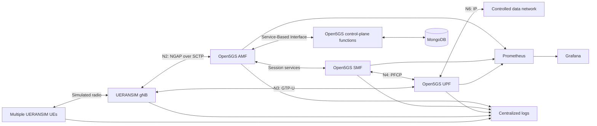

# Cloud-Native Multi-UE 5G Core Platform

## Overview

This repository is the implementation workspace for a reproducible,
containerized 5G Standalone (5G SA) Core platform. The target system will
deploy Open5GS, MongoDB, and UERANSIM on a local Kubernetes environment,
exercise multiple synthetic User Equipments (UEs), and produce measured
evidence for signalling, user-plane traffic, observability, load, failure, and
recovery behavior.

The project extends the validated protocol baseline documented in the
[5G SA Core Protocol Lab](https://github.com/abdelrahman-fawaz18/5g-sa-core-protocol-lab).
It focuses on packaging, orchestration, repeatability, operational visibility,
and reliability rather than repeating the original single-host installation.

## Current Status

The repository boundary and host preflight are complete. Pinned Docker Engine
and Compose components are installed, and before/after evidence confirms that
the existing host Open5GS, MongoDB, LXC, routes, and firewall rules remain
operational. The Phase 2 image and Compose definitions are undergoing build
and protocol validation; see the [project status](docs/project-status.md),
[container report](reports/02_container_baseline.md), and [Compose
topology](docs/architecture/phase-02-compose-topology.md). The Kubernetes
distribution remains proposed until Phase 3 networking tests produce evidence.

## Target Capabilities

- pinned and reproducible container images;
- a reversible local Kubernetes environment;
- Helm-managed Open5GS, MongoDB, and UERANSIM workloads;
- meaningful startup, readiness, and liveness checks;
- automated synthetic subscriber generation and provisioning;
- concurrent UE registration and Protocol Data Unit (PDU) sessions;
- at least two Data Network Names (DNNs) or network slices;
- Prometheus metrics and version-controlled Grafana dashboards;
- centralized, correlated operational logs;
- repeatable throughput, latency, loss, and resource measurements;
- controlled component-failure and recovery experiments;
- Continuous Integration (CI) validation for source, configuration, charts,
  tests, and container artifacts;
- concise, sanitized evidence and operational runbooks.

## Target Architecture



The final deployment topology is intentionally not frozen yet. A networking
feasibility phase must first prove that the selected local Kubernetes approach
handles Stream Control Transmission Protocol (SCTP), Packet Forwarding Control
Protocol (PFCP), GPRS Tunnelling Protocol User Plane (GTP-U), TUN devices, and
the Linux capabilities required by the User Plane Function (UPF) and UERANSIM.

## Repository Structure

```text
cloud-native-5g-core-platform/
├── charts/                 Helm packaging
├── containers/             Container build definitions
├── configs/                Synthetic lab configuration
├── scripts/                Lifecycle, test, and cleanup automation
├── tools/                  Validation and reporting software
├── tests/                  Unit, integration, and acceptance tests
├── monitoring/             Prometheus rules and Grafana provisioning
├── logging/                Centralized logging configuration
├── benchmarks/             Reproducible experiment definitions and summaries
├── docs/                   Architecture, decisions, operation, and analysis
├── reports/                Sanitized validation and experiment reports
├── versions/               Exact tool, image, and source provenance manifests
├── captures/               Intentionally reviewed protocol evidence
├── screenshots/            Selected visual evidence
├── diagrams/               Architecture and call-flow sources
└── .github/                Continuous Integration workflows
```

## Evidence Policy

Only synthetic identities and credentials may be used. Raw logs, runtime data,
local kubeconfigs, private keys, and packet captures are ignored by default.
Selected captures may be added only after a documented content and privacy
review. Performance and reliability claims must link to reproducible commands,
machine-readable measurements, and concise reports.

## Authoritative References

- [Open5GS documentation](https://open5gs.org/open5gs/docs/)
- [Kubernetes concepts](https://kubernetes.io/docs/concepts/)
- [kind documentation](https://kind.sigs.k8s.io/docs/user/quick-start/)
- [Helm documentation](https://helm.sh/docs/)
- [Prometheus documentation](https://prometheus.io/docs/introduction/overview/)
- [Grafana documentation](https://grafana.com/docs/grafana/latest/)
- [GitHub Actions documentation](https://docs.github.com/en/actions)
