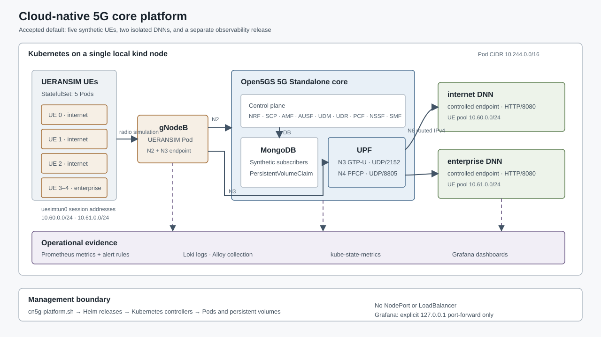

# Cloud-Native 5G Core Platform

[](https://github.com/abdelrahman-fawaz18/cloud-native-5g-core-platform/actions/workflows/ci.yml)
[](LICENSE)
[](versions/kubernetes-runtime.env)

A reproducible Open5GS and UERANSIM 5G Standalone platform on Kubernetes,
built to demonstrate real signalling, isolated user-plane traffic,
observability, controlled performance experiments, and recovery engineering.



## What I implemented

I wrote the project-specific Helm charts, deployment profiles, lifecycle and validation commands,
telecom probes, observability provisioning, experiment analysis, and scoped teardown and release
checks. Open5GS, UERANSIM, Kubernetes, Prometheus, Grafana, Loki, and Alloy are upstream components
integrated by the project.

## What this system does

The default deployment creates a complete local mobile network inside a
single-node [kind](https://kind.sigs.k8s.io/) cluster:

- five synthetic User Equipments (UEs) register through one UERANSIM gNodeB;
- Open5GS provides the 5G core control and user-plane functions;
- three UEs use the `internet` Data Network Name (DNN), while two use the
  isolated `enterprise` DNN;
- every UE receives a unique session address and reaches only its intended
  controlled data endpoint;
- Prometheus, Grafana, Loki, Alloy, and kube-state-metrics expose service health,
  resource use, logs, experiment results, and recovery timing; and
- lifecycle commands validate, test, and remove only resources identified as
  project-owned.

This is an engineering integration platform, not a carrier production
topology. The tested setup uses one local Kubernetes node, one gNodeB, one User
Plane Function (UPF), five synthetic subscribers, and two controlled data
networks.

## Operational views

The dashboards are provisioned from Git and checked against saved metrics and
test results. Each screenshot is sanitized and linked to its source dashboard
by checksum.

| Live service health | Per-UE and DNN behavior |
| --- | --- |
| [](docs/images/dashboards/service-overview-healthy.png) | [](docs/images/dashboards/telecom-sessions-and-dnns-healthy.png) |

| Performance test results | Recovery test results |
| --- | --- |
| [](docs/images/dashboards/performance-reviewed.png) | [](docs/images/dashboards/resilience-reviewed.png) |

See the [dashboard gallery](docs/dashboard-gallery.md) for each panel's data
source and limitations.

## Architecture at a glance

```text
UE StatefulSet (5 Pods)
   │ simulated radio
   ▼
UERANSIM gNodeB
   ├── N2: NGAP over SCTP/38412 ──> AMF ──> Open5GS control plane
   └── N3: GTP-U over UDP/2152 ───> UPF
                                         ├── N6 ──> internet endpoint
                                         └── N6 ──> enterprise endpoint

Open5GS + UE probes + Kubernetes API
   ├── metrics ──> Prometheus ──┐
   └── logs ─────> Alloy ─> Loki├──> Grafana
Kubernetes objects ─> kube-state-metrics ─┘
```

Helm renders and submits the desired state; Kubernetes controllers create
Deployments, StatefulSets, Services, Jobs, ConfigMaps, Secrets, and
PersistentVolumeClaims. The 5G protocols then run between Pods—the Helm and
Kubernetes management path is separate from the mobile signalling and user
traffic paths.

The detailed [complete system architecture](docs/architecture/complete-system-architecture.md)
maps ownership, Pods and sidecars, stable service names, runtime address
domains, every relevant port, telemetry flow, and one end-to-end example from
a stopped UE to a returned ping.

## What was tested

| Area | Result | Limits |
| --- | --- | --- |
| 5G control plane | 5G-AKA authentication, NAS security, registration, unique PDU sessions, nine stable NRF profiles | Synthetic subscribers on one local cluster |
| User plane | N4 PFCP, N3 GTP-U, bidirectional tunnel counters, HTTP and ICMP through `uesimtun0` | One gNodeB and one UPF |
| Network separation | 3 `internet` UEs, 2 `enterprise` UEs, fail-closed source policy, every cross-DNN request denied | Exactly two controlled DNNs |
| Performance | Three runs at 1, 3, and 5 UEs; reports and plots generated from saved results | Local comparison, not carrier capacity |
| Recovery | Nine controlled AMF, SMF, and UPF failures with measured detection and restoration | Single replicas; recovery was operator-assisted, not high availability |
| Observability | Six dashboards, controlled metric cardinality, centralized logs, and three alerts tested from trigger through resolution | Single-replica local telemetry stack |
| Persistence | MongoDB subscriber state survives Pod recreation and controlled release lifecycle tests | Local-path PersistentVolume, not replicated storage |
| Supply chain | Pinned inputs, High/Critical image scan gates, SPDX SBOMs, policy checks, secret scanning, and read-only hosted CI | Local images; no production registry or signing |
| Release lifecycle | Clean-cluster installation from tracked inputs and exact project-owned teardown both passed | Documented Ubuntu/AMD64 environment |

Measurements and test limitations are documented under [`reports/`](reports/README.md).
Raw scanner output, credentials, kubeconfigs, packet-level diagnostics, and
host snapshots remain local and excluded from Git.

## Deploy the default platform

The default profile deploys five UEs, two DNNs, and the observability stack.
Smaller configurations are optional and do not need to be run first.

```bash
git clone https://github.com/abdelrahman-fawaz18/cloud-native-5g-core-platform.git
cd cloud-native-5g-core-platform

sudo ./scripts/cn5g-platform.sh preflight
sudo ./scripts/cn5g-platform.sh deploy
sudo ./scripts/cn5g-platform.sh validate
```

Open the provisioned Grafana dashboards:

```bash
sudo ./scripts/cn5g-platform.sh dashboard
```

Grafana is forwarded only to `127.0.0.1:13000`; ending that command closes the
connection. No workload uses a NodePort, LoadBalancer, host port, or host
network.

Remove the exact project-owned cluster and its local PersistentVolumes:

```bash
sudo ./scripts/cn5g-platform.sh destroy --confirm
```

Prerequisites, expected runtime, troubleshooting, controlled tests, and
cleanup behavior are documented in [Platform operations](docs/platform-operations.md).

## Deployment profiles

| Profile | Topology | Intended use |
| --- | --- | --- |
| `default` | 5 UEs, 2 DNNs, observability | Normal deployment and demonstration |
| `core-only` | 5 UEs, 2 DNNs | Protocol work without the telemetry stack |
| `resource-limited` | 5 UEs, 2 DNNs, reduced database reservation | Constrained local host |
| `single-ue` | 1 UE, 1 DNN | Minimal compatibility and diagnosis |

Example:

```bash
sudo ./scripts/cn5g-platform.sh deploy --profile core-only
```

Profile definitions live in [`profiles/`](profiles/). The Helm chart itself
also defaults to the complete multi-UE topology, so direct rendering does not
quietly fall back to the simpler model.

## Optional engineering campaigns

Performance and recovery tests use the default platform; they are not separate
products.

```bash
# Route-enforced traffic pilot, repeated matrix, deterministic analysis
sudo ./scripts/cn5g-platform.sh campaign performance prepare
sudo ./scripts/cn5g-platform.sh campaign performance pilot
sudo ./scripts/cn5g-platform.sh campaign performance run
sudo ./scripts/cn5g-platform.sh campaign performance analyze

# Component fault pilot, repeated recovery matrix, deterministic analysis
sudo ./scripts/cn5g-platform.sh campaign resilience pilot-amf
sudo ./scripts/cn5g-platform.sh campaign resilience run
sudo ./scripts/cn5g-platform.sh campaign resilience analyze
```

Each run defines resource abort thresholds, fault or traffic windows, and
restoration checks. Summaries include only runs that completed those checks;
failed attempts are kept for diagnosis.

## Repository map

| Path | Purpose |
| --- | --- |
| [`charts/`](charts/README.md) | Helm-managed 5G core and observability releases |
| [`profiles/`](profiles/) | Supported deployment configurations |
| [`containers/`](containers/README.md) | Pinned local image builds and entrypoints |
| [`scripts/`](scripts/README.md) | Unified lifecycle, validation, campaigns, and assurance tooling |
| [`docs/`](docs/README.md) | Architecture, operations, runbooks, and design decisions |
| [`reports/`](reports/README.md) | Sanitized measurements, test results, and limitations |
| [`benchmarks/`](benchmarks/README.md) | Experiment definitions and machine-readable results |
| [`policy/`](policy/README.md) | Kubernetes admission-style security policy |
| [`release/`](release/README.md) | Release checks and generated figures |

## Implementation choices

- **Repeatable tests.** Results are kept with the configuration, procedure, and
  saved output needed to inspect them.
- **Least privilege.** No workload is privileged. UPF receives `NET_ADMIN`;
  UE Pods receive only `NET_ADMIN` and `NET_RAW`; controlled data endpoints
  run with no effective capabilities.
- **Runtime discovery.** Services and DNS provide stable
  discovery while validators derive current Pod addresses and exact node-side
  routes rather than assuming stale allocations.
- **Targeted cleanup.** Cleanup checks identity and ownership; scripts never
  run broad Docker prunes, flush host firewall state, or remove unrelated
  resources.
- **Documented limits.** The results cover a single-node test environment, not
  high availability, carrier capacity, or RF performance.

## Documentation

Start with the [documentation portal](docs/README.md). Particularly useful
deep dives are:

- [Complete system architecture](docs/architecture/complete-system-architecture.md)
- [Observability architecture](docs/architecture/observability.md)
- [Performance engineering](docs/architecture/performance-engineering.md)
- [Resilience engineering](docs/architecture/resilience-engineering.md)
- [Supply-chain security](docs/architecture/supply-chain-security.md)
- [Architecture decisions](docs/adr/README.md)

## License

Project-authored material is licensed under the [Apache License 2.0](LICENSE).
Upstream Open5GS, UERANSIM, container images, and tools retain their own
licenses; see [third-party notices](THIRD_PARTY_NOTICES.md).
