# Kubernetes Foundations And Platform System Guide

This document provides the conceptual and operational foundation for the
Kubernetes implementation in this repository. It begins with the container
model, explains the Kubernetes objects and control loops that manage those
containers, reconstructs the Phase 3 feasibility work, and maps those results
to the accepted Helm-managed single-UE platform implemented in Phase 4.

The document is deliberately self-contained. A reader who understands a
container as an isolated process with its own filesystem and networking should
be able to use this file to answer four questions:

1. Why is Kubernetes being introduced after the Docker Compose baseline?
2. What are the main Kubernetes components and how do they connect?
3. What exactly did Phase 3 prove, and what did it not prove?
4. Which Kubernetes resources and behaviors did Phase 4 implement and prove?

The explanations describe the verified local architecture. They do not claim
that a single-node kind cluster has the availability, scale, storage,
networking, or security controls of a production telecommunications platform.

Phase-specific extensions:

- [Phase 6 observability architecture](architecture/phase-06-observability.md)
- [Phase 6 observability runbook](runbooks/phase-06-observability.md)
- [Observability dashboard evolution plan](architecture/observability-dashboard-evolution-plan.md)
- [ADR-0005 observability stack decision](adr/0005-observability-stack.md)
- [Phase 7 controlled performance methodology](architecture/phase-07-performance-methodology.md)
- [Complete accepted-system architecture](architecture/complete-system-architecture.md)
- [Phase 7 reviewed performance report](../reports/07_phase07_performance.md)
- [ADR-0009 benchmark traffic-path decision](adr/0009-phase-07-benchmark-path.md)

Because this is a long-form reference, it can be read in parts:

- Sections 1-10 build the execution and reconciliation model.
- Sections 11-13 build the networking and 5G address model.
- Sections 14-20 explain configuration, storage, health, resources, security,
  operations, and Helm.
- Sections 21-24 connect Compose and Phase 3 to a complete visual and
  operational model of the accepted Phase 4 platform, then compare that local
  system with production practice.
- Sections 25-30 provide troubleshooting, a concise narrative, a glossary,
  readiness questions, the documentation index, and authoritative references.

---

## 1. Starting From The Container Model

A container is not a small virtual machine. At runtime it is one or more Linux
processes isolated with kernel features such as namespaces and control groups.
The container image supplies the application filesystem and metadata; the
host kernel still executes the processes.

Docker provides several important functions around that model:

- builds an image from a Dockerfile;
- creates and starts containers from an image;
- assigns container network interfaces and addresses;
- attaches storage and configuration;
- applies resource and security options; and
- records container state and logs.

Docker Compose adds a declarative description for a group of containers. The
Phase 2 `compose.yaml` states which containers should exist, which networks
they join, which files they mount, their dependencies, and their health
checks. Compose is therefore already a form of orchestration, but its normal
scope is one Docker Engine and a comparatively direct container lifecycle.

Kubernetes retains the same images and Linux container fundamentals. It adds
an Application Programming Interface (API), persistent desired-state records,
controllers, scheduling, stable service discovery, workload identity, storage
abstractions, rollout history, and continuous reconciliation.

The transition can be summarized as follows:

```text
Host services:
  operator edits host files and systemd manages host processes

Docker containers:
  operator builds images and Docker runs isolated processes

Docker Compose:
  operator declares a multi-container application on one Docker Engine

Kubernetes:
  operator declares API objects and controllers continuously make runtime
  objects converge toward that declared state

Helm on Kubernetes:
  operator installs a parameterized, versioned package that renders the
  related Kubernetes API objects as one release
```

Kubernetes does not replace containers. It decides where and how containerized
workloads run, observes them, and replaces or reconfigures runtime objects when
the declared state changes.

---

## 2. Why Use Kubernetes Here?

The predecessor 5G lab runs Open5GS and UERANSIM as services directly on one
Ubuntu host. That is a valid architecture for a controlled protocol lab. The
Compose baseline improves isolation and reproducibility, but it still leaves
the application tied to the lifecycle and networking model of one Docker
Engine.

This project introduces Kubernetes to evaluate and implement capabilities that
matter when a containerized 5G core becomes an operated platform:

### 2.1 Declarative desired state

Instead of scripting every start operation, the repository declares what
should exist. The cluster records that state and continuously works toward it.
If a managed Pod disappears, its controller creates a replacement.

### 2.2 Stable application discovery

Pod addresses are replaceable. Kubernetes Services provide stable names and
virtual addresses for traffic that should not depend on one Pod instance. This
is particularly useful for the HTTP-based 5G Service-Based Interface (SBI).

### 2.3 Standardized configuration and secret delivery

ConfigMaps, Secrets, and volumes separate runtime configuration from an image.
This allows the same image to be used with different controlled configuration
without rebuilding it.

### 2.4 Controlled lifecycle and rollout history

Deployments manage replacement and rollout of stateless workloads.
StatefulSets associate stable identities and storage claims with stateful
workloads. Helm groups the complete application into revisions that can be
installed, upgraded, rolled back, and uninstalled.

### 2.5 Health and dependency signals

Startup, readiness, and liveness probes express different operational facts.
Kubernetes can delay traffic until a component is ready or restart a process
that is alive at the operating-system level but no longer making progress.

### 2.6 Resource and security boundaries

Requests, limits, security contexts, Linux capabilities, ServiceAccounts, and
Role-Based Access Control (RBAC) make resource and privilege requirements
explicit in version-controlled configuration.

### 2.7 A transferable deployment contract

The API objects and Helm structure used locally are also used by managed-cloud
and on-premises Kubernetes platforms. The infrastructure details will differ,
but the application packaging and reconciliation concepts transfer.

Kubernetes is not automatically the correct answer for every 5G deployment.
A fixed, small installation may be simpler as host services. A high-throughput
User Plane Function (UPF) may require dedicated nodes, secondary interfaces,
Single Root Input/Output Virtualization (SR-IOV), Data Plane Development Kit
(DPDK), CPU pinning, or even operation outside Kubernetes. This repository
uses Kubernetes because orchestration, repeatability, lifecycle evidence, and
platform operations are explicit project goals—not because Kubernetes makes
the underlying 5G protocols work by itself.

---

## 3. The Most Important Mental Model: An API And Control Loops

Kubernetes should first be imagined as a control system, not as a collection
of shell commands.

You submit an object to the Kubernetes API. That object contains a desired
state. Controllers observe the desired state and the current state. When they
differ, controllers take actions that reduce the difference. This repeating
process is called **reconciliation**.

### 3.1 Example: requesting one AMF Pod

Suppose a Deployment says that one Access and Mobility Management Function
(AMF) replica should exist.

```text
1. Desired state
   Deployment.spec.replicas = 1

2. Current state
   zero matching Pods exist

3. Reconciliation
   Deployment controller causes a ReplicaSet to request one Pod

4. Scheduling
   scheduler assigns the new Pod to a suitable node

5. Node execution
   kubelet asks the container runtime to create the Pod and AMF container

6. Observation
   kubelet reports container and probe status through the API

7. Stable state
   one matching Ready Pod exists
```

If that Pod is deleted, Kubernetes does not repair the same Pod. The
controller creates a new Pod because the declared replica count is still one.
The new Pod may have a different name and IP address.

This distinction is fundamental:

- a **container** is a running process environment;
- a **Pod** is a Kubernetes runtime object containing one or more containers;
- a **Deployment** declares how a replaceable set of Pods should be managed;
- a **Service** gives clients a stable way to find selected Pods.

### 3.2 Desired state is not proof of application success

Kubernetes can prove that an object exists and that configured health checks
pass. It cannot infer that a UE registered, that a PFCP session was created, or
that GTP-U carried bidirectional traffic. Those are application and protocol
acceptance tests that this repository must implement separately.

`Pod Running` therefore means only that the Pod's containers are running. It
does not mean the 5G control plane or user plane works.

---

## 4. The Complete System Hierarchy

Read the following hierarchy from top to bottom. Indentation means “is hosted
inside” or “is managed within.” It is not a packet-flow diagram.

```text
Ubuntu host
├── existing host Open5GS/UERANSIM lab (outside this project's cluster)
├── Docker Engine
│   └── kind node container: cn5g-control-plane
│       ├── Kubernetes control plane
│       │   ├── kube-apiserver
│       │   ├── etcd
│       │   ├── kube-scheduler
│       │   └── kube-controller-manager
│       ├── node components
│       │   ├── kubelet
│       │   ├── containerd
│       │   ├── kube-proxy
│       │   └── kindnet network plugin
│       ├── cluster add-ons
│       │   ├── CoreDNS
│       │   └── local-path storage provisioner
│       └── workload Pods
│           └── one or more containers per Pod
└── kubectl and Helm clients
    └── connect to kube-apiserver using a kubeconfig
```

There are two different container-runtime layers in this local design:

1. Docker runs the kind node container on Ubuntu.
2. containerd inside the kind node runs Kubernetes Pod containers.

Docker does not directly manage the application Pods. Kubernetes asks the
node's containerd runtime to manage them.

In a production cluster, a node is normally a virtual machine or physical
server rather than a Docker container. The Kubernetes control model remains
similar, but the local kind nesting is removed.

### 4.1 One-page relationship mind map

This map groups concepts by responsibility. A vertical branch means “contains
or manages.” A horizontal arrow states the exact interaction.

```text
Kubernetes cluster
├── control plane: stores desired state and makes cluster decisions
│   ├── API server <-> every authenticated client and controller
│   ├── API server <-> etcd state database
│   ├── scheduler -> assigns pending Pods to nodes
│   └── controllers -> create/update objects to reconcile desired state
│
├── node: supplies the environment where Pods execute
│   ├── kubelet -> asks containerd to run assigned Pod containers
│   ├── CNI plugin -> gives Pods network interfaces and Pod IPs
│   └── kube-proxy -> implements Service forwarding in this cluster
│
├── workloads: declare how application Pods should be managed
│   ├── Deployment -> ReplicaSet -> replaceable Pods
│   ├── StatefulSet -> identity-stable Pods + storage claims
│   └── Job -> completion-oriented Pods
│
├── connectivity and discovery
│   ├── Service selector -> matching ready Pods
│   ├── EndpointSlice -> current backend Pod addresses
│   └── CoreDNS -> Service name resolves to discovery endpoint
│
├── application inputs
│   ├── ConfigMap -> non-secret files/environment
│   ├── Secret -> controlled sensitive files/environment
│   └── PVC -> requested persistent storage mounted by a Pod
│
└── policy and observation
    ├── probes -> startup/readiness/liveness status and actions
    ├── requests/limits -> scheduling and runtime resource boundaries
    ├── security context -> Linux user, capabilities, and seccomp
    └── ServiceAccount + RBAC -> workload identity and API permissions

kubectl -- authenticated API requests --> API server
Helm -- renders a chart, then submits objects --> API server
5G applications -- use Pod/Service networks and explicit 5G interfaces -->
  other application Pods
```

The map separates three concerns that are often accidentally combined:

1. Helm packages and submits objects.
2. Kubernetes reconciles and runs those objects.
3. Open5GS and UERANSIM implement the actual 5G protocols inside the Pods.

---

## 5. Cluster, Control Plane, And Node Components

### 5.1 Cluster

A **cluster** is the complete Kubernetes system: its control plane, one or
more nodes, networking, storage integrations, and API objects.

The accepted local cluster is named `cn5g`. It is disposable: project data
required beyond a cluster lifecycle must not depend on the continued existence
of the kind node container.

### 5.2 Control plane

The **control plane** stores desired state and makes cluster-wide decisions.
Its core components are:

| Component | Purpose | Useful mental shortcut |
| --- | --- | --- |
| `kube-apiserver` | Validates and exposes the Kubernetes API | The front door to cluster state |
| `etcd` | Stores API data as a consistent key-value database | The cluster's state record |
| `kube-scheduler` | Assigns unscheduled Pods to suitable nodes | Chooses where a Pod should run |
| `kube-controller-manager` | Runs built-in reconciliation controllers | Keeps declared and actual state aligned |

Clients and components normally communicate through the API server rather
than writing directly to `etcd`.

### 5.3 Node

A **node** supplies compute, networking, and storage access for Pods. A node
can be a physical machine, a virtual machine, or—in kind—a container.

Important node components are:

| Component | Purpose |
| --- | --- |
| `kubelet` | Watches assigned Pod specifications and ensures their containers run |
| container runtime | Pulls images and starts/stops containers; this cluster uses containerd |
| `kube-proxy` | Programs the node's Service forwarding rules in this cluster |
| Container Network Interface (CNI) plugin | Connects Pods to the Pod network; kind uses kindnet |

The local cluster has one node. That node runs both the control plane and
workloads. This is resource-efficient and reproducible, but a node failure
removes the entire cluster. It is not a high-availability architecture.

### 5.4 Cluster add-ons

- **CoreDNS** answers cluster DNS queries, including Service names.
- **kindnet** implements the Pod network used by kind.
- **kube-proxy** implements Service virtual-address forwarding in this
  cluster.
- The **local-path provisioner** can satisfy storage claims using storage on
  the kind node. It is suitable for local testing, not equivalent to a
  replicated production storage system.

---

## 6. How A Kubernetes Request Becomes A Running Container

The arrows below are numbered and labeled. This is a control flow, not an
application packet flow.

```text
[1] operator or automation
      |
      | kubectl/Helm sends an authenticated HTTPS API request
      v
[2] kube-apiserver
      |
      | validates and persists desired state
      v
[3] etcd

[4] controllers watch the API
      |
      | create/update dependent objects such as ReplicaSets and Pods
      v
[5] unscheduled Pod exists
      |
      | scheduler selects a node and records the binding
      v
[6] kubelet on selected node
      |
      | asks containerd and the network/storage plugins for runtime resources
      v
[7] Pod containers, interfaces, mounts, and probes run
      |
      | status is reported back through the API
      v
[8] operator sees status using kubectl
```

Helm participates at step 1. Helm renders and submits Kubernetes objects. Helm
does not become a controller that runs the containers; Kubernetes still owns
reconciliation after the objects enter the API.

---

## 7. Kubernetes Objects And YAML

A Kubernetes object is an API record. Most manifest files contain four
important top-level sections:

```yaml
apiVersion: apps/v1
kind: Deployment
metadata:
  name: example
  namespace: cn5g
spec:
  replicas: 1
  selector:
    matchLabels:
      app.kubernetes.io/name: example
  template:
    metadata:
      labels:
        app.kubernetes.io/name: example
    spec:
      containers:
        - name: example
          image: example.invalid/application:1.0.0
```

- `apiVersion` selects the API version and group containing the object type.
- `kind` identifies the type of object.
- `metadata` contains identity and organization fields such as name,
  namespace, labels, and annotations.
- `spec` declares the desired state.
- `status`, normally written by Kubernetes rather than the operator, reports
  observed state.

The sample image name is illustrative and is not a project runtime input.

`kubectl apply` submits a manifest. The file is not itself the running
application; it is a desired-state document stored through the API.

---

## 8. Namespaces, Names, Labels, And Selectors

### 8.1 Namespace

A **namespace** is a logical scope for namespaced API objects. It helps group
and isolate resources, but it is not automatically a complete security or
network boundary.

For example, two namespaces may each contain a Service named `mongodb`.
Cluster DNS distinguishes them using namespace-qualified names.

Phase 3 used `cn5g-feasibility` so every temporary probe object had a clear
ownership boundary. Phase 4 uses the separate `cn5g` namespace for the Helm
release, retained claim, and pre-created subscriber Secret.

### 8.2 Name

An object name identifies one resource within its kind and namespace. A Pod
created by a controller often has a generated suffix because Pods are
replaceable instances.

### 8.3 Labels

**Labels** are queryable key/value identity fields. They answer questions such
as:

- Which Pods belong to this application?
- Which release owns this resource?
- Which component is the AMF?

Common professional labels include application name, component, instance,
version, and managing tool.

### 8.4 Selectors

A **selector** matches labels. Deployments use selectors to identify the Pods
they manage. Services use selectors to identify the Pods that should receive
traffic.

This means label correctness is functional, not cosmetic. If a Service
selector does not match a Pod's labels, the Service can exist and have an IP
address while forwarding to no endpoints.

### 8.5 Annotations

**Annotations** are non-identifying metadata used by tools and controllers.
They are not normally used to select objects. Helm hooks, checksums that force
configuration rollouts, and documentation references are common uses.

---

## 9. Pods: The Smallest Kubernetes Execution Unit

A **Pod** is the smallest deployable compute object in Kubernetes. A Pod
contains one or more containers that intentionally share:

- one network namespace and therefore one Pod IP address;
- the same loopback interface;
- declared volumes; and
- one scheduling and lifecycle boundary.

Containers in the same Pod communicate over `localhost`. They cannot bind the
same address and port simultaneously because they share the network stack.

### 9.1 Why not manage containers directly?

Kubernetes attaches networking, storage, identity, probes, and scheduling to a
Pod. The Pod is the unit the scheduler places on a node.

### 9.2 One container versus multiple containers

The normal application pattern is one main container per Pod. Additional
containers are appropriate when they share the exact lifecycle and network
context, for example:

- a sidecar that exports metrics for the main process;
- a proxy that must share `localhost`; or
- a tightly coupled packet observer in a controlled test Pod.

Unrelated 5G Network Functions should not be combined merely to reduce the
number of Pods. Separate Pods preserve lifecycle, configuration, health,
resource, and security boundaries.

### 9.3 Init containers

An **init container** runs to completion before the main application
containers start. It can prepare files or perform a narrow prerequisite.
Repeated initialization of shared state must still be idempotent, meaning it
can safely run more than once.

### 9.4 Pod lifetime

Pods are replaceable. A replacement is a new object and normally receives a
new IP address. Persistent identity must come from a higher-level workload
object, a Service, or persistent storage—not from assuming one Pod will live
forever.

---

## 10. Workload Controllers

Directly creating long-running Pods is uncommon because a bare Pod has no
higher-level controller to replace it. Phase 3 used bare Pods intentionally
because they were short-lived, precisely controlled feasibility probes. Phase
4 uses workload controllers for the long-running platform.

### 10.1 Deployment

A **Deployment** manages interchangeable, normally stateless Pods. It creates
and manages a **ReplicaSet**, which maintains the requested number of matching
Pods.

Phase 4 uses Deployments for Open5GS, UERANSIM, and the controlled data
endpoint. Each initial replica count is one; the controller still provides
replacement and rollout behavior when a Pod disappears or the template
changes.

“Stateless” here does not mean a process has no runtime memory. It means the
Pod does not require a unique persistent identity or local state to be a valid
replacement.

### 10.2 StatefulSet

A **StatefulSet** manages Pods that require stable identity, ordered lifecycle,
or stable association with storage. Phase 4 uses a MongoDB StatefulSet with a
retained PersistentVolumeClaim.

A StatefulSet does not make data durable by itself. Persistence comes from the
PersistentVolumeClaim and its backing storage. The StatefulSet makes the
relationship between a stable Pod identity and that claim manageable.

### 10.3 Job

A **Job** manages a task that should complete successfully and stop. Subscriber
database initialization is a natural Job because it should provision the
synthetic record and exit rather than run forever.

The successful state for a Job is `Completed`, not `Running`.

### 10.4 DaemonSet

A **DaemonSet** places a Pod on every selected node. Network plugins and
node-level collectors commonly use it. Phase 4 does not need to force an
application Network Function into a DaemonSet simply because the local cluster
has one node.

### 10.5 Controller ownership chain

```text
Deployment
└── ReplicaSet
    └── Pod
        └── container process

StatefulSet
└── identity-stable Pod
    └── container process + mounted persistent claim

Job
└── one or more completion-oriented Pods
    └── process exits successfully or fails
```

When troubleshooting, inspect the chain rather than only the final container.
A scheduling problem is visible at the Pod level; a rollout problem is often
visible at the Deployment or ReplicaSet level.

---

## 11. Kubernetes Networking From The Ground Up

Kubernetes networking is easier to understand when its address domains are
kept separate.

### 11.1 Node network

Nodes need addresses that allow cluster components and other nodes to reach
them. In kind, the node is attached to a Docker bridge and received
`172.18.0.2` during the accepted Phase 3 run.

### 11.2 Pod network

Every Pod receives its own Pod IP from the cluster's Pod range. The accepted
kind configuration uses `10.244.0.0/16`.

Containers in one Pod share that IP. Different Pods have different IPs, even
when their containers use the same image.

Pod IPs are operational endpoints, not durable identities. A replacement Pod
may receive another address.

The CNI plugin sets up Pod interfaces and reachability. In this kind cluster,
kindnet supplied Pod networking. Phase 3 observed a node-side virtual Ethernet
(`veth`) interface and route for each Pod rather than assuming a bridge named
`cni0` existed.

### 11.3 Service network

A **Service** represents a stable network endpoint for a changing set of Pods.
The accepted Service address range is `10.96.0.0/16`.

A normal ClusterIP Service has:

- a stable virtual IP inside the cluster;
- a DNS name;
- one or more ports; and
- EndpointSlices containing the currently selected backend Pod addresses.

The ClusterIP is usually virtual; it is not simply another address assigned to
the application container's interface. kube-proxy programs forwarding rules
so traffic to that virtual address reaches a selected ready endpoint.

### 11.4 Service discovery by DNS

CoreDNS creates names using this pattern:

```text
<service>.<namespace>.svc.cluster.local
```

For example:

```text
mongodb.cn5g.svc.cluster.local
```

Pods in the same namespace can normally use the short name `mongodb`.
Explicit namespace-qualified names are clearer when components cross
namespace boundaries.

### 11.5 Service selectors and EndpointSlices

```text
client Pod
  -> Service DNS name
  -> Service ClusterIP and port
  -> kube-proxy forwarding
  -> one ready endpoint from an EndpointSlice
  -> selected server Pod IP and target port
```

The Service does not start Pods. A workload controller starts Pods. The
Service discovers them by matching labels.

### 11.6 Service `port`, `targetPort`, and protocol

- `port` is the port clients use on the Service.
- `targetPort` is the port used on the selected Pod.
- `protocol` identifies TCP, UDP, or SCTP.

A container's `containerPort` entry is primarily declarative metadata. It does
not by itself publish a host port or create a Service.

### 11.7 ClusterIP is not host exposure

A ClusterIP is reachable within the cluster network. It does not expose the
application on the Ubuntu host or the public Internet.

Other mechanisms such as NodePort, LoadBalancer, Ingress, Gateway API, or
`kubectl port-forward` address different access needs. Phase 3 intentionally
published no application workload port to Ubuntu.

### 11.8 Headless Service

A headless Service uses `clusterIP: None`. DNS returns endpoint addresses
instead of a virtual ClusterIP. This is useful where clients need direct Pod
identity or where a protocol endpoint must remain explicit. It does not make
the Pod address permanent.

### 11.9 NetworkPolicy

A **NetworkPolicy** declares allowed Pod traffic when the installed CNI
implementation enforces it. Creating a NetworkPolicy object without an
enforcing implementation does not prove isolation. NetworkPolicy enforcement
is not part of the accepted Phase 3 evidence and must not be assumed.

---

## 12. Why 5G Networking Needs Extra Care

Ordinary application traffic often works well through stable Services. Some
5G protocols also carry endpoint addresses or tunnel identifiers inside their
own protocol messages. A virtual Service address is therefore not always a
valid substitute for the address on which the real protocol endpoint listens.

The project distinguishes these interfaces:

| Interface | Protocol purpose | Initial Kubernetes approach |
| --- | --- | --- |
| SBI | HTTP-based communication between 5G core Network Functions | ClusterIP Services and DNS are appropriate |
| N2 | NGAP between gNB and AMF over SCTP/38412 | Explicit reachable endpoint; validate real SCTP association |
| N3 | GTP-U between gNB and UPF over UDP/2152 | Direct advertised Pod endpoint unless evidence supports another model |
| N4 | PFCP between SMF and UPF over UDP/8805 | Explicit reachable endpoint and real PFCP validation |
| N6 | Routed user IP traffic between UPF and data network | Explicit routes, forwarding, MTU, and return-path validation |

**NGAP** means Next Generation Application Protocol. It carries control-plane
signalling on N2.

**SCTP** means Stream Control Transmission Protocol. It is the transport used
by NGAP.

**PFCP** means Packet Forwarding Control Protocol. The Session Management
Function (SMF) uses it to control the UPF on N4.

**GTP-U** means GPRS Tunnelling Protocol User Plane. It carries user packets
between the gNB and UPF on N3.

A successful UDP/2152 test alone proves only that UDP can cross the path on
that port. Phase 4 made the stronger claim with real Open5GS and UERANSIM
traffic, visible PFCP/GTP-U session evidence, application responses, and
positive UE/UPF tunnel counters.

---

## 13. The Four Address Domains In This Project

Do not treat every `10.x.x.x` address as belonging to one network.

```text
Ubuntu/Docker node network
  172.18.0.0/16
  connects the kind node container to Docker

Kubernetes Pod network
  10.244.0.0/16
  gives each Pod an address

Kubernetes Service network
  10.96.0.0/16
  gives Services virtual cluster addresses

5G UE session network
  10.60.0.0/24
  exists behind TUN/tunnel endpoints as subscriber data-plane addresses
```

The UE session address is not a Pod IP. The same UE Pod can have both:

- a Pod interface with a `10.244.x.x` outer-network address; and
- a TUN interface with a `10.60.0.x` inner subscriber address.

That separation creates an inner and outer packet model:

```text
inner packet:
  UE session source/destination, such as 10.60.0.2 -> data endpoint

outer packet during tunnelling:
  Pod-network source/destination, such as UE Pod -> UPF/router Pod on UDP/2152
```

In the real Phase 4 user plane, GTP-U provides the N3 encapsulation. Phase 3
used a smaller synthetic encapsulator to test the infrastructure path without
mixing it with real 5G application configuration.

---

## 14. Configuration: ConfigMaps And Secrets

### 14.1 ConfigMap

A **ConfigMap** stores non-secret configuration in the Kubernetes API. It can
be exposed to a Pod as files or environment variables.

Open5GS and UERANSIM YAML configuration belongs in ConfigMaps when it contains
no sensitive values. Separating it from the image allows one reviewed image to
run with environment-specific addresses and settings.

### 14.2 Secret

A **Secret** is a Kubernetes object intended for sensitive data delivery. In
ordinary YAML, Secret values are commonly base64-encoded. Base64 is an
encoding, not encryption: anyone who obtains the value can decode it.

The Phase 4 rule is therefore:

- synthetic secret values are generated for an installation;
- live values are not committed;
- public examples contain only clearly synthetic placeholders; and
- RBAC and mount scope restrict which workloads can retrieve them.

A production cluster may add encryption at rest, an external secret manager,
key rotation, and audited access. A local Secret object alone does not provide
all of those controls.

### 14.3 Configuration updates

Changing a ConfigMap or Secret does not guarantee that an application reloads
it. Environment-variable values are fixed for a running container. Mounted
files may update, but the application must detect and reload them. A common
chart pattern includes a configuration checksum in the Pod template so a
configuration change deliberately triggers a rollout.

---

## 15. Volumes, PersistentVolumes, And Claims

Container writable layers and ordinary Pod-local volumes should be treated as
ephemeral. A replacement Pod must not be expected to retain them.

Kubernetes separates a workload's request for storage from the storage
implementation:

- a **volume** is storage mounted into a Pod;
- a **PersistentVolume (PV)** represents storage available to the cluster;
- a **PersistentVolumeClaim (PVC)** is a workload's request for storage; and
- a **StorageClass** describes a class and provisioner that can create backing
  volumes.

The relationship is:

```text
MongoDB StatefulSet
  -> Pod template mounts a claim
  -> PersistentVolumeClaim requests capacity/access mode
  -> StorageClass/provisioner supplies a PersistentVolume
  -> PersistentVolume maps to actual backing storage
```

The kind local-path provisioner stores data inside the kind node environment.
It can prove Pod replacement and Helm release persistence behavior within the
local cluster. Deleting the disposable kind node removes that local storage;
it is not equivalent to a production network or cloud storage service.

Phase 4 proved the persistence contract recorded in ADR-0004. A synthetic
marker and the exact claim UID/backing volume survived MongoDB Pod recreation,
controlled upgrade, rollback, and complete Helm uninstall/reinstall. Cluster
deletion remains a separate boundary because kind local-path data resides
inside the disposable node.

---

## 16. Startup, Readiness, And Liveness Probes

Kubernetes probes answer different questions. Reusing one weak check for all
three hides failure modes.

| Probe | Question | Effect when repeatedly failing |
| --- | --- | --- |
| Startup | Has this process finished starting? | Container is restarted; readiness and liveness wait while startup is pending |
| Readiness | Should this Pod receive Service traffic now? | Pod remains running but is removed from ready Service endpoints |
| Liveness | Is this process stuck and unlikely to recover without restart? | Container is restarted |

Examples of meaningful distinctions:

- A MongoDB process may be alive but not ready to answer database operations.
- An AMF process may exist but still be initializing its SCTP listener and SBI
  relationships.
- A temporarily unavailable dependency should not necessarily cause another
  component's liveness check to restart it repeatedly.

Probe settings include interval, timeout, success threshold, and failure
threshold. Aggressive liveness checks can create restart loops or cascading
failures. The accepted chart uses component-specific startup, readiness, and
liveness checks and keeps end-to-end protocol validation separate.

Probes are platform health evidence. End-to-end UE registration and PDU
session validation remain separate functional evidence.

---

## 17. Scheduling, Resource Requests, And Limits

The scheduler must decide whether a node has enough declared capacity for a
Pod.

- A **request** is the amount of CPU or memory used for scheduling and the
  workload's resource guarantee model.
- A **limit** is an enforced upper boundary.

CPU and memory behave differently:

- exceeding a CPU limit generally causes throttling;
- exceeding a memory limit can cause the process to be terminated as
  `OOMKilled`, meaning killed after an out-of-memory condition.

Requests that are too high waste schedulable capacity. Requests that are too
low make contention and eviction more likely. Limits that are copied from an
unrelated example are not evidence-based.

Phase 4 measured the functional single-UE steady state twice with ten-second
cgroup v2 samples. The accepted requests are 200 mCPU/256 MiB for MongoDB,
25 mCPU/64 MiB for the shared Open5GS control-plane profile, 20 mCPU/64 MiB
for UPF, 10 mCPU/16 MiB for the data endpoint, and 25 mCPU/96 MiB for each
UERANSIM workload. Limits retain startup and transient headroom. These values
are a local scheduling baseline, not a production-capacity claim.

The one-node kind cluster cannot prove rescheduling across nodes, node
anti-affinity, topology spread, or high availability.

---

## 18. Security Contexts, Linux Capabilities, And Workload Identity

Kubernetes security fields configure the same Linux mechanisms used by
containers, but they make the requirements part of the Pod specification.

### 18.1 Container user

`runAsNonRoot` and `runAsUser` prevent a process from running as Linux root
when the image supports an unprivileged user. The Open5GS and UERANSIM project
images use user `65532:65532` by default.

### 18.2 Linux capabilities

Linux divides some root privileges into capabilities. A strong baseline drops
all capabilities and adds back only those proved necessary.

Phase 3 established:

- ordinary TCP, UDP, SCTP, and data-endpoint containers needed no effective
  capabilities;
- creating and configuring a TUN interface required `NET_ADMIN`;
- raw packet observation required `NET_RAW`; and
- no feasibility container required `privileged: true`.

`NET_ADMIN` is powerful. It permits network administration inside the
container's network namespace. It should be granted only to the UE and UPF
containers that prove they require it.

### 18.3 TUN device mount

The TUN device `/dev/net/tun` lets a userspace process exchange IP packets with
the kernel through a virtual interface. Mounting the character device makes it
visible; `NET_ADMIN` authorizes interface configuration. Both were required by
the positive Phase 3 test.

### 18.4 Privileged mode

A privileged container receives an extremely broad security boundary and can
interact much more directly with the node. It was deliberately unnecessary in
Phase 3 and is not a baseline Phase 4 assumption.

### 18.5 Seccomp

**seccomp** filters system calls. The feasibility Pods used
`RuntimeDefault`, allowing the runtime's standard profile to block unexpected
system calls while retaining required behavior.

### 18.6 ServiceAccount and RBAC

A **ServiceAccount** is a non-human Kubernetes identity assigned to Pods.
**RBAC** grants API actions to identities through Roles and bindings.

RBAC controls Kubernetes API access. It does not grant Linux `NET_ADMIN`,
filesystem permissions, or network reachability.

Most Network Functions do not need to call the Kubernetes API. Their
ServiceAccounts should therefore receive no extra API permissions, and token
automounting should be disabled where unnecessary. A helper that truly needs
API access receives a dedicated ServiceAccount and the narrowest namespaced
Role that supports its operation.

---

## 19. `kubectl`, Kubeconfig, Context, And Namespace

`kubectl` is a command-line client for the Kubernetes API. It is not the
cluster and it does not start containers directly.

A **kubeconfig** tells a client:

- which API server to contact;
- which cluster certificate to trust;
- which identity or credentials to use; and
- which context and default namespace to select.

A **context** combines a cluster, identity, and optional namespace. The Phase
3 context was `kind-cn5g` and the kubeconfig was stored under ignored local
artifacts rather than in Git.

Common read operations and what they mean:

| Command pattern | Question answered |
| --- | --- |
| `kubectl get pods` | Which Pods exist and what summary state do they report? |
| `kubectl get all` | Which common workload and Service objects exist? It does not literally show every API kind |
| `kubectl describe pod NAME` | Why was a Pod scheduled, rejected, restarted, or marked unready? |
| `kubectl logs POD -c CONTAINER` | What did one container write to standard output/error? |
| `kubectl get events` | Which recent scheduling, image, mount, and probe events occurred? |
| `kubectl exec POD -c CONTAINER -- COMMAND` | Run a diagnostic inside one container; this is not configuration management |
| `kubectl get endpointslices` | Which backend addresses currently serve Services? |
| `kubectl get RESOURCE -o yaml` | Show the API object, including observed fields |

Always specify the intended kubeconfig and namespace in automation. Relying on
a global current context can direct a command at the wrong cluster.

`kubectl delete` removes API objects. If a controller still declares a desired
replica, deleting only its Pod causes a replacement. To stop a managed
workload, change or remove the owning workload object.

---

## 20. Helm: Packaging Kubernetes Objects

Kubernetes manifests become numerous once an application includes workloads,
Services, configuration, Secrets, storage, identities, probes, and tests.
Helm packages related templates and configuration as a versioned unit.

### 20.1 Core terms

| Term | Meaning |
| --- | --- |
| Chart | A package containing Kubernetes templates, defaults, metadata, and optional dependencies |
| Template | A file that Helm renders into one or more Kubernetes manifests |
| Value | An intended configuration input used during rendering |
| Release | One installed instance of a chart in a cluster |
| Revision | A numbered release state created by install, upgrade, or rollback |
| Upgrade | Render and apply a new chart/configuration state to an existing release |
| Rollback | Create a new revision based on an earlier release revision |

### 20.2 Expected chart structure

```text
charts/<chart-name>/
├── Chart.yaml          chart identity and versions
├── values.yaml         reviewed default values
├── values.schema.json  validation for supported values
├── templates/          Kubernetes object templates
├── templates/_helpers.tpl
└── templates/NOTES.txt
```

### 20.3 Render path

```text
chart templates + default values + approved overrides
  -> Helm renders ordinary Kubernetes YAML
  -> lint/schema checks validate chart structure and inputs
  -> Helm submits objects to kube-apiserver
  -> Kubernetes controllers reconcile those objects
  -> Helm records the release revision in the cluster
```

Helm does not replace Kubernetes reconciliation. A successful `helm template`
or `helm lint` proves that rendering passed; it does not prove that Pods can
start or that a UE can register.

### 20.4 Values are an interface

Chart values should expose supported variation: images, addresses, resource
settings, storage size, subscriber inputs, and optional components. Turning
every manifest field into a value creates an undocumented and untestable
configuration surface.

### 20.5 Rollback boundaries

Helm rollback restores previously rendered Kubernetes configuration as a new
revision. It does not automatically reverse external side effects or database
schema/data changes. The Phase 4 test used a controlled rollout-token change,
restored the accepted revision-7 configuration as revision 11, preserved the
MongoDB claim, rebuilt service/session state, and reran complete validation.

### 20.6 Ownership and uninstall

Helm tracks release resources, but some resources—especially persistent claims
or hook-created objects—may have special lifecycle behavior. Uninstall tests
must prove exactly what was removed and what persistence was intentionally
retained.

---

## 21. Compose-To-Kubernetes Translation

Kubernetes is easier to understand when each familiar Compose concept is
mapped explicitly. The mapping is not always one-to-one.

| Compose concept | Kubernetes/Helm concept | Important difference |
| --- | --- | --- |
| Compose project | Helm release in a namespace | Release history and API ownership are recorded |
| service definition | Deployment, StatefulSet, or Job plus Pod template | Workload controller manages replaceable Pods |
| one service container | container inside a Pod | Pod is the scheduling/network unit |
| `depends_on` | readiness, startup logic, retry behavior, and Jobs | Kubernetes does not provide a general application startup-order guarantee |
| service name DNS | Kubernetes Service DNS | Service selects ready endpoints and survives Pod replacement |
| Compose network | CNI Pod network plus Services | Every Pod has an address; Services use a separate virtual range |
| mounted config file | ConfigMap-backed volume | Configuration is an API object and may trigger rollout logic |
| environment secret | Secret reference or mounted Secret | Base64 is not encryption; live values remain uncommitted |
| named volume | PVC/PV/StorageClass | Claim is separated from backing storage implementation |
| healthcheck | startup/readiness/liveness probes | Each probe has different controller behavior |
| restart policy | workload controller plus Pod/container restart policy | Controllers replace Pods; kubelet may restart containers |
| resource limits | requests and limits | Requests also influence scheduling |
| `cap_add` | container security context capabilities | Baseline drops all, then adds only proved needs |
| `docker compose up` | `helm install` plus readiness/functional validation | API acceptance is not application acceptance |
| `docker compose down` | `helm uninstall` plus scoped verification | Persistent and hook resources need explicit lifecycle review |

The largest conceptual change is `depends_on`. Distributed applications must
handle temporarily unavailable dependencies with retries. Kubernetes may
start Pods in an order different from the order written in a file, and a
dependency can disappear later even if startup was ordered initially.

---

## 22. Phase 3: What Was Built And Why

Phase 3 was a **feasibility spike**: a bounded experiment used to answer risky
technical questions before investing in the full application migration.

The central question was not “Can Kubernetes run a web container?” It was:

> Can a disposable local kind cluster support the transport protocols, TUN
> devices, Linux capabilities, nested routing, packet visibility, and scoped
> cleanup needed for a real Open5GS/UERANSIM deployment?

Testing these primitives separately prevents two problem domains from being
mixed:

- Kubernetes infrastructure and networking failures; and
- Open5GS/UERANSIM protocol configuration failures.

### 22.1 Pinned local cluster

Phase 3 installed checksum-pinned `kind` 0.32.0 and `kubectl` 1.36.1. The
cluster used the digest-pinned Kubernetes 1.36.1 kind node image.

The cluster definition fixed:

- cluster name: `cn5g`;
- one control-plane node;
- API access on a random loopback-only host port;
- Pod range: `10.244.0.0/16`;
- Service range: `10.96.0.0/16`; and
- repository-local ignored kubeconfig.

Before creation, automation checked host services, running radio simulation
processes, memory, Docker storage, existing clusters, kubeconfig ownership,
and subnet conflicts.

### 22.2 Project-owned feasibility probe

A small C probe was built into `cn5g/feasibility-probe:0.1.0`. It provided
controlled TCP, UDP, SCTP, TUN, tunnel, and packet-observation behavior without
installing broad debugging suites into application images.

The image reused the pinned UERANSIM runtime base, ran as `65532:65532` by
default, and was loaded directly into the kind node's containerd image store.
Loading is required because locally built Docker images are not automatically
present inside the nested node runtime.

### 22.3 Transport probe

The transport server Pod contained separate listener containers for:

- TCP/8080;
- UDP/9091;
- SCTP/38412, representing the N2 transport prerequisite;
- UDP/8805, representing the N4 port prerequisite; and
- UDP/2152, representing the N3 port prerequisite.

A client Pod tested every transport twice:

1. directly to the server Pod IP; and
2. through the `transport-server` ClusterIP Service DNS name.

Each server returned an exact application-level acknowledgement so a passing
test proved request and response behavior, not merely that a socket existed.

All direct and Service paths passed with zero effective Linux capabilities.

What this proved:

- the Pod network carried TCP, UDP, and SCTP;
- ClusterIP Service forwarding handled those declared protocols and ports;
- CoreDNS and Service endpoint selection worked; and
- ordinary transport did not require elevated privilege.

What it did not prove:

- NGAP messages on SCTP were valid;
- PFCP messages on UDP/8805 were valid; or
- GTP-U messages on UDP/2152 were valid.

### 22.4 TUN negative and positive controls

Two Pods isolated the TUN permission question:

- `tun-denied` mounted `/dev/net/tun` but had all Linux capabilities dropped;
  the TUN creation operation failed with `Operation not permitted` as
  expected.
- `tun-allowed` mounted the same device and added only `NET_ADMIN`; it created
  `cn5gtun0`, assigned `10.63.0.1/30`, and brought the interface up.

The positive Pod was not privileged. This paired negative/positive design
proved that `NET_ADMIN` was both relevant and sufficient for the tested
operation rather than granting broad privilege and assuming it was necessary.

### 22.5 Synthetic N6 path

The synthetic N6 experiment modeled the network shape needed by UE and UPF
traffic while deliberately avoiding a claim of GTP-U protocol correctness.

The logical objects were:

```text
n6-ue Pod
  cn5gue0 = 10.60.0.2/24
  synthetic tunnel client over UDP/2152

n6-router Pod
  cn5gupf0 = 10.60.0.1/24
  synthetic tunnel server over UDP/2152
  represents the routing position of the UPF

n6-data Pod
  TCP listener on 8080
  zero effective Linux capabilities

n6-node-observer Pod
  shares the disposable kind-node network namespace
  observes UDP/2152 with NET_RAW
```

Both TUN interfaces used Maximum Transmission Unit (MTU) 1400 to leave room
for outer encapsulation headers.

### 22.6 Forward request path

Read each arrow as “the packet is handed to the next interface or process.”

```text
[1] test client in n6-ue opens TCP connection to n6-data:8080
      |
[2] exact route sends the inner IP packet into cn5gue0
      |
[3] UE relay reads the inner packet from TUN
      |
[4] relay encapsulates it in synthetic UDP/2152
      |
[5] outer packet crosses Pod network: n6-ue Pod IP -> n6-router Pod IP
      |
[6] router relay removes synthetic outer framing
      |
[7] relay writes inner packet into cn5gupf0
      |
[8] n6-router kernel routes inner packet toward n6-data Pod
      |
[9] n6-data TCP listener receives the request
```

### 22.7 Return response path

```text
[1] n6-data creates response for inner destination 10.60.0.2
      |
[2] data Pod sends it through its normal default gateway
      |
[3] kind node has one exact project-owned route for 10.60.0.0/24
      |
[4] node route forwards to n6-router through its discovered node-side veth
      |
[5] n6-router kernel sends packet into cn5gupf0
      |
[6] router relay reads it and encapsulates it over UDP/2152
      |
[7] outer packet crosses Pod network back to n6-ue
      |
[8] UE relay writes the inner response into cn5gue0
      |
[9] original TCP client receives the exact acknowledgement
```

This return route was installed in the kind node's network namespace, not in
the Ubuntu host network namespace. The automation discovered the router Pod's
node-side `veth` dynamically because Pod addresses and generated interface
names are not stable inputs.

### 22.8 Packet and counter evidence

The validation required multiple independent observations:

- the application received the expected TCP acknowledgement;
- both TUN interfaces existed with the expected addresses and MTU;
- both receive and transmit TUN counters increased in both directions;
- a Pod-level observer saw UDP/2152 packets; and
- a kind-node network observer saw UDP/2152 packets.

The observer that used the node network shared the disposable kind node's
network namespace. It did not share the Ubuntu host network namespace.

### 22.9 Capability evidence

| Workload role | Effective capability requirement |
| --- | --- |
| ordinary transport client/server | none |
| controlled data endpoint | none |
| UE and router TUN endpoints | `NET_ADMIN` only |
| packet observers | `NET_RAW` only |
| any feasibility container | privileged mode not required |

### 22.10 Cleanup evidence

Cleanup was a first-class test, not an afterthought. It removed:

- transport, TUN, and N6 probe resources;
- the exact project-marked node return route;
- the named `cn5g` cluster node container;
- the project kubeconfig; and
- the `kind` Docker network only after verifying it was empty and matched the
  expected ownership contract.

A complete create/delete recheck reproduced readiness and cleanup. Same-runtime
host snapshots showed identical interfaces, routes, policy rules, listening
services, Docker resource structure, and firewall rule structure after
cleanup. Volatile counters, timestamps, memory use, and ordering were not
treated as configuration drift.

### 22.11 Phase 3 conclusion

kind is accepted for the local single-node Kubernetes baseline. The k3s
fallback is not needed. The result proves that the infrastructure primitives
required for the next phase are available with narrowly scoped privilege.

Phase 3 did not deploy the real Kubernetes Open5GS/UERANSIM platform. Phase 4
subsequently proved real NGAP, authentication, registration, PFCP session
creation, GTP-U traffic, and N6 behavior on the accepted kind foundation.

---

## 23. Phase 4: Complete System And Operational Model

Phase 4 converted the verified Compose topology into a declarative Kubernetes
application packaged as one Helm release. The telecom behavior did not change:
Open5GS still provides the 5G Core, UERANSIM still provides the gNodeB (gNB)
and User Equipment (UE), and MongoDB still stores subscriber and policy data.
What changed is the platform contract around those processes: Kubernetes now
creates, addresses, checks, replaces, and allocates resources to them, while
Helm versions the complete group of Kubernetes objects as one release.

The diagrams in this section are intended for the GitHub web interface, which
renders Mermaid natively. Every diagram is followed by a prose or table
interpretation. In ownership diagrams, read from top to bottom. In packet-path
diagrams, follow the numbered arrows. A solid arrow carries runtime traffic; a
dashed arrow represents configuration or control of another object.

### 23.1 Phase boundary: what changed and what stayed the same

| Concern | Phase 2 Compose baseline | Phase 3 feasibility spike | Accepted Phase 4 system |
| --- | --- | --- | --- |
| Purpose | Prove the container images and complete one-UE application | Prove kind can support the required networking primitives | Run the real application as a managed Kubernetes release |
| Workload definition | `compose.yaml` services | purpose-built probe Pods and Services | Helm-rendered Deployments, StatefulSet, Job, Services, ConfigMaps, and ServiceAccount |
| 5G software | real Open5GS and UERANSIM | synthetic transport/TUN/N6 probes | real Open5GS and UERANSIM |
| Stable discovery | Compose service names | probe Service DNS | Kubernetes Service DNS and EndpointSlices |
| Process recovery | container restart policy and scripts | probe recreation only | Deployment/StatefulSet reconciliation plus application-aware convergence |
| Persistent state | Docker named volume | not in scope | retained 2 GiB PersistentVolumeClaim (PVC) and PersistentVolume (PV) |
| Release history | image and Compose configuration in Git | disposable cluster procedure | Helm revisions with tested upgrade and rollback |
| Acceptance proof | registration, session, and data path | SCTP/UDP/TUN/capability/N6 primitives | real N2, N3, N4, N6, Service-Based Interface (SBI), persistence, and lifecycle |

The important distinction is that Phase 3 answered **“can this local
Kubernetes environment carry the required kinds of traffic safely?”** Phase 4
answered **“can the complete 5G system operate and survive managed lifecycle
changes in that environment?”**

### 23.2 The five-layer mental model

Read this diagram from the operator at the top to subscriber traffic at the
bottom. Each layer consumes the contract exposed by the layer above it.

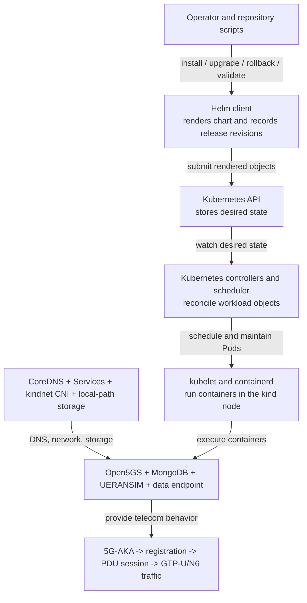

The layers have different responsibilities:

1. **Repository automation** checks ownership, versions, images, secrets, and
   host safety before invoking the platform.
2. **Helm** is a rendering and release-history client. Helm is not a daemon
   that keeps Pods running after installation.
3. **Kubernetes** stores desired state and continuously reconciles controllers,
   Pods, storage, and Service endpoints.
4. **Cluster infrastructure** supplies Pod networking, stable DNS, virtual
   Service addresses, and local persistent storage.
5. **The 5G application** performs authentication, mobility/session control,
   tunnelling, and user-plane forwarding. Kubernetes cannot infer whether
   these telecom procedures succeeded, so repository validation proves them
   separately.

### 23.3 Where everything runs

Read outside-in: the Ubuntu host runs Docker; Docker runs one kind node; that
node contains both Kubernetes system components and the project namespace.

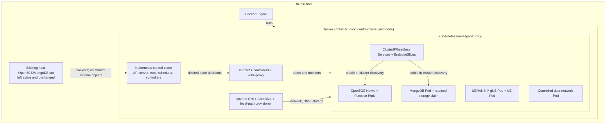

This is a **single-node** cluster: the control plane and all application Pods
share the same kind node. It proves Kubernetes packaging and reconciliation,
but it cannot prove cross-node scheduling or high availability. The Kubernetes
API is exposed only on a loopback host port. No Phase 4 application Service is
published through a `NodePort`, `LoadBalancer`, host port, or host network.

### 23.4 Kubernetes object inventory and ownership

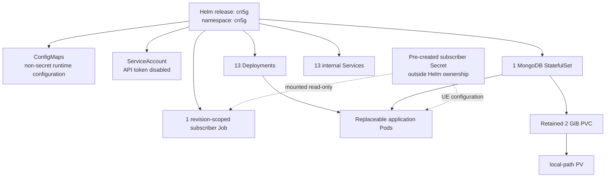

| Object | Quantity or identity | Why it exists | Lifecycle owner |
| --- | --- | --- | --- |
| Namespace | `cn5g` | API naming and project ownership boundary | project helper; retained on normal uninstall |
| Helm release | `cn5g` | one versioned package and revision history | Helm |
| Deployments | 13 | nine SBI functions, UPF, gNB, UE, and data endpoint | Helm definition; Kubernetes controller reconciliation |
| StatefulSet | 1, `cn5g-mongodb` | stable MongoDB Pod/storage association | Helm and StatefulSet controller |
| Job | `cn5g-subscriber-init-r<revision>` | finite, idempotent subscriber provisioning | Helm; exact completion checked by helper |
| Services | 13 | stable cluster DNS/virtual IPs and protocol ports | Helm; EndpointSlices updated by Kubernetes |
| ConfigMaps | Open5GS and UERANSIM configuration | versioned non-secret configuration | Helm |
| Secret | `cn5g-subscriber` | synthetic authentication and UE material | pre-created by project helper, deliberately not Helm-owned |
| ServiceAccount | `cn5g-workload` | explicit workload identity without API access | Helm |
| PVC/PV | 2 GiB ReadWriteOnce claim and local-path backing volume | database state beyond the MongoDB Pod lifetime | StatefulSet creates claim; keep policy retains it |

There are two ownership chains that must not be confused:

```text
Helm release -> Deployment -> ReplicaSet -> Pod -> container
Helm release -> StatefulSet -> MongoDB Pod -> mounted PVC -> PV
```

Helm owns the declared release objects. Kubernetes controllers own the
replaceable runtime objects beneath them. The retained PVC and pre-created
subscriber Secret intentionally cross a normal release-uninstall boundary.

### 23.5 Component and protocol connectivity

Read left-to-right for access/session traffic and top-to-bottom for SBI and
database dependencies. The labels on arrows identify the actual protocol and
port, not merely a conceptual relationship.

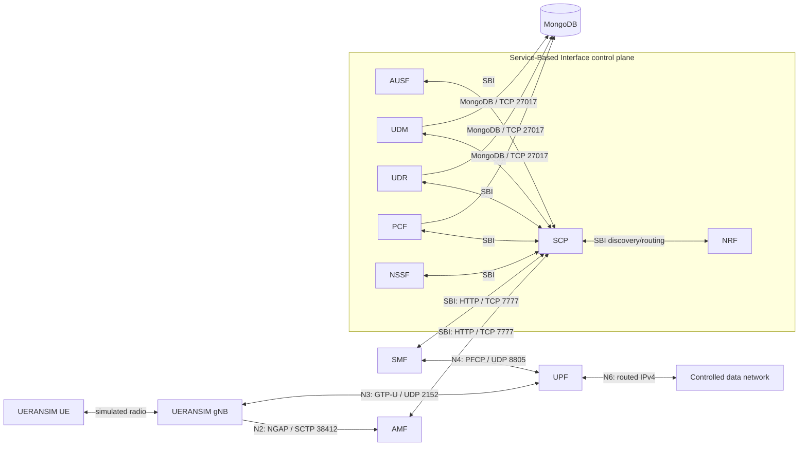

The diagram groups the SBI functions to keep the picture readable. The nine
NRF profiles validated in the accepted release are NRF, SCP, AMF, AUSF, UDM,
UDR, PCF, NSSF, and SMF. UPF is controlled through PFCP rather than registered
as an SBI Network Function in this topology.

### 23.6 Stable identities versus replaceable identities

Kubernetes treats Pods as replaceable. A Pod name and address can change after
an upgrade, rollback, restart, or manual deletion. Components therefore use a
stable name when the protocol supports it and a current runtime address only
when the protocol requires an explicit transport endpoint.

| Identity | Example | Stability | Used for |
| --- | --- | --- | --- |
| Helm release/namespace | `cn5g` / `cn5g` | stable until explicit removal | ownership and lifecycle scope |
| Service DNS | `cn5g-nrf.cn5g.svc.cluster.local` | stable across Pod replacement | SBI advertisement and discovery |
| ClusterIP | allocated from `10.96.0.0/16` | stable for the Service lifetime | in-cluster virtual endpoint |
| Pod IP | allocated from `10.244.0.0/16` | replaceable | process listener binding and current transport endpoint |
| EndpointSlice entry | current Pod IP selected by labels | automatically updated | Service-to-Pod forwarding |
| UE session address | `10.60.0.2/24` in the accepted single-UE run | session identity, separate from Pod IP | inner subscriber packet source |
| UPF TUN gateway | `10.60.0.1/24` | configured data-plane gateway | UE subnet termination |
| node-side veth name | generated, for example `veth...` | replaceable | exact kind-node return route to the current UPF Pod |

This distinction explains why the release needs application-aware convergence.
Kubernetes can update a Service endpoint when a Pod changes, but Open5GS peers
may still hold cached SBI, PFCP, or GTP-U state that refers to the old process.
The helper verifies stable NRF advertisements and reconstructs the session
chain when required.

### 23.7 The four address domains

Read the diagram as nested forwarding domains. Addresses from one box do not
automatically imply reachability in another box; Services, CNI routing, TUN
devices, and the explicit N6 return route connect them.

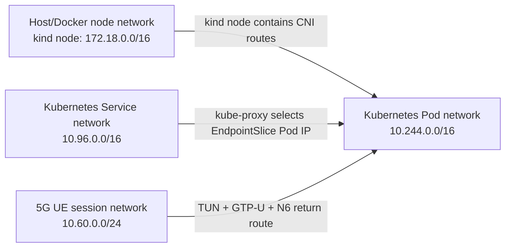

| Domain | Allocator/owner | What lives there | What it is not |
| --- | --- | --- | --- |
| Docker/kind node network | Docker | kind node container and loopback-published API path | the application Pod network |
| Pod network | kindnet CNI | one IP per Pod | a stable service identity or UE address pool |
| Service network | Kubernetes | virtual ClusterIP addresses and DNS names | a real interface inside an application container |
| UE session network | SMF/UPF configuration and UERANSIM session | inner subscriber addresses on `uesimtun0` and `ogstun` | a Kubernetes Pod or Service subnet |

### 23.8 Registration and authentication sequence

Read top-to-bottom. The sequence intentionally separates radio/NAS signalling
from the HTTP-based core-service interactions it triggers.

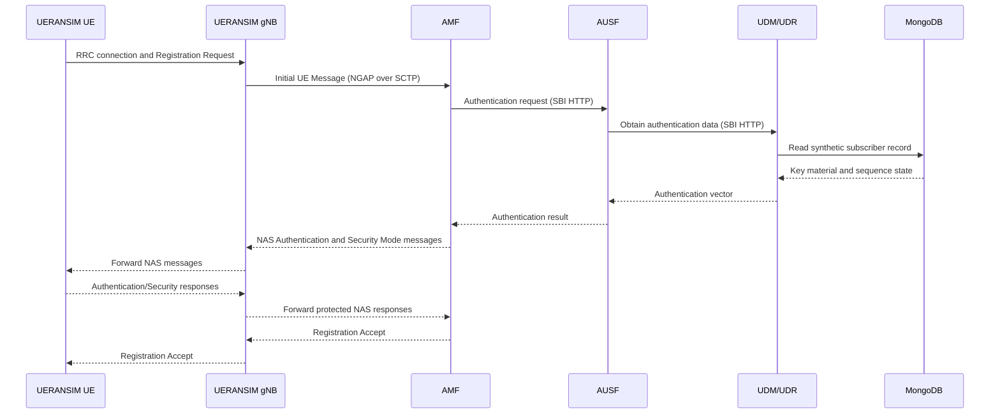

The acceptance validator does not infer registration from a Running Pod. It
checks component evidence for the SCTP association, NG Setup, 5G Authentication
and Key Agreement (5G-AKA), Non-Access Stratum (NAS) security activation, and
the final registered UE state.

### 23.9 PDU session control sequence

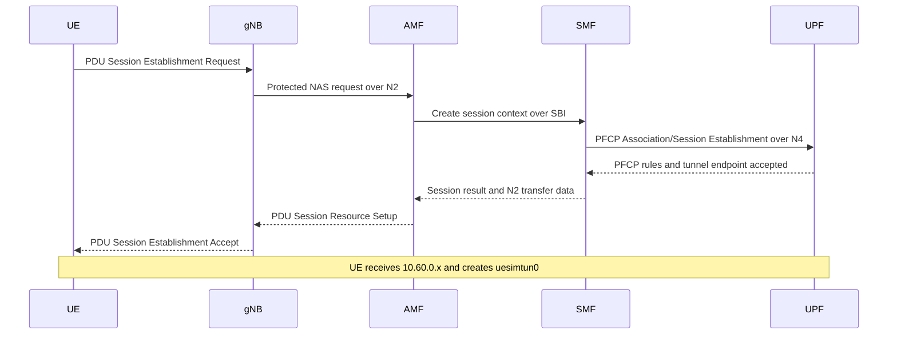

PFCP programs the UPF with the relationship between the UE address, the gNB's
GTP-U endpoint, and the N6 forwarding path. A successful NAS accept is
therefore necessary but not sufficient; Phase 4 also checks PFCP session and
GTP-U session evidence.

### 23.10 User-plane packet path

Follow the numbered arrows for the request. The response traverses the same
elements in reverse, but the kind-node return route is what directs the UE
subnet back to the current UPF Pod.

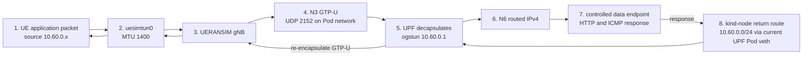

The route is installed **inside the disposable kind node**, not in the Ubuntu
host network namespace. It is marked with project-specific protocol and metric
values, checked against the current UPF Pod IP and node-side veth, reconciled
after address-changing rollouts, and removed during scoped uninstall/cluster
cleanup.

Phase 4 proves bidirectionality in two independent ways:

- controlled HTTP and ICMP requests receive valid responses; and
- both UE and UPF TUN receive/transmit counters increase during that traffic.

### 23.11 Configuration and secret delivery

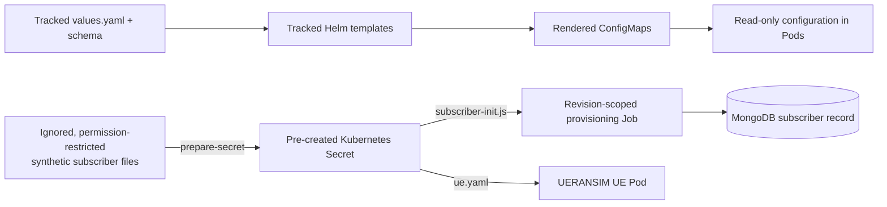

The repository contains templates and generation logic, not live subscriber
credentials. Kubernetes Secret data is base64-encoded API content, not
encryption. The helper therefore validates local file permissions and exact
Secret ownership/content without printing authentication material. Helm only
receives the name of the existing Secret.

At container startup, tracked configuration placeholders such as the current
Pod IP are resolved into a writable temporary copy. The tracked ConfigMap
remains immutable from the process's point of view, and no live container is
manually edited.

### 23.12 Startup, readiness, and dependency convergence

Read this as a gate chain: the next functional layer is accepted only after
the previous one is proven.

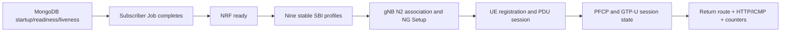

- A **startup probe** gives a slow-starting process time before liveness is
  evaluated.
- A **readiness probe** controls whether a Pod is eligible as a Service
  endpoint.
- A **liveness probe** detects a process that should be restarted.
- Repository convergence goes further than all three: it verifies nine stable
  NRF profiles and the complete current PFCP/GTP-U session chain.

This extra convergence is necessary because application caches can be stale
even when every container process is alive and every basic probe passes.

### 23.13 Security and privilege map

```text
No added Linux capabilities
├── MongoDB and subscriber Job
├── nine Open5GS SBI control-plane functions
├── UERANSIM gNB
└── controlled data-network endpoint

CAP_NET_ADMIN only (effective mask 0x1000)
└── UPF + /dev/net/tun

CAP_NET_ADMIN + CAP_NET_RAW (effective mask 0x3000)
└── UE + /dev/net/tun
```

| Control | Accepted Phase 4 behavior |
| --- | --- |
| Container user | non-root image users where supported |
| Capability baseline | drop `ALL`, add only UPF/UE network capabilities shown above |
| Privileged mode | disabled for every workload |
| TUN mount | present only in UPF and UE |
| Privilege escalation | disabled |
| Seccomp | `RuntimeDefault` |
| Root filesystem | read-only where application behavior permits; writable temporary volumes are explicit |
| Kubernetes API token | automatic mounting disabled |
| RBAC | no Role or RoleBinding because workloads do not call the API |
| External exposure | no application NodePort, LoadBalancer, host port, or host network |

The gNB does not receive `NET_RAW` merely because it carries SCTP/GTP-U; the
kernel and ordinary sockets provide what it needs. The UE receives `NET_RAW`
because its health and controlled validation include raw-network operations.

### 23.14 MongoDB persistence lifecycle

Read the state diagram clockwise. The Pod is replaceable; the PVC/PV identity
is the persistence boundary.

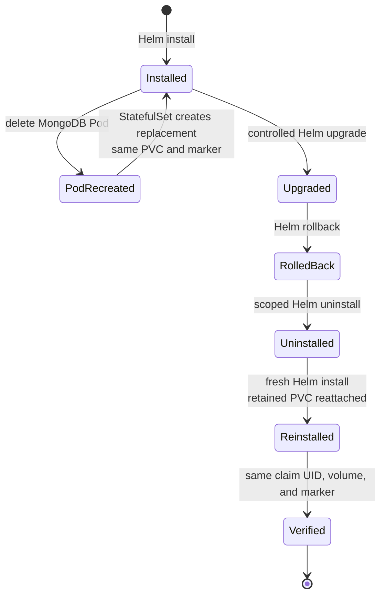

The test wrote a synthetic evidence marker, then verified:

1. MongoDB Pod identity changed after deletion;
2. PVC identity did not change;
3. the marker survived Pod recreation;
4. the same claim survived upgrade and rollback;
5. uninstall retained the bound claim; and
6. a fresh Helm release reattached it and recovered the marker.

This proves persistence across the tested workload/release lifecycle. It does
not prove survival after deletion of the kind node because local-path storage
resides in that disposable node.

### 23.15 Helm lifecycle and application-aware recovery

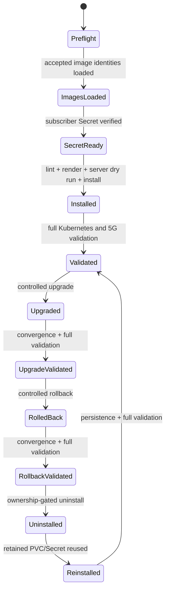

The lifecycle helper adds safeguards that plain Helm commands do not provide:

- verifies accepted host and kind-runtime image identities;
- validates the existing Secret without disclosing it;
- performs Helm lint, deterministic render, schema, and API dry-run gates;
- waits for the exact revision-scoped subscriber Job and all controllers;
- verifies stable Service DNS advertisements and exactly nine NRF profiles;
- rebuilds address-sensitive state in the order UPF, SMF, gNB, and UE when
  required;
- reconciles the exact project-marked N6 return route;
- resumes interrupted upgrade, rollback, repair, and uninstall operations from
  identity-checked state; and
- deletes only exact, labeled, annotated project resources.

### 23.16 Why the controlled recovery order matters

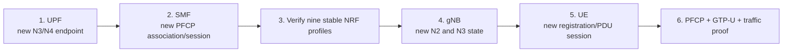

Restarting these components in arbitrary order can leave one process caching
an address or session from the previous Pod generation. The order reconstructs
the dependency chain from the user-plane anchor outward, then creates a fresh
UE session only after the core peers are current.

### 23.17 Engineering problems found and resolved

| Observed problem | Root cause | Permanent engineering response |
| --- | --- | --- |
| digest-pinned MongoDB image could not be loaded by its `tag@digest` reference | kind imports local Docker archives and containerd records different repository aliases/configuration identities | verify the accepted upstream digest, create an exact local export tag, then compare the runtime configuration identity actually loaded into kind |
| Pods were Ready but UE convergence failed after replacement | replaceable Pod addresses left stale NRF, PFCP, SCTP, or GTP-U state | advertise stable SBI Service names and perform ordered, application-aware session-chain recovery |
| Helm 4 upgrade rejected `RollingUpdate` to `Recreate` | server-side apply retained the incompatible `rollingUpdate` field during the strategy transition | perform an ownership-checked Deployment strategy migration and server-side preview before Helm applies the new revision |
| interrupted install/upgrade/rollback left a failed release | Helm revision state, PVC state, and live resources could diverge | make operations resumable from exact release revision, resource ownership, and PVC identity |
| historical subscriber Jobs remained after lifecycle trials | old revision-scoped Jobs were not part of the current release manifest | remove only completed Jobs matching exact project labels, annotations, and names |
| N6 response path broke when the UPF Pod changed | the kind-node route still referenced an obsolete Pod IP/veth | identify the current node-side interface and reconcile one ownership-marked route |

These fixes are part of the platform contract rather than undocumented manual
repair steps.

### 23.18 Validation architecture

Read left-to-right. A later gate never substitutes for an earlier one.

```mermaid
flowchart LR
    STATIC["Static gates<br/>shell, Python, YAML, Helm lint/render"]
    API["API gates<br/>server dry run and object ownership"]
    READY["Platform gates<br/>controllers, Pods, Jobs, Services, PVC"]
    CONTROL["5G control gates<br/>NRF, N2, AKA, NAS, registration, PDU"]
    USER["5G user-plane gates<br/>PFCP, GTP-U, N6, HTTP, ICMP, counters"]
    LIFE["Lifecycle gates<br/>persistence, upgrade, rollback, uninstall/reinstall"]
    SECURITY["Security/resource gates<br/>capabilities and cgroup observation"]

    STATIC --> API --> READY --> CONTROL --> USER --> LIFE --> SECURITY
```

| Validation layer | Evidence accepted in Phase 4 |
| --- | --- |
| Packaging | strict Helm lint, deterministic rendering, schema-negative tests |
| Kubernetes API | server-side dry run and project ownership checks |
| Workload state | 13 Deployments Ready, MongoDB StatefulSet Ready, exact Job Complete |
| Discovery | stable advertised SBI names and exactly nine NRF profiles |
| Access/control | N2 SCTP association, NG Setup, 5G-AKA, NAS security, registration |
| Session | IPv4 PDU session, PFCP association/session, GTP-U session |
| User plane | N6 return route, HTTP, ICMP, and positive UE/UPF bidirectional TUN deltas |
| Security | UPF `0x1000`, UE `0x3000`, data endpoint zero capabilities, no privileged Pods |
| Persistence | same PVC UID/PV and marker across all tested lifecycle boundaries |
| Release operations | upgrade, rollback, uninstall, fresh reinstall, and revalidation |

### 23.19 Resource observations and accepted scheduling values

The bars below show measured average CPU relative to each accepted CPU
request. They are visual scheduling evidence, not performance benchmarks.

```text
Component/profile       Observed average       Accepted request
MongoDB                 143-170 mCPU  █████████████████   200 mCPU
Open5GS control plane    12-22 mCPU   ██                 25 mCPU
UPF                          14 mCPU   █                  20 mCPU
Data endpoint              6-8 mCPU   █                  10 mCPU
gNB                       11-15 mCPU   █                  25 mCPU
UE                        16-17 mCPU   ██                 25 mCPU
```

| Component/profile | Current memory observed | Peak observed | Request | Limit |
| --- | ---: | ---: | ---: | ---: |
| MongoDB | 217-222 MiB | 380-381 MiB | 256 MiB | 768 MiB |
| Open5GS control-plane functions | 6-40 MiB | within the observed range per function | 64 MiB | 256 MiB |
| UPF | 7-12 MiB | 13-17 MiB | 64 MiB | 384 MiB |
| Data endpoint | 3 MiB | 7-8 MiB | 16 MiB | 64 MiB |
| gNB | 7-11 MiB | 13-17 MiB | 96 MiB | 512 MiB |
| UE | 9 MiB | 11-12 MiB | 96 MiB | 512 MiB |

Two ten-second cgroup v2 observations were taken in the validated single-UE
steady state, including one after the requests were applied. Requests reserve
scheduling capacity; limits bound consumption. These measurements must be
revisited under Phase 5 concurrency and Phase 7 load before any capacity claim.

### 23.20 Operator workflow

The normal command path is intentionally short; the helper performs the
identity, ownership, readiness, convergence, and validation checks behind each
operation.

```text
preflight
  -> create kind cluster
  -> load accepted images
  -> prepare synthetic subscriber Secret
  -> install
  -> validate
  -> test persistence
  -> upgrade and validate
  -> rollback and validate
  -> observe resources
  -> uninstall/reinstall and verify persistence
  -> capture reviewed host state
```

Exact commands, expected output, recovery paths, and destructive confirmation
boundaries are maintained in the [automation reference](../scripts/README.md#helm-managed-single-ue-lifecycle).

### 23.21 Accepted end state after Phase 4

```text
Local cluster       kind cn5g, one control-plane node
Application scope   namespace cn5g, Helm release cn5g
Workloads           13 Deployments + 1 MongoDB StatefulSet
Finite work         1 completed revision-scoped subscriber Job
Discovery           13 internal Services; 9 stable NRF SBI profiles
Persistence         retained 2 GiB MongoDB PVC/PV
Subscriber path     one synthetic UE, IPv4 10.60.0.x/24
Data path           UE TUN <-> gNB <-> GTP-U <-> UPF <-> N6 endpoint
Security            no privileged Pods; narrowly scoped capabilities/TUN mounts
Exposure            cluster-internal application Services only
Validation          phase04_validation=pass
Lifecycle           upgrade, rollback, uninstall/reinstall, persistence passed
```

The accepted test history included a controlled upgrade to revision 10,
rollback of revision-7 configuration as revision 11, and a full
uninstall/reinstall that intentionally reset Helm history to revision 1 while
preserving the same MongoDB claim and evidence marker. Revision numbers are
release history, not software versions.

### 23.22 Compact architecture narrative

The Phase 4 platform is a Helm-packaged, single-node Kubernetes deployment of
Open5GS, MongoDB, UERANSIM, and a controlled data endpoint. Helm renders and
versions the Kubernetes objects; Kubernetes controllers reconcile Pods;
CoreDNS and internal Services provide stable discovery; kindnet routes Pod
traffic; a retained PVC holds MongoDB state; and narrowly privileged TUN
workloads implement the subscriber data path. SBI uses stable Service DNS,
while N2, N3, and N4 use current transport endpoints. One project-marked route
inside the kind node returns the UE subnet to the current UPF Pod. Acceptance
requires both Kubernetes health and real 5G evidence: N2/NGAP, 5G-AKA, NAS
security, registration, PDU session, PFCP, GTP-U, N6 traffic, tunnel counters,
persistence, and release lifecycle all passed.

### 23.23 Phase 4 acceptance result

The Phase 4 exit gate is accepted because:

- `helm lint`, schema validation, and deterministic rendering pass;
- installation reaches meaningful Ready state;
- stable Service discovery converges to exactly nine NRF profiles;
- one synthetic UE completes 5G-AKA, NAS security, registration, and an IPv4
  PDU session;
- PFCP and bidirectional GTP-U/N6 traffic are proven independently;
- requests, limits, capabilities, TUN mounts, ServiceAccount, and RBAC match
  observed and minimum-required behavior;
- MongoDB persistence matches ADR-0004 across every tested boundary;
- upgrade, rollback, scoped uninstall, and reinstall pass; and
- post-phase host state contains only the expected project-owned cluster,
  Docker-network, route/firewall, storage, and resource changes.

Phase 5 therefore used this one-UE release as its stable starting and rollback
point. It changed subscriber/configuration generation and workload concurrency
without weakening the Phase 4 lifecycle, persistence, network, security, or
validation gates.

---

## 24. How Close Is This To A Real Deployment?

This work is a professional local integration and operations baseline. It is
not a claim of production readiness.

### 24.1 Practices that transfer directly

The following methods are representative of real Kubernetes engineering:

- immutable, pinned container inputs;
- declarative API objects;
- controller-managed workloads rather than manually maintained Pods;
- stable Service discovery and explicit endpoint selection;
- configuration and secret separation;
- startup, readiness, and liveness semantics;
- resource requests and limits;
- non-root containers, dropped capabilities, seccomp, ServiceAccounts, and
  least-privilege RBAC;
- persistent storage claims;
- Helm charts, schemas, releases, upgrades, rollback, and scoped uninstall;
- repeatable validation and negative controls; and
- evidence-backed architecture decisions and cleanup.

### 24.2 Local simplifications

| Local baseline | Typical production difference |
| --- | --- |
| one kind node inside Docker | multiple physical or virtual nodes, often with separate control-plane nodes |
| one control-plane replica | redundant control plane and failure-domain planning |
| kindnet CNI | production CNI selected for policy, performance, routing, and observability requirements |
| local-path storage | Container Storage Interface driver backed by durable, monitored storage |
| locally loaded images | authenticated container registry, signing, scanning, and promotion workflow |
| one synthetic UE in Phase 4 | measured concurrency and capacity targets |
| software TUN and ordinary kernel networking | possible Multus, SR-IOV, DPDK, huge pages, CPU isolation, and hardware acceleration for demanding user planes |
| loopback-only API | secured operator/automation access across managed networks |
| no external load balancer or ingress | controlled north-south exposure and production Domain Name System/certificates where required |
| generated synthetic Secrets | external secret management, encryption at rest, rotation, and audit controls |
| cluster recreated on one workstation | backup, disaster recovery, upgrades, node maintenance, and multi-zone behavior |

### 24.3 What the local system can legitimately demonstrate

It can demonstrate that the application is packaged declaratively, that
Kubernetes reconciliation and networking work for the tested topology, that
privileges are minimized, and that the complete 5G signalling and user path is
reproducible in a controlled cluster.

It cannot yet demonstrate production availability, geographic redundancy,
carrier-scale throughput, public-cloud portability, zero-downtime upgrades,
or hardened multi-tenant isolation.

### 24.4 Containerized is not automatically cloud-native

Putting an existing daemon in a Pod makes it containerized. Cloud-native
operation additionally requires that configuration, health, identity,
persistence, replacement, upgrade, observation, and failure behavior fit the
orchestrator's model.

Phase 4 tests that operational fit for one UE. Later phases add concurrent
UEs, observability, performance, recovery, Continuous Integration, and supply
chain evidence before any broader claim is made.

---

## 25. Failure-Oriented Mental Model

When something fails, identify the layer before changing configuration.

| Symptom | First layer to inspect | Typical evidence |
| --- | --- | --- |
| object rejected immediately | API/schema/Helm rendering | Helm lint output, API validation message |
| Pod remains Pending | scheduler, resources, volume, node constraints | Pod events and conditions |
| Pod shows ImagePullBackOff | image name, digest, registry/runtime availability | Pod events, node image inventory |
| container restarts | process exit, liveness, memory limit | previous logs, exit code, restart reason |
| Pod Running but not Ready | readiness or application dependency | probe output, Pod conditions, endpoints |
| Service resolves but connection fails | selector, EndpointSlice, protocol/port, NetworkPolicy | Service YAML, EndpointSlices, direct Pod test |
| direct Pod connection works but Service fails | Service/kube-proxy path | ClusterIP rules and endpoint selection |
| N2 association fails | SCTP reachability or AMF/gNB advertised addresses/configuration | direct SCTP test, both component logs |
| PFCP session absent | SMF/UPF discovery, N4 address, protocol configuration | SMF and UPF logs, UDP/8805 packets |
| UE registers but user traffic fails | PDU session, GTP-U, TUN, routes, MTU, N6 return path | session logs, routes, TUN counters, UDP/2152 packets |
| data works one way only | return route, reverse-path filtering, NAT | route lookup in each namespace and counters |
| data disappears after Pod replacement | storage was ephemeral or claim was incorrect | Pod mounts, PVC/PV state, storage policy |

Do not use a broad privilege increase as the first diagnostic. A failed
minimum-permission test is more informative than a successful privileged Pod.

---

## 26. Concise Architecture Narrative

The platform uses pinned container images as the execution artifact and
Kubernetes as the desired-state control system. A disposable single-node kind
cluster runs inside Docker for local reproducibility. Kubernetes control-plane
components store and reconcile API objects; kubelet and containerd run Pods;
kindnet supplies Pod networking; CoreDNS and ClusterIP Services provide stable
application discovery; and Helm packages the complete application as a
versioned release.

SBI traffic uses Kubernetes Services and DNS, while N2, N3, N4, and N6 use
explicit endpoint and routing decisions because 5G protocols can advertise
addresses or carry tunneled subscriber traffic. Phase 3 proved TCP, UDP,
SCTP, TUN, minimum Linux capabilities, a bidirectional synthetic N6 return
path, packet visibility, and exact cleanup. Phase 4 then replaced the
synthetic protocol-port probes with Helm-managed Open5GS, MongoDB, and
UERANSIM workloads and proved real registration, PFCP, GTP-U, persistence,
upgrade, rollback, and uninstall/reinstall behavior.

This narrative is short enough to state without losing the distinction
between container execution, Kubernetes orchestration, Helm packaging, and 5G
protocol validation.

---

## 27. Glossary

| Term | Plain-language definition |
| --- | --- |
| API | A defined interface through which software submits and reads Kubernetes objects |
| API server | The authenticated front door for Kubernetes state and operations |
| Cluster | The control plane, nodes, networking, storage integration, and API state together |
| CNI | Container Network Interface; the plugin contract used to configure Pod networking |
| Container | An isolated process environment created from an image |
| containerd | The container runtime used inside the kind node |
| Controller | Software that repeatedly moves current state toward desired state |
| CoreDNS | The cluster DNS service used to resolve Service names |
| Desired state | The configuration declared in an object's `spec` |
| Deployment | A controller for replaceable stateless Pods and their rollouts |
| EndpointSlice | An API object listing network endpoints behind a Service |
| etcd | The consistent key-value store containing Kubernetes API data |
| Helm chart | A package of templates, default values, metadata, and dependencies |
| Helm release | One installed instance of a chart |
| Job | A controller for a task that should complete and stop |
| kind | Kubernetes IN Docker; a tool that creates Kubernetes nodes as containers |
| kube-apiserver | The process that exposes and validates the Kubernetes API |
| kube-controller-manager | The process running core reconciliation controllers |
| kube-proxy | The node component implementing Service forwarding in this cluster |
| kube-scheduler | The control-plane component that assigns Pods to nodes |
| kubeconfig | Client configuration containing cluster endpoint, trust, identity, and context |
| kubelet | The node agent that ensures assigned Pod containers run |
| kubectl | A command-line Kubernetes API client |
| Label | Queryable key/value metadata used for organization and selection |
| Namespace | A logical naming and policy scope for namespaced objects |
| Node | A compute environment on which Pods are scheduled |
| PersistentVolume | A Kubernetes representation of backing persistent storage |
| PersistentVolumeClaim | A workload's request for persistent storage |
| Pod | The smallest scheduled Kubernetes unit, containing one or more containers |
| Probe | A repeated diagnostic used for startup, readiness, or liveness decisions |
| RBAC | Role-Based Access Control; Kubernetes API authorization through roles and bindings |
| Reconciliation | Repeated comparison and correction of desired versus current state |
| ReplicaSet | The controller that maintains a specified count of matching Pods, normally under a Deployment |
| Request | CPU or memory quantity used for scheduling and resource guarantees |
| Resource limit | Enforced upper CPU or memory boundary for a container |
| Secret | Kubernetes object for controlled sensitive-data delivery; base64 alone is not encryption |
| Service | Stable virtual endpoint and discovery abstraction for selected Pods |
| ServiceAccount | A non-human Kubernetes identity assigned to workloads |
| StatefulSet | Controller for Pods needing stable identity or storage association |
| StorageClass | Description of a storage provisioning class and policy |
| TUN | A virtual network device that exchanges IP packets between userspace and the kernel |
| `veth` | A paired virtual Ethernet interface used to connect network namespaces |

---

## 28. Phase 4 Foundation And Verified Outcome

A reader understands the foundation and accepted Phase 4 outcome when they
can explain the following without treating the terms as interchangeable:

- an image is the packaged filesystem; a container is a running process
  environment; a Pod is the Kubernetes scheduling and network unit;
- a Deployment or StatefulSet manages Pods; a Service discovers selected
  ready Pods;
- Kubernetes records desired state and controllers reconcile actual state;
- a Pod IP is replaceable while a Service name is stable;
- the node, Pod, Service, and UE session ranges are separate address domains;
- a ConfigMap is non-secret configuration and base64 in a Secret is not
  encryption;
- a StatefulSet supplies identity while PVC/PV storage supplies persistence;
- startup, readiness, and liveness probes answer different questions;
- requests affect scheduling while limits constrain runtime consumption;
- RBAC controls API access while Linux capabilities control kernel privileges;
- Helm renders and submits Kubernetes objects but Kubernetes performs ongoing
  reconciliation;
- Phase 3 proved infrastructure primitives, while Phase 4 proved real NGAP,
  PFCP, GTP-U, and N6 behavior; and
- the accepted Phase 4 result combines Kubernetes lifecycle gates, real 5G
  functional gates, least privilege, measured resource requests, and retained
  MongoDB persistence.

---

## 29. Technical Documentation Index

After this foundation, use the following review order:

1. [Project status](project-status.md) — completed gates, current boundary,
   and claims that remain unproven.
2. [Repository overview](../README.md) — verified deployment hierarchies,
   address layers, and target architecture.
3. [Phase 2 Docker Compose architecture](architecture/phase-02-compose-topology.md)
   — component roles, interfaces, addressing, signalling sequence, health
   dependencies, security boundaries, and lifecycle model.
4. [Image provenance](image-provenance.md) — immutable inputs, multi-stage
   build design, identities, runtime users, and Linux capabilities.
5. [Docker Engine installation runbook](runbooks/docker-engine-installation.md)
   — pinned runtime installation, host impact, verification, and rollback.
6. [Compose baseline runbook](runbooks/compose-baseline.md) — exact build,
   deployment, validation, diagnostics, persistence, and cleanup.
7. [Phase 2 validation report](../reports/02_container_baseline.md) — accepted
   functional and coexistence evidence.
8. [Phase 4 complete visual system guide](#23-phase-4-complete-system-and-operational-model)
   — layered architecture, object ownership, address domains, signalling,
   user plane, storage, security, lifecycle, recovery, validation, and
   resource model.
9. [Phase 4 validation summary](../reports/README.md#phase-4-single-ue-kubernetes-validation-summary)
   — concise real 5G, lifecycle, persistence, security, resource, and
   limitation evidence.
10. [CN5G chart reference](../charts/cn5g/README.md) — Kubernetes object,
   network, recovery, security, resource, and accepted-scope model.
11. [Automation reference](../scripts/README.md) — exact Phase 3 and Phase 4
    lifecycle commands, ownership boundaries, and cleanup behavior.
12. [Architecture Decision Records](adr/README.md) — decisions, alternatives,
    evidence, consequences, and reversal boundaries.
13. [Phase 5 implementation model](#31-phase-5-multi-ue-and-dnn-implementation-model)
    — deterministic identity derivation, StatefulSet ordinals, two-DNN
    topology, source-policy isolation, controlled migration, and runtime gate.
14. [Phase 6 observability model](#32-phase-6-observability-and-operational-mental-model)
    — metrics, logs, dashboards, alerts, sidecar probes, persistence, and
    operational troubleshooting.
15. [Phase 7 experiment model](#33-phase-7-controlled-performance-and-capacity-experiment)
    — route enforcement, controlled workload, clean-state boundaries,
    repeated analysis, retained failures, results, and rollback.
16. [Complete accepted-system architecture](architecture/complete-system-architecture.md)
    — Helm and Kubernetes ownership, every Pod/container, 5G and telemetry
    interfaces, address/port inventory, probes, storage, security, and a
    registration-to-ping walkthrough.

Raw logs, host snapshots, runtime state, kubeconfigs, Secrets, keys, and packet
captures remain local and ignored by default. Public reports contain only
synthetic, reviewed evidence. Availability, security, scale, performance, and
recovery claims require their own reproducible phase evidence.

---

## 30. Authoritative References

- [Kubernetes concepts](https://kubernetes.io/docs/concepts/)
- [Kubernetes components](https://kubernetes.io/docs/concepts/overview/components/)
- [Kubernetes workloads](https://kubernetes.io/docs/concepts/workloads/)
- [Kubernetes Services](https://kubernetes.io/docs/concepts/services-networking/service/)
- [Kubernetes probes](https://kubernetes.io/docs/concepts/workloads/pods/probes/)
- [Kubernetes persistent volumes](https://kubernetes.io/docs/concepts/storage/persistent-volumes/)
- [Kubernetes security contexts](https://kubernetes.io/docs/tasks/configure-pod-container/security-context/)
- [Kubernetes ServiceAccounts](https://kubernetes.io/docs/concepts/security/service-accounts/)
- [Kubernetes RBAC](https://kubernetes.io/docs/reference/access-authn-authz/rbac/)
- [kind documentation](https://kind.sigs.k8s.io/docs/user/quick-start/)
- [Helm introduction](https://helm.sh/docs/intro/introduction/)
- [Helm chart template guide](https://helm.sh/docs/chart_template_guide/)

---

## 31. Phase 5 Multi-UE And DNN Implementation Model

Phase 5 was accepted on 2026-08-05 after five concurrent UEs, two Data Network
Names (DNNs), negative behavior, partial-provisioning recovery, rollback,
repeat migration, persistence, and resource observation passed on the named
kind cluster. This section explains both the version-controlled design and the
runtime evidence that established the phase exit gate.

### 31.1 Why a single successful UE is not enough

The Phase 4 UE proved that one internally consistent identity could register
and establish one Protocol Data Unit (PDU) session. A concurrent topology adds
three contracts that a single-UE test cannot expose:

1. **Identity uniqueness:** every Subscriber Permanent Identifier (SUPI),
   International Mobile Subscriber Identity (IMSI), authentication value, and
   equipment identity must be unique while the simulator and database copies
   remain identical.
2. **Stable workload-to-identity mapping:** Pod replacement must not silently
   assign one subscriber's credentials to a different logical UE.
3. **Service selection:** each UE must request an authorized DNN, receive an
   address from the corresponding pool, and reach only the corresponding
   controlled endpoint.

These are configuration-management and orchestration properties in addition
to 5G protocol properties.

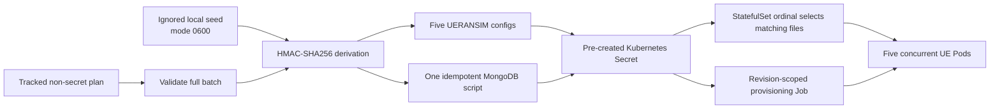

### 31.2 Deterministic does not mean public

The tracked subscriber plan contains only reserved synthetic IMSIs, equipment
identities, DNN assignments, and network contracts. Authentication K and OPc
values are not tracked. The generator creates one random 32-byte local seed
on its first run, stores it with mode `0600` below the ignored `artifacts/`
tree, and derives per-IMSI values with keyed Hash-based Message
Authentication Code using SHA-256 (HMAC-SHA256).

For a fixed plan and seed:

```text
K(IMSI)   = first 16 bytes of HMAC-SHA256(seed, "cn5g-phase05:k:" + IMSI)
OPc(IMSI) = first 16 bytes of HMAC-SHA256(seed, "cn5g-phase05:opc:" + IMSI)
```

The outputs are byte-identical on every rerun, but someone cloning the public
repository cannot recover them without the ignored seed. The generator never
prints K, OPc, or the seed. It also verifies directory mode `0700`, file mode
`0600`, the exact expected file set, and every output byte.

This design is **deterministic** because the same inputs produce the same
outputs and **idempotent** because applying it repeatedly converges to the
same intended state. Idempotence is important when a Job is retried after a
partial failure: a retry must repair missing records without duplicating
correct records or inventing new credentials.

### 31.3 Batch validation is a transaction boundary

The generator validates the entire public plan before creating or changing
runtime material. It rejects a duplicate IMSI, IMEI, or IMEISV; a
non-contiguous StatefulSet ordinal; an unsupported DNN; a changed synthetic
Public Land Mobile Network (PLMN) or slice; an overlapping address pool; and
an unsafe or unexpected file.

This is a fail-closed boundary: one invalid subscriber prevents the whole
batch from reaching MongoDB. The provisioning script then uses an upsert for
each validated IMSI, verifies that exactly five Phase 5-managed records
exist, and leaves unrelated database collections untouched.

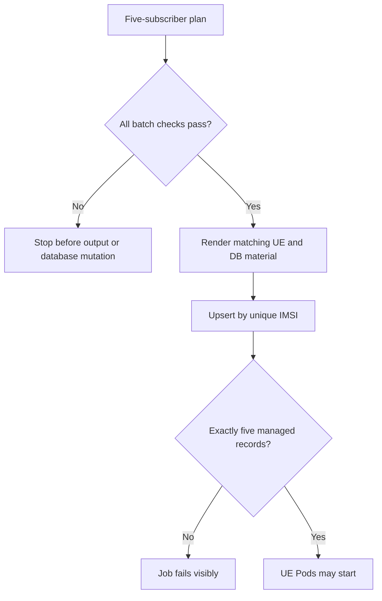

### 31.4 Why the UE controller changes to a StatefulSet

A Deployment treats its Pods as interchangeable. That is appropriate for a
stateless Network Function, but not for a five-entry identity mapping. A
StatefulSet assigns stable ordinal names:

| Ordinal | Pod identity | Secret files | DNN |
| ---: | --- | --- | --- |
| 0 | `cn5g-ue-0` | `imsi-0`, `ue-0.yaml`, `dnn-0` | `internet` |
| 1 | `cn5g-ue-1` | `imsi-1`, `ue-1.yaml`, `dnn-1` | `internet` |
| 2 | `cn5g-ue-2` | `imsi-2`, `ue-2.yaml`, `dnn-2` | `internet` |
| 3 | `cn5g-ue-3` | `imsi-3`, `ue-3.yaml`, `dnn-3` | `enterprise` |
| 4 | `cn5g-ue-4` | `imsi-4`, `ue-4.yaml`, `dnn-4` | `enterprise` |

The ordinal is an index, not a credential. Each init container extracts it
from the Kubernetes-assigned Pod name, accepts only `0` through `4`, selects
the matching files, verifies that MongoDB contains exactly one matching IMSI,
and then renders the runtime gNB address. The StatefulSet uses parallel Pod
management because the five subscribers are independent after the Job has
provisioned them. It does not create a PVC for each UE; stable identity is
needed, persistent UE filesystems are not.

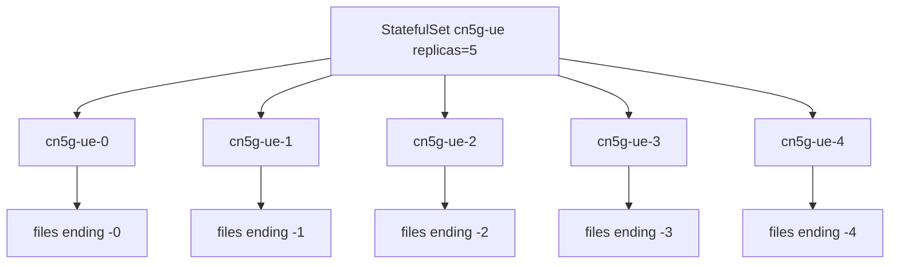

### 31.5 DNN differentiation

A DNN identifies the data network requested by a PDU session. It is similar
in purpose to an Access Point Name (APN) in earlier mobile systems. Merely
changing the DNN string would not prove differentiation. The design therefore
binds each DNN to a separate session pool, UPF TUN interface, route-policy
table, and controlled endpoint.

| DNN | UE pool | UPF gateway | TUN | Allowed endpoint |
| --- | --- | --- | --- | --- |
| `internet` | `10.60.0.0/24` | `10.60.0.1` | `ogstun` | `data-internet` |
| `enterprise` | `10.61.0.0/24` | `10.61.0.1` | `ogstun2` | `data-enterprise` |

Both sessions use the already accepted slice with Slice/Service Type (SST) 1.
This phase therefore demonstrates DNN differentiation, not differentiated
network-slice treatment.

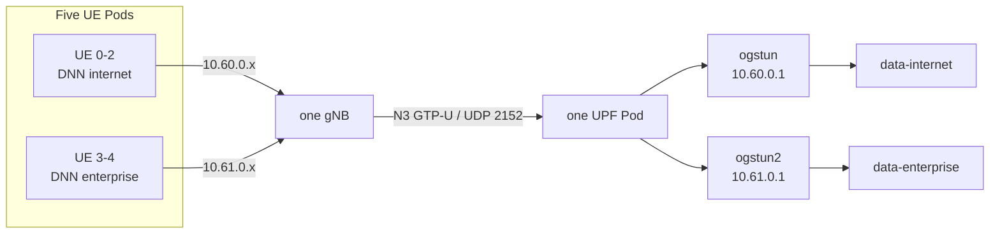

### 31.6 Source-policy isolation inside the UPF Pod

After GTP-U decapsulation, the original UE address remains the packet source.
Linux policy routing selects a routing table by that source prefix:

```text
from 10.60.0.0/24 -> table 1060 -> route only to data-internet -> unreachable default
from 10.61.0.0/24 -> table 1061 -> route only to data-enterprise -> unreachable default
```

The endpoint Services are headless, so their DNS names resolve directly to
the current endpoint Pod IPs. Each policy table contains one exact permitted
endpoint route. Its `unreachable default` is deliberate: traffic to the other
DNN's endpoint fails instead of falling through to the ordinary Pod default
route. Only the UPF setup init container receives `NET_ADMIN`, matching the
capability already required by the UPF. The endpoints keep zero effective
capabilities.

N4 uses the same direct-endpoint principle for a different reason. Phase 5
creates a dedicated headless `cn5g-upf-pfcp` Service, and the SMF uses that
name for PFCP on UDP/8805. CoreDNS therefore returns the ready UPF Pod address
instead of a virtual ClusterIP. No kube-proxy destination/source translation
is inserted into this N4 path. That distinction matters because Open5GS binds
PFCP association state to the observed peer transport address and port. With
several concurrent session procedures, a proxied UDP flow can otherwise be
observed with a translated source port and rejected as an unknown PFCP peer.
The ordinary `cn5g-upf` ClusterIP Service is retained for the general UPF
service contract; the dedicated headless Service is narrowly scoped to N4.

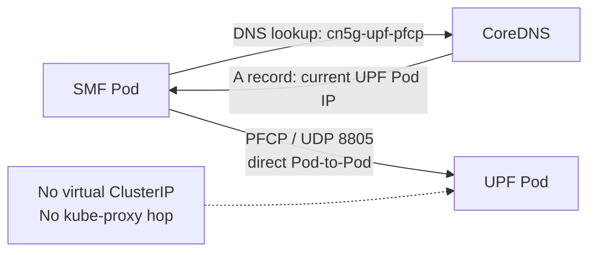

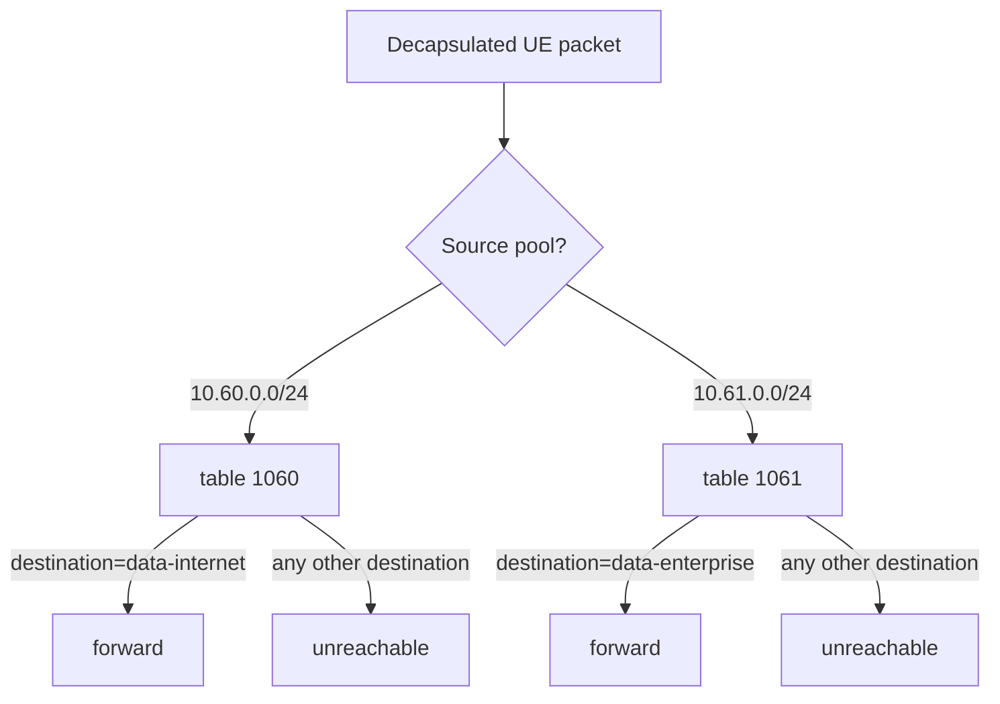

The return direction still traverses the kind node. Two exact, ownership-
checked routes return `10.60.0.0/24` and `10.61.0.0/24` through the current
UPF Pod-side virtual Ethernet interface. The routes exist inside the
disposable kind node, not in the Ubuntu host route table.

### 31.7 Controlled migration and rollback

The Phase 5 chart is an overlay. The default values still render the accepted
Phase 4 single-UE Deployment, which remains the rollback target. Before the
upgrade, the lifecycle helper records the Helm revision and MongoDB PVC
identity, then scales the old UE Deployment to zero. This prevents the old UE
and the new ordinal-zero UE from using the same synthetic identity
concurrently while Helm changes the controller kind.

The helper deliberately separates API submission from convergence. Helm first
submits the rendered revision without waiting for every UE. The helper then
waits for MongoDB, the subscriber Job, the control plane, both data endpoints,
the UPF, and the gNB. Only after that foundation is ready does it restart the
UPF, SMF, gNB, and UE StatefulSet in dependency order. This prevents a startup
deadlock in which the first UE PDU-session request occurs before the UPF is
available and Helm waits indefinitely for that UE to become ready. A missing
policy-routing table is also treated as the UPF's valid first-start state; the
table is created by the first route while subsequent route and validation
steps remain fail-closed.

The convergence boundary also quiesces the UE StatefulSet before rebuilding
network-function state. NRF, SCP, UDR, UDM, AUSF, PCF, NSSF, UPF, SMF, AMF,
and the gNB are restarted in dependency order, and the lifecycle requires nine
NRF profiles before restoring five UE replicas. This prevents failed PDU-
session retries from accumulating stale Subscription Data Management (SDM)
subscriptions in UDM while PFCP or SBI peers are still changing.

Rollback performs the inverse boundary: it scales the five-UE StatefulSet to
zero, removes only the recognized enterprise return route, rolls back to the
recorded Phase 4 revision, waits for the restored subscriber Job, deletes only
the four records still marked as Phase 5-managed, verifies the unchanged PVC,
and runs the complete Phase 4 validator. The restored Job name is read from
the active Helm manifest because a rollback reuses the target revision's
rendered object names even though Helm records the rollback itself as a new
revision. If execution stops after Helm applies the target, rerunning the same
action verifies the rollback description, PVC, Job ownership, route state,
and subscriber counts before resuming. Subscriber cleanup also recognizes its
already-complete state, so interruption after database cleanup remains safe.

```mermaid
sequenceDiagram
    participant O as Lifecycle helper
    participant H as Helm
    participant K as Kubernetes
    participant M as MongoDB PVC
    O->>O: Record revision and PVC identity
    O->>K: Scale Phase 4 UE Deployment to 0
    O->>H: Server-side dry-run Phase 5 overlay
    O->>H: Submit upgraded release
    H->>K: Replace UE controller and endpoints
    K->>M: Provision five records through Job
    O->>K: Quiesce all UE replicas
    O->>K: Wait for database, core, UPF, DNNs, and gNB
    O->>K: Rebuild SBI, PFCP, and NGAP state in dependency order
    O->>K: Require nine NRF profiles, then start five UEs
    O->>K: Reconcile two return routes
    O->>O: Run five-UE acceptance validator
```

### 31.8 Runtime acceptance matrix

Static rendering proves that the intended objects are syntactically and
structurally present. Runtime validation must additionally prove:

| Layer | Required runtime evidence |
| --- | --- |
| Kubernetes | 13 Deployments, MongoDB StatefulSet, five-ready-replica UE StatefulSet, completed exact Job |
| Database | exactly five Phase 5-managed records and no extra subscriber |
| N2 | SCTP association and successful NG Setup |
| Per UE | authentication, NAS security, registration, PDU-session success, matching ordinal/IMSI/DNN |
| Addressing | three unique `10.60.0.x` and two unique `10.61.0.x` addresses |
| Session identity | five unique UP and CP F-SEIDs correlated to the five UE addresses; no collision symptoms or PFCP peer/session-programming errors |
| User plane | intended HTTP identity and ICMP pass from every UE through its TUN |
| Isolation | cross-DNN HTTP fails for every UE |
| Counters | receive and transmit counters increase on every UE TUN |
| Security | UPF `NET_ADMIN`, UE `NET_ADMIN` + `NET_RAW`, endpoints zero; no privileged container |
| Lifecycle | PVC identity survives upgrade and rollback; Phase 4 validator passes after rollback |
| Negative behavior | duplicate identity and unsupported DNN/slice fail before generation; a non-provisioned live UE is denied without affecting five valid UEs; one removed managed record is restored by an idempotent Job |

This matrix, repeat migration, resource observation, and scoped recovery all
passed. Five Ready Pods alone would still have been insufficient: acceptance
required protocol, traffic, isolation, security, persistence, and lifecycle
evidence.

Resource observation is deliberately ordinal-aware. It samples every
singleton component, both DNN endpoints, and each of the five UE Pods over a
ten-second cgroup window, then prints the measured CPU and current/peak memory
beside the workload's declared requests and limits. These are local
five-UE steady-state observations, not capacity or production-sizing claims.

Open5GS INFO logs expose each session's user-plane and control-plane F-SEIDs,
DNN, and UE address, but not the assigned numeric GTP-U TEID. The validator
therefore does not label F-SEIDs as TEIDs. It demonstrates that five distinct
F-SEID/address correlations carry simultaneous bidirectional traffic through
five UE TUN devices and reports the narrower conclusion that no TEID collision
symptom was observed. Direct numeric TEID evidence requires a packet-level
capture and is reserved for the observability evidence phase.

The validator treats those INFO lines as event history rather than a live
session table. During an ordinal StatefulSet rollout, it retains the newest
F-SEID row for each currently assigned UE address before checking uniqueness.
Historical rows from replaced sessions therefore cannot be misreported as
concurrent session collisions.

The two runtime negative actions are intentionally separate from normal
validation. `test-invalid-ue` creates a temporary configuration Secret and a
sixth, unprovisioned UE Pod, confirms that registration never succeeds, checks
that the database still contains exactly five managed records, revalidates all
five accepted data paths while the invalid UE exists, and removes the exact
temporary objects. `test-reprovision` removes only ordinal 4's managed record,
runs a separately owned batch Job, requires the record count to return to
five, quiesces and recreates all UE Pods while reconciling the session chain,
and repeats full validation. Quiescence is enforced inside the shared recovery
primitive: replacing the gNB beneath still-running UERANSIM processes can
leave container-ready UEs with no selected radio cell. A failed
reprovision Job is retained for diagnosis; rerunning the same action is the
documented repair path. The Job uses the same 256 MiB memory ceiling as the
accepted subscriber initialization workload because `mongosh` can exceed a
128 MiB limit while loading the five-record batch script. Its lifecycle waiter
distinguishes `Complete`, `Failed`, and timeout states, so an out-of-memory or
other terminal failure is reported immediately rather than appearing only as
a generic timeout.

### 31.9 Accepted runtime evidence

The final accepted release was Helm revision 8. It used 13 Deployments, the
MongoDB StatefulSet, the five-replica UE StatefulSet, one revision-scoped
subscriber Job, and 16 cluster-internal Services. The exact Pod and session
addresses are replaceable runtime values; the stable contracts are the
Service names, StatefulSet ordinals, DNN pools, and ownership-marked routes.

| Gate | Accepted result |
| --- | --- |
| Concurrent identities | five Ready UE Pods mapped ordinals 0-4 to five distinct synthetic subscribers |
| DNN selection | ordinals 0-2 selected `internet`; ordinals 3-4 selected `enterprise` |
| Session addressing | three unique `10.60.0.x/24` and two unique `10.61.0.x/24` addresses |
| Control plane | N2 SCTP, NG Setup, nine NRF profiles, and PFCP health passed |
| Session uniqueness | five distinct user-plane and control-plane F-SEIDs; no concurrent collision symptom |
| Intended traffic | HTTP, ICMP, and bidirectional per-UE TUN counters passed for every UE |
| Isolation | every cross-DNN HTTP attempt was denied by source-policy routing |
| Least privilege | UPF used `NET_ADMIN`; UEs used `NET_ADMIN` and `NET_RAW`; both endpoints had zero effective capabilities |
| Invalid subscriber | a temporary sixth, unprovisioned UE was denied while all five accepted paths remained healthy |
| Partial provisioning | one deliberately removed managed record was restored by the idempotent Job, followed by full revalidation |
| Lifecycle | rollback restored the accepted Phase 4 topology with the same MongoDB claim; a repeat Phase 5 migration passed as revision 8 |

The accepted per-UE relationship is easier to read as a path than as a list of
objects:

```mermaid
flowchart LR
    subgraph I["internet contract"]
      IUE["UE ordinals 0-2"] --> IP["10.60.0.0/24"]
      IP --> ITUN["UPF ogstun / table 1060"]
      ITUN --> IE["data-internet only"]
    end
    subgraph E["enterprise contract"]
      EUE["UE ordinals 3-4"] --> EP["10.61.0.0/24"]
      EP --> ETUN["UPF ogstun2 / table 1061"]
      ETUN --> EE["data-enterprise only"]
    end
    IE -. "denied" .-> EE
    EE -. "denied" .-> IE
```

The ten-second five-UE steady-state observation recorded MongoDB at 162 mCPU,
241 MiB current memory, and 691 MiB peak memory. Each UE averaged 17-19 mCPU,
used 5-10 MiB current memory, and reached 11-15 MiB peak memory. Open5GS
functions averaged 15-22 mCPU except the UPF at 15 mCPU; current memory stayed
between 5 and 20 MiB for the control plane and was 7 MiB for the UPF. The two
data endpoints averaged 8-9 mCPU and used 2-3 MiB current memory. These are
observations from one local five-UE run, not throughput, capacity, availability,
or production-sizing results.

### 31.10 Operational mental model and engineering lessons

The complete Phase 5 control loop is:

```mermaid
flowchart TD
    PLAN["Tracked synthetic identity and DNN plan"] --> GEN["Validate and derive ignored secret material"]
    GEN --> SECRET["Pre-created Kubernetes Secret"]
    SECRET --> JOB["Idempotent five-record MongoDB Job"]
    JOB --> CORE["Converge NRF and core functions"]
    CORE --> SESSION["Rebuild PFCP, NGAP, and GTP-U state"]
    SESSION --> UES["Start five ordinal-bound UE Pods"]
    UES --> VALIDATE{"All identity, session, traffic, isolation, and security gates pass?"}
    VALIDATE -- No --> QUIESCE["Quiesce UEs and perform scoped dependency-order recovery"]
    QUIESCE --> CORE
    VALIDATE -- Yes --> ACCEPT["Accepted Phase 5 runtime"]
```

Several implementation details carry broader operational lessons:

- A StatefulSet ordinal is a stable identity index, not the subscriber secret
  itself. Recreated Pod `cn5g-ue-3` deterministically selects ordinal 3's
  configuration.
- Kubernetes readiness proves that a process can serve its probe. It does not
  prove that cached NRF, PFCP, NGAP, or GTP-U state has converged after peer
  Pod addresses change.
- PFCP uses the dedicated headless `cn5g-upf-pfcp` Service so the SMF reaches
  the current UPF Pod address without ClusterIP UDP translation changing the
  observed peer transport tuple.
- A route check must include the UE source address. `ip route get` without
  `from <UE-address>` does not exercise the UPF's source-policy rule and can
  report the wrong table.
- UEs are stopped while gNB and core session state is rebuilt. A container can
  remain Ready even when its simulated UE no longer has a selected radio cell.
- Recovery Jobs are evaluated as `Complete`, `Failed`, or timed out. A terminal
  failure is retained for diagnosis, and rerunning the idempotent operation is
  the documented repair path.
- Helm rollback creates a new release revision but reuses resources rendered
  by the target revision. Automation therefore discovers the active subscriber
  Job from the restored manifest instead of guessing its name.

Phase 5 establishes a reproducible multi-identity and service-selection
baseline for Phase 6 observability. It does not establish high availability,
multi-node behavior, production storage, numeric GTP-U Tunnel Endpoint
Identifier capture, carrier throughput, or general capacity beyond the five
accepted concurrent UEs.

## 32. Phase 6 Observability And Operational Mental Model

Phase 6 answers a question that Kubernetes alone cannot answer: **is the 5G
service actually working, and what evidence explains a failure?** A green Pod
only means its readiness check currently passes. It does not prove that a UE
is registered, that an SMF programmed a PFCP session, or that user traffic can
cross GTP-U and reach the selected DNN.

### 32.1 The four evidence planes

```mermaid
mindmap
  root((Operational truth))
    Platform state
      Pods and controllers
      PVC state
      CPU and memory
      Scrape health
    5G state
      Registered UEs
      PFCP sessions
      SBI profiles
    User-plane state
      Per-ordinal probe success
      Probe duration
      TUN packet counters
    Diagnostic context
      Container logs
      Kubernetes Events
      Cross-component timeline
```

Each plane answers a different question:

| Evidence plane | Main question | Source |
| --- | --- | --- |
| Platform | Did Kubernetes create and keep the requested objects healthy? | Kubernetes API, kube-state-metrics, kubelet/cAdvisor |
| 5G | Does Open5GS currently report the expected registrations and sessions? | native AMF, PCF, SMF, and UPF metrics |
| User plane | Can each UE reach only its assigned endpoint through its live session? | one bounded probe sidecar per UE |
| Diagnostics | What events and component messages explain a transition? | Alloy-collected Pod logs and Kubernetes Events in Loki |

The dashboard is useful because it places these planes next to each other. It
does not merge them into one vague “healthy” light.

### 32.2 Component connection map

```mermaid
flowchart TB
    subgraph C["cn5g namespace — service release"]
        NF["Open5GS network functions\nAMF / PCF / SMF / UPF"]
        UES["UE StatefulSet\n5 UEs + 5 probe sidecars"]
        OBJ["Deployments / StatefulSets / Jobs / PVC"]
        OUT["Container stdout and stderr"]
    end

    subgraph O["cn5g-observability namespace — telemetry release"]
        KSM["kube-state-metrics\nobject-state translator"]
        P[("Prometheus\nmetrics + PromQL + alerts")]
        A["Grafana Alloy\nlog collector"]
        L[("Loki\nlogs + LogQL")]
        G["Grafana\n4 dashboards"]
    end

    API["Kubernetes API and kubelet proxy"]
    OBJ --> API --> KSM --> P
    API -->|"node/container metrics"| P
    NF -->|"HTTP /metrics"| P
    UES -->|"five HTTP /metrics targets"| P
    OUT -->|"project-scoped API streams"| A --> L
    P --> G
    L --> G
```

- **Prometheus** is a time-series database and rule engine. It periodically
  *scrapes*—pulls—numeric metrics from HTTP endpoints and stores the samples
  with timestamps and bounded labels.
- **PromQL** (Prometheus Query Language) selects and calculates over those
  time series. Dashboards and alerts use the same query language.
- **kube-state-metrics** reads Kubernetes objects and converts fields such as
  desired replicas, available replicas, Pod readiness, Job completion, and
  PVC phase into Prometheus metrics. It does not measure CPU and does not know
  5G protocols.
- **kubelet/cAdvisor** provide node and container CPU, memory, network, and
  filesystem measurements through the authenticated Kubernetes API proxy.
- **Loki** stores logs. Unlike a full-text database that indexes every word,
  Loki indexes a deliberately small set of stream labels and stores compressed
  log content.
- **LogQL** (Loki Query Language) selects log streams and filters or aggregates
  their contents.
- **Grafana Alloy** reads only the project namespaces through the Kubernetes
  API and pushes those streams to Loki. It replaces the retired Promtail
  collector without mounting host log directories or the container runtime
  socket.
- **Grafana** is the visual layer. It contains no manually created source of
  truth: two data sources and four dashboards are provisioned from Git.

### 32.3 Why a probe sidecar is needed

Open5GS can report that a session exists, but a control-plane session record
does not prove that an application response crosses the complete user plane.
Each UE Pod therefore contains a small non-root sidecar. A **sidecar** is a
second container in the same Pod that assists the main process. Containers in
one Pod share its network namespace, so the sidecar can use the TUN interface
created by UERANSIM without receiving subscriber credentials.

```mermaid
sequenceDiagram
    participant S as UE probe sidecar
    participant T as uesimtun0
    participant R as gNB
    participant U as UPF
    participant D as assigned DNN endpoint
    participant P as Prometheus

    S->>T: bind HTTP source to UE session address
    T->>R: simulated radio user plane
    R->>U: N3 GTP-U / UDP 2152
    U->>D: route through selected DNN
    D-->>S: HTTP response over return path
    S->>S: update success, duration, RX/TX samples
    P->>S: scrape /metrics on port 9101
```

The probe runs as UID/GID 65532, drops every Linux capability, uses a read-only
root filesystem, mounts no subscriber Secret, and receives no Kubernetes API
token. Its only variable labels are five ordinals, two DNN names, and two
packet directions. This produces 20 custom series and is rejected if it grows
beyond 30.

### 32.4 Pull metrics, push logs, query both

```text
metrics producer <-- HTTP pull -- Prometheus <-- PromQL -- Grafana/alerts

log producer -- API stream --> Alloy -- push --> Loki <-- LogQL -- Grafana
```

This direction matters. A failed Prometheus scrape immediately becomes a
target-health signal. A failed log collector does not make the application
unhealthy, but it creates a diagnostic blind spot that must be visible in the
platform dashboard and collector logs.

### 32.5 Alert states and the tested lifecycle

An alert expression does not jump directly from normal to notification. Its
local lifecycle is:

```mermaid
stateDiagram-v2
    [*] --> Inactive
    Inactive --> Pending: condition becomes true
    Pending --> Firing: condition remains true for required duration
    Pending --> Inactive: condition clears early
    Firing --> Inactive: condition resolves
```

Prometheus evaluates four project rules. Three can be exercised safely without
stopping a real workload:

| Alert | Condition represented | Accepted exercise |
| --- | --- | --- |
| `Cn5gPrometheusTargetDown` | required metrics target is unavailable | fired, then resolved |
| `Cn5gWorkloadUnavailable` | requested Deployment replica is unavailable | installed; not disrupted in the bounded exercise |
| `Cn5gRegisteredUeMismatch` | AMF session count differs from five | fired, then resolved |
| `Cn5gUserPlaneProbeFailed` | one or more UE probes fail | fired, then resolved |

The exercise endpoint changes only a synthetic metric used by the real rule
expressions. A trap restores all exercise values to zero if the command is
interrupted. Alertmanager—which would send notifications to an external
receiver—is deliberately absent because no receiver and credential boundary
has been approved.

### 32.6 Persistence and ownership

```text
Helm release cn5g
└── UE probe ConfigMap, sidecars, and metrics Service port

Helm release cn5g-observability
├── Prometheus StatefulSet -> retained 2 GiB PVC, 24 h / 1 GB limit
├── Loki StatefulSet       -> retained 2 GiB PVC, 24 h retention
├── Grafana Deployment     -> 2 data sources + 4 dashboards from code
├── Alloy Deployment       -> disposable collector state
└── kube-state-metrics     -> read-only, project-scoped API access

Pre-created ignored material
└── Grafana administrator Secret
```

The separation lets telemetry be upgraded or removed without pretending it is
part of the 5G protocol service itself. Normal uninstall restores the Phase 5
core overlay and retains the two observability claims, namespace, and Grafana
Secret. Confirmed destruction is a separate operation and refuses to continue
until it can identify the exact release-owned boundary.

### 32.7 Accepted runtime evidence

The original 2026-08-05 Phase 6 acceptance and the 2026-08-06 Stage A
hardening acceptance produced this final state:

| Check | Result |
| --- | --- |
| Helm | core Phase 6 overlay active; observability revision 3 deployed |
| Kubernetes | four observability Deployments and two StatefulSets Ready; zero final restarts |
| Storage | Prometheus and Loki PVCs Bound at 2 GiB each |
| Scraping | 14 active targets; 13/13 required targets healthy; five UE targets |
| Telecom state | five AMF sessions; five active PFCP sessions |
| End-to-end probe | five of five UE probes successful |
| Cardinality | 20 custom UE series, maximum 30 |
| Logs | recent project streams returned from Loki |
| Grafana | two data sources; four Git-controlled dashboards with 48 panels; 192 MiB request and 768 MiB limit |
| Interactive stability | 2,568 seconds; same Pod; zero restart increase; 473.2 MiB peak below the 80% ceiling |
| Alerts | target-down, UE mismatch, and user-plane failure each fired and resolved |
| Regression | full Phase 5 five-UE/two-DNN validator passed |

The terminal gates were `phase06_install=pass`,
`phase06_validation=pass`, and
`phase06_alert_lifecycle=pass tested=3`. A final host-state snapshot was
captured after acceptance; its raw local data remains ignored by Git.

### 32.8 Failures found and what they teach

| Symptom | Cause | Durable correction |
| --- | --- | --- |
| Phase 5 validation saw ten addresses/F-SEIDs after UE rollout | the log parser counted historical sessions in the retained UPF log | correlate only the latest row for each current UE address |
| kube-state-metrics never became Ready | health paths were assigned to the wrong listener ports | startup uses `/healthz` on metrics; readiness uses `/readyz` on telemetry |
| Prometheus rejected the exercise target | Prometheus 3 required an explicit protocol for the intentionally minimal text endpoint | declare the Prometheus text fallback scrape protocol |
| first observability install rolled back | readiness failure was correctly enforced by rollback-on-failure | preserve the exact failed workload evidence, fix the chart, and rerun without deleting PVCs |
| dashboard port-forward lost its backend | Grafana was OOMKilled at the original 384 MiB limit while serving interactive queries | bound log results, disable runtime plugin work, adopt the measured 192/768 MiB contract, and require an identity/restart/memory soak |
| cardinality check reported 40 after session repair | the unbounded Prometheus series inventory included retained historical UE Pod identities | gate the currently active UE telemetry vector while retaining history for investigation |

These are useful Kubernetes lessons: longer timeouts do not repair a wrong
endpoint; retained logs require current-state correlation; and automatic Helm
rollback protects the release but does not replace diagnosis.

### 32.9 What the dashboards prove—and do not prove

```mermaid
flowchart LR
    M["Measured now"] --> A["readiness / restarts"]
    M --> B["CPU / memory"]
    M --> C["current 5G sessions"]
    M --> D["UE path success / probe duration"]
    M --> E["searchable recent logs"]

    N["Not yet measured"] --> F["maximum throughput"]
    N --> G["packet loss under controlled load"]
    N --> H["long-duration reliability"]
    N --> I["multi-node or HA behavior"]
    N --> J["external notification delivery"]
```

The current metrics are operational signals, not a performance benchmark.
Probe duration is not radio latency, a current session gauge is not an
availability percentage, and a short CPU sample is not capacity planning.
Phase 7 subsequently defined offered traffic, warm-up, measurement duration,
repetitions, percentiles, loss calculation, and pass/fail thresholds before it
reported any controlled local performance result.

### 32.10 Compact operator model

When investigating a problem, move from broad dependency to narrow evidence:

1. Check Helm and Kubernetes state: did the desired objects converge?
2. Check Prometheus target health: is the evidence pipeline intact?
3. Compare AMF, PFCP, and UE-probe counts: platform issue, control/session
   issue, or data-path issue?
4. Use the dashboard time window to identify when the signals diverged.
5. Query Loki for the affected component and time range.
6. Run the full Phase 5 validator before declaring recovery complete.

This is the central Phase 6 mental model: **metrics reveal the shape and time
of a problem; logs explain the component behavior; application validation
proves the service has actually recovered.**

## 33. Phase 7 Controlled Performance And Capacity Experiment

Phase 7 was accepted on 2026-08-06 after a route-enforced pilot, nine repeated
matrix conditions, deterministic analysis, scoped Helm rollback, and complete
Phase 5/6 regression validation. The phase answers a narrow question:
**how does this exact single-node, five-UE UERANSIM platform behave under a
controlled local workload?** It does not estimate carrier capacity or
production sizing.

The detailed cross-phase system containing Kubernetes, every 5G function,
sidecars, Services, ports, address domains, probes, storage, and observability
is documented separately in the [complete accepted-system architecture](architecture/complete-system-architecture.md).

There are two different acceptance states in this section. The Phase 7
benchmark campaign, analyzer, reviewed report, and rollback are accepted. The
post-analysis **fifth Grafana dashboard extension is prepared and statically
verified but is not yet runtime-accepted**. Its Deployment, scrape target, and
dashboard descriptions below explain the reviewed candidate implementation;
they become current-runtime claims only after the controlled observability
upgrade, full validator, and visual inspection pass. This distinction prevents
planned dashboard state from being presented as live evidence.

This section is deliberately written in layers. Sections 33.1 through 33.12
assume no previous Prometheus or Grafana experience. They establish the mental
model and vocabulary first. Sections 33.13 onward then describe the accepted
performance implementation, its evidence, and the prepared dashboard extension
precisely. A reader should not need to infer what a tool does from a command
name.

### 33.1 The whole phase in plain language

Before Phase 7, the project had already proved that the 5G system **worked**:
five synthetic User Equipment (UE) instances could register, create Protocol
Data Unit (PDU) sessions, and exchange traffic through the User Plane Function
(UPF).
That is functional validation. It answers “does the required behavior happen?”

Phase 7 asks a different question: **what measurements do we observe when the
same system carries a precisely declared workload?** To answer that honestly,
the phase had to control all of the following:

- how many UEs were active;
- which network path their packets used;
- how much traffic was offered;
- how long startup, measurement, and recovery lasted;
- how many times each condition was repeated;
- which component resources were observed at the same time; and
- which evidence was allowed into the final report.

The simplest end-to-end picture is:

```text
start from a known healthy platform
  -> activate 1, 3, or 5 UEs
  -> prove their test traffic will use the 5G tunnel
  -> generate a fixed, timed workload
  -> collect traffic, procedure, and resource observations
  -> repeat the condition three times
  -> analyze only complete accepted evidence
  -> restore the normal five-UE platform
  -> display the reviewed results in Grafana
```

The dashboard is the final viewing layer. Grafana did not generate the traffic,
decide whether a run was valid, or calculate the accepted report. Those jobs
belong to the benchmark runner and deterministic analyzer.

### 33.2 Kubernetes, Helm, Prometheus, and Grafana have different jobs

These four names are often shown together, but they are not interchangeable.

| Technology | Simple meaning | Exact job in this phase | What it does **not** do |
| --- | --- | --- | --- |
| Kubernetes | Runs and supervises containers | Runs the 5G Pods, benchmark sidecars, Prometheus, the reviewed-results exporter, and Grafana | It does not design the experiment or interpret a graph |
| Helm | Installs versioned Kubernetes configuration | Renders the chart templates and applies the temporary Phase 7 overlay or the observability release | It does not replace Kubernetes and it is not a metrics database |
| Prometheus | Collects and queries numeric measurements | Scrapes metric endpoints, stores timestamped samples, answers Prometheus Query Language (PromQL) queries, and supplied resource observations during the benchmark | It does not render the final dashboards and it does not run `iperf3` |
| Grafana | Queries data sources and presents visualizations | Asks Prometheus for selected reviewed metrics and displays them in panels | It is not the source of the measurements and is not the Phase 7 analyzer |
| `iperf3` | Generates measured Transmission Control Protocol (TCP) or User Datagram Protocol (UDP) traffic | Runs as a client beside each UE and as servers beside the two Data Network Name (DNN) endpoints | It does not collect Kubernetes central processing unit (CPU) or memory metrics |
| Phase 7 analyzer | Validates and reduces raw evidence | Rejects incomplete evidence and produces reviewed JavaScript Object Notation (JSON), comma-separated values (CSV), Scalable Vector Graphics (SVG), and report artifacts | It is not a continuously running cluster service |

An important professional distinction is therefore:

```text
Kubernetes runs the components.
Helm declares how those components should be installed.
Prometheus stores and queries numeric observations.
Grafana turns query results into human-readable panels.
```

### 33.3 Minimum Kubernetes and Helm vocabulary

The following terms are enough to understand the Phase 7 deployment boundary.

| Term | Precise meaning | Phase 7 example |
| --- | --- | --- |
| Container | An isolated process created from a container image | the `benchmark-client` process running `iperf3` |
| Pod | Kubernetes' smallest deployable unit; its containers share one network namespace and can share volumes | one UE container and one benchmark-client sidecar |
| Sidecar | An additional container in the same Pod that supports the main application | the benchmark client beside UERANSIM or benchmark server beside a DNN endpoint |
| Deployment | A controller for replaceable Pods with a declared replica count | Grafana and the reviewed-results exporter |
| StatefulSet | A controller that gives Pods stable ordinal identities | `cn5g-ue-0` through `cn5g-ue-4` |
| Service | A stable virtual network endpoint that selects one or more Pods | Prometheus reaching the reviewed-results exporter on TCP port 8080 |
| ConfigMap | A Kubernetes object containing non-secret configuration data | the generated reviewed metric text and Grafana dashboard JSON |
| Secret | A Kubernetes object intended for sensitive values | the pre-created Grafana administrator credentials |
| Namespace | A Kubernetes application programming interface (API) naming and ownership boundary | `cn5g` for the core and `cn5g-observability` for telemetry |
| Chart | A Helm package containing templates, default values, and files | `charts/cn5g-observability` |
| Values | Inputs that control how chart templates render | resource limits, image identities, and scrape intervals |
| Release | One installed instance of a chart tracked by Helm revisions | `cn5g-observability` |
| Overlay | An additional values file applied to a known baseline | `values-phase07.yaml`, which temporarily enabled benchmark sidecars |
| Revision | Helm's numbered record of an install, upgrade, or rollback | used to return to the exact pre-experiment configuration |

Helm performs a client-side rendering step: it combines templates with values
to produce ordinary Kubernetes objects. Kubernetes then stores their desired
state and its controllers create the corresponding Pods. A successful Helm
render proves that the YAML configuration format can be generated; it does not
by itself prove that the Pods became Ready or that a UE registered.

### 33.4 The 5G path being measured

The relevant 5G terms are:

- **User Equipment (UE):** here, one synthetic mobile device simulated by
  UERANSIM;
- **gNodeB (gNB):** the simulated 5G base station used by all active UEs;
- **User Plane Function (UPF):** the Open5GS function that forwards PDU-session
  user traffic between the access network and the selected data network;
- **Data Network Name (DNN):** the requested logical data network, comparable
  in role to an Access Point Name (APN) in older mobile systems; and
- **GPRS Tunnelling Protocol User Plane (GTP-U):** the tunnel protocol carrying
  UE user packets between the gNB and UPF on the N3 reference point;
- **N3:** the 5G user-plane reference point between the gNB and UPF;
- **N6:** the reference point between the UPF and data network; and
- **TUN interface:** a Linux virtual network interface that exchanges Layer 3
  Internet Protocol (IP) packets with a user-space process; UERANSIM creates
  the `uesimtun0` TUN interface for the UE session.

In this project the intended benchmark packet path is:

```text
iperf3 client
  -> UE's uesimtun0 interface
  -> UERANSIM UE and gNB
  -> N3 GTP-U tunnel
  -> Open5GS UPF
  -> N6 route
  -> the UE's assigned DNN iperf3 server
```

The ordinary Kubernetes Pod interface, usually `eth0`, provides another
possible route between Pods. That route is useful for ordinary cluster
communication, but it bypasses `uesimtun0`, the simulated radio path, GTP-U,
and UPF forwarding. Measuring that shortcut would answer the wrong question.

### 33.5 Why the benchmark uses sidecars

Installing `iperf3` inside the already accepted UERANSIM image would change
the main UE runtime merely to perform a temporary experiment. Running it from
an unrelated Pod would not automatically use the UE's tunnel. A sidecar solves
both problems.

Containers in one Pod share the same Linux network namespace. This means the
UE container and `benchmark-client` sidecar see the same interfaces, addresses,
routes, and transport-port space. UERANSIM creates `uesimtun0`; the sidecar can
bind its client socket to the IP address on that interface without being given
permission to create or reconfigure the interface.

```mermaid
flowchart LR
    subgraph UEPOD["one UE Pod"]
        UE["UERANSIM UE\ncreates uesimtun0"]
        CLIENT["benchmark-client\niperf3 and ip tools"]
        NET["shared Pod network namespace\neth0 plus uesimtun0"]
        UE --> NET
        CLIENT --> NET
    end

    NET -->|"source-bound traffic through uesimtun0"| GNB["UERANSIM gNB"]
    GNB -->|"N3 GTP-U"| UPF["Open5GS UPF"]
    UPF --> DNN["assigned DNN Pod\nbenchmark-server sidecar"]
```

The security boundary is intentionally narrow. Both benchmark sidecars run as
non-root user/group 65532, drop every Linux capability, disable privilege
escalation, use a read-only root filesystem, and do not receive a Kubernetes
API token. They have neither `NET_ADMIN` nor `NET_RAW`, no host mount, and no
subscriber Secret. A 16 MiB memory-backed `/tmp` is their only writable
scratch space.

### 33.6 Route enforcement: validating the measurement before traffic starts

The runner first discovers the current UE tunnel address and the current DNN
endpoint Pod address. It then performs the conceptual equivalent of:

```text
ip -4 route get <DNN-endpoint-IP> from <UE-session-IP>
ip -4 rule show
```

The first command asks the Linux kernel: “if a packet goes to this destination
and has this source address, which route would you actually select?” The
runner accepts the answer only when it contains all of these facts:

- the source is the current UE PDU-session address;
- the output device is `uesimtun0`; and
- policy-routing table 1000 was selected.

The policy-rule output must independently show that traffic from that UE
address looks up table 1000. UERANSIM names the table `rt_uesimtun0` inside
its own container filesystem, but the sidecar has a separate read-only `/etc`.
Both names refer to the same kernel table number; table 1000 is the portable
identity visible to the sidecar.

The `iperf3 --bind <UE-session-IP>` option then binds the client socket to that
source address. Source binding and route inspection are complementary:
binding selects the source; the policy route proves where packets with that
source will go. If either check fails, no benchmark traffic begins and the
condition is evidence of a failed mechanism, not a performance result.

### 33.7 What an experimental condition means

An **experiment** is not simply a command that prints a number. It is a
controlled comparison in which the changed factor, fixed factors, observations,
timing, and acceptance rules are declared before results are selected.

| Professional term | Meaning in this project |
| --- | --- |
| Independent variable | the factor deliberately changed: 1, 3, or 5 concurrent UEs |
| Controlled variable | a factor kept fixed: images, topology, Maximum Transmission Unit (MTU) 1400, traffic definition, stream count, timing, and reset method |
| Dependent variable | an observed result: throughput, loss, jitter, latency, CPU, memory, or restart count |
| Condition | one complete execution at one UE level within one repetition |
| Repetition | a fresh execution of the same condition used to expose run-to-run variation |
| Confounder | an unintended difference that could explain a result, such as stale sessions or host contention |
| Pilot | a small one-UE execution that validates the mechanism before the full matrix |
| Matrix | all planned repetition/load combinations: 3 repetitions multiplied by 3 UE levels equals 9 conditions |

The source of truth is the machine-readable
[`experiment.json`](../benchmarks/phase-07/experiment.json), not an informal
command history. The runner reads this contract, and the analyzer checks that
the retained evidence matches it.

### 33.8 Workload direction, offered load, and delivered load

`iperf3` uses a client/server model. The client is beside the UE and the server
is beside the DNN endpoint.

- **Forward TCP** means client to server: UE-originated traffic toward the DNN.
  Its offered rate is unbounded, so TCP attempts to use the locally available
  path. This is the phase's saturation-oriented stage.
- **Reverse TCP** uses `iperf3 --reverse`: the server sends toward the UE-side
  client. The offered rate is fixed at 10 Mbit/s per UE. It asks whether the
  path can deliver that declared service load; it does not search for maximum
  downlink capacity.
- **UDP** is sent at 1 Mbit/s per UE. Because User Datagram Protocol (UDP) has
  no TCP-style congestion control or retransmission, the receiver can directly
  report delivered rate, loss, and arrival-time variation.
- **Internet Control Message Protocol (ICMP)** echo requests provide a small
  reachability and round-trip-time check. They are not a throughput test.

**Offered load** is what the generator asks the path to carry. **Delivered
throughput** is what the receiver reports it actually received. A 99.96%
target-attainment ratio means delivered rate divided by the fixed offered rate
was approximately 0.9996. It does not mean the path was 99.96% utilized or
that its maximum capacity was discovered.

Each `iperf3` stage discards a three-second warm-up and measures the following
15 seconds. Warm-up prevents connection startup and initial congestion-window
behavior from dominating the reported interval. After the condition, the
runner allows ten seconds of cool-down. A separate 30-second idle baseline
records the platform without benchmark traffic.

```text
start stream |--- 3 s omitted ---|------ 15 s measured ------| stop
condition completes ------------------------------------------|--- 10 s cool-down ---|
```

One stream runs per active UE. Separate server ports 5201 through 5205 prevent
simultaneous clients from queuing behind one single-test `iperf3` server
process.

### 33.9 Prometheus from the ground up

Prometheus is a monitoring system built around **time series**. A time series
is a stream of samples identified by one metric name and one exact label set.
Each sample has a timestamp and a numeric value.

For example:

```text
cn5g_phase07_reviewed_procedure_success_ratio{procedure="registration",ue_level="5"} 1
```

Read this line from left to right:

- `cn5g_phase07_reviewed_procedure_success_ratio` is the metric name;
- `procedure="registration"` and `ue_level="5"` are labels, which describe
  the dimensions of this particular series; and
- `1` is the current numeric value, meaning a ratio of 1.0, or 100%.

Changing a label value creates a different time series. The otherwise identical
series with `ue_level="3"` is therefore separate from the five-UE series. This
dimensional model lets one metric name represent a bounded family of related
measurements.

Two metric types matter here:

- A **counter** normally increases over the lifetime of the observed process.
  `container_cpu_usage_seconds_total` is a counter. A raw value tells how much
  CPU time has accumulated; `rate(...[1m])` estimates how quickly it increased
  over the last minute.
- A **gauge** can rise, fall, or remain constant. Memory working set, active
  sessions, and every `cn5g_phase07_reviewed_*` result are gauges. A reviewed
  result such as 114.70 Mbit/s describes a completed campaign and should not
  increase like an event counter.

Prometheus normally uses a **pull model**:

1. an application or exporter exposes metric text at a Hypertext Transfer
   Protocol (HTTP) endpoint;
2. Prometheus has that endpoint in a **scrape configuration**;
3. at every scrape interval, Prometheus sends an HTTP request to the target;
4. it parses the returned metric samples and attaches target labels such as
   `job` and `instance`; and
5. it stores timestamped samples in its time-series database.

In this chart, the global scrape interval is supplied by Helm values and the
reviewed-results job targets the exporter Service on TCP port 8080. The
accepted configuration uses a 15-second scrape interval. A **target** is the
HTTP endpoint being scraped; a **job** is the configured group describing why
and how one or more targets are scraped. The metric `up{job="phase07-reviewed-results"}`
is 1 when Prometheus' most recent scrape of that target succeeded and 0 when it
failed.

Prometheus exposes a query language named **Prometheus Query Language
(PromQL)**. PromQL selects series by name and labels, calculates rates or
aggregations, and returns numeric result vectors. It is the query layer between
stored measurements and Grafana.

The official references are the Prometheus
[data model](https://prometheus.io/docs/concepts/data_model/),
[querying basics](https://prometheus.io/docs/prometheus/latest/querying/basics/),
and [configuration reference](https://prometheus.io/docs/prometheus/latest/configuration/configuration/).

### 33.10 How Prometheus was used during the live experiment

During each accepted condition, the runner opened a loopback-only port-forward
to Prometheus and called its HTTP range-query API. A **range query** evaluates a
PromQL expression repeatedly between a start and end timestamp. The runner used
a five-second query step.

Representative live queries were:

```promql
sum by (pod, container) (
  rate(container_cpu_usage_seconds_total{namespace="cn5g",container=~"amf|smf|upf|gnb|ue|data-network|benchmark-client|benchmark-server"}[1m])
)
```

```promql
sum by (pod, container) (
  container_memory_working_set_bytes{namespace="cn5g",container=~"amf|smf|upf|gnb|ue|data-network|benchmark-client|benchmark-server"}
)
```

The CPU expression can be read as follows:

1. select the cumulative container CPU counter in namespace `cn5g`;
2. keep only the declared component containers using the regular-expression
   label matcher `=~`;
3. use `rate(...[1m])` to estimate counter increase per second over a one-minute
   lookback window; and
4. sum matching series while preserving the `pod` and `container` labels.

One returned CPU value of 0.5 means approximately half of one logical CPU core
during that rate window. Kubernetes commonly expresses the same quantity as
500 millicores, where 1000 millicores equals one CPU core.

The memory query reads a gauge directly and returns bytes. The runner also
queried restart counters, received/transmitted network-byte rates, Access and
Mobility Management Function (AMF) sessions, and active Packet Forwarding
Control Protocol (PFCP) sessions. These responses were saved with each raw
attempt. Because CPU uses a one-minute rate lookback, it is aligned to the
condition's query timestamps but necessarily incorporates counter samples from
before each evaluation instant; it is not a packet-level 15-second profiler.

### 33.11 Grafana from the ground up

Grafana is the presentation and exploration layer. It does not automatically
discover meaning in a metric and it is not the database of record here. Its
main concepts are:

| Grafana term | Meaning in this project |
| --- | --- |
| Data source | a configured connection to a backend; `Prometheus` supplies metrics and `Loki` supplies logs |
| Dashboard | one named page that organizes related panels |
| Panel | one rectangular visualization with a title, query, unit, display type, and optional thresholds |
| Visualization | how query results are drawn, such as a stat value, bar gauge, or text explanation |
| Variable | a dashboard-level value substituted into one or more queries; `ue_level` can be 1, 3, or 5 |
| Instant query | evaluates a PromQL expression at one point in time and returns the latest eligible value per series |
| Range query | evaluates across a time interval and is appropriate for a line evolving through time |
| Provisioning | loading data sources and dashboard definitions from files rather than creating them manually in the UI |

The Phase 7 dashboard uses the Prometheus data source. When a panel refreshes,
the Grafana backend sends the panel's PromQL query to Prometheus and returns the
result to the Grafana frontend in the browser. The frontend applies the panel's
unit and visualization configuration and renders it.

```text
browser -> Grafana -> Prometheus HTTP API -> stored metric samples
                    <- PromQL result ------
browser <- formatted panel ----------------
```

Grafana provisioning is configuration as code. The Helm chart stores data
source YAML and all five dashboard JSON documents in ConfigMaps. Kubernetes
mounts them read-only into the Grafana Pod. After the extension is deployed,
Grafana loads them into the `CN5G Platform` folder. `allowUiUpdates: false`
prevents a dashboard edited in the user interface (UI)
from becoming an unreviewed source of truth; durable changes belong in the
tracked JSON and are delivered through a reviewed Helm upgrade.

The Prometheus data source uses the cluster-internal Service URL and the
Grafana server performs the proxy request. Grafana itself is a ClusterIP-only
Service. It is not exposed permanently on the Ubuntu host or local network; an
operator reaches it through a loopback-bound Kubernetes port-forward.

The official Grafana references are
[data sources](https://grafana.com/docs/grafana/latest/datasources/),
[dashboards and panels](https://grafana.com/docs/grafana/latest/visualizations/dashboards/),
[variables](https://grafana.com/docs/grafana/latest/visualizations/dashboards/variables/),
and [file provisioning](https://grafana.com/docs/grafana/latest/administration/provisioning/).

### 33.12 Live telemetry and reviewed results are two different pipelines

Prometheus appears twice in Phase 7, for two different purposes. Keeping these
pipelines separate prevents a common misunderstanding.

```mermaid
flowchart TB
    subgraph LIVE["A. Live condition measurement"]
        WORK["running 5G and benchmark containers"] --> CAD["container and Kubernetes metrics"]
        CAD --> PROM1["Prometheus time series"]
        PROM1 --> RANGE["range-query JSON saved with raw attempt"]
        IPERF["iperf3, ping, and UERANSIM logs"] --> RAW["raw attempt evidence"]
        RANGE --> RAW
    end

    subgraph REVIEWED["B. Reviewed dashboard publication"]
        RAW --> ANALYZER["deterministic analyzer"]
        ANALYZER --> SUMMARY["tracked reviewed summary.json"]
        SUMMARY --> GENERATOR["reviewed-metrics generator"]
        GENERATOR --> TEXT["bounded Prometheus metric text"]
        TEXT --> EXPORTER["restricted static exporter"]
        EXPORTER --> PROM2["Prometheus scrapes every 15 s"]
        PROM2 --> GRAFANA["Grafana instant-query panels"]
    end
```

Pipeline A records what happened while traffic was running. Its raw `iperf3`
JSON, ping output, logs, Prometheus responses, and runtime Pod identities remain
ignored local evidence. The analyzer validates and reduces that evidence.

Pipeline B republishes only the accepted, tracked summary in a form Grafana can
query consistently. It is needed because the benchmark sidecars disappear
after rollback and Prometheus retains only 24 hours of live history. Grafana
must not depend on temporary series that will expire, and manually copying
numbers into dashboard text would break traceability.

The dashboard is therefore a **projection of reviewed evidence**. It is not a
live benchmark, a second statistical analyzer, or proof that current traffic
is running.

### 33.13 From functional validation to an experiment

Phase 5 proved that five UEs could register concurrently, establish unique PDU
sessions, select two DNNs, reach only their intended endpoints, and recover.
Phase 6 proved that the platform exposed metrics, logs, dashboards, and alert
state. Neither phase controlled offered load, duration, repetitions, or
statistical treatment, so neither could support a throughput result.

Phase 7 introduced the basic language of an experiment:

| Concept | Phase 7 meaning |
| --- | --- |
| Independent variable | concurrent UE count: 1, 3, or 5 |
| Controlled variables | image identity, topology, MTU 1400, one stream, traffic rate, duration, reset method, and run order |
| Dependent variables | throughput, retransmissions, loss, jitter, ICMP round-trip time, procedure time, CPU, memory, and restarts |
| Repetition | three fresh executions of each UE level |
| Median | middle of the three condition results; less sensitive to one extreme observation than the mean |
| Nearest-rank 95th percentile (p95) | largest observation when only three repetitions exist; retained but interpreted cautiously |
| Failure | preserved evidence that is excluded from accepted summaries unless the declared contract passed |

The machine-readable contract in
[`benchmarks/phase-07/experiment.json`](../benchmarks/phase-07/experiment.json)
is the source of truth. Documentation describes it; the lifecycle and analyzer
enforce it.

### 33.14 The temporary benchmark boundary

Phase 7 did not send traffic from an ordinary Pod interface because that would
bypass the 5G user plane. It temporarily added a restricted **benchmark
sidecar** to every UE Pod and a restricted iperf3 server sidecar to each DNN
Pod. Containers in one Pod share a network namespace, so the client could use
the UE main container's `uesimtun0` without receiving the UE's Secret or extra
Linux capabilities.

```mermaid
flowchart LR
    RUNNER["Phase 7 runner"]
    subgraph UEPOD["UE Pod — shared network namespace"]
        UE["UERANSIM UE\ncreates uesimtun0"]
        CLIENT["benchmark-client sidecar\niperf3 + ip\nzero capabilities"]
        TUN["uesimtun0\nUE session address"]
        UE --> TUN
        CLIENT -->|"bind source address"| TUN
    end
    GNB["UERANSIM gNB"]
    UPF["Open5GS UPF"]
    subgraph DNNPOD["Assigned DNN Pod"]
        HTTP["data-network\nTCP 8080"]
        SERVER["benchmark-server sidecar\nTCP/UDP 5201-5205\nzero capabilities"]
    end

    RUNNER -->|"starts bounded window"| CLIENT
    TUN -->|"simulated radio"| GNB
    GNB -->|"N3 GTP-U / UDP 2152"| UPF
    UPF -->|"N6 routed IP"| SERVER
```

Each DNN sidecar ran five independent iperf3 server processes. UE ordinal 0
used port 5201, ordinal 1 used 5202, through ordinal 4 on 5205. Separate ports
allowed simultaneous clients to run concurrently; a single iperf3 server
process accepts one test at a time and could otherwise serialize the workload.

Both benchmark containers:

- ran with numeric user identifier (UID) and group identifier (GID) 65532,
  with all Linux capabilities dropped;
- used a read-only root filesystem and no Kubernetes API token;
- mounted only a 16 MiB memory-backed `/tmp` for iperf3 scratch state;
- had no host mount, subscriber Secret, `NET_ADMIN`, or `NET_RAW`; and
- existed only while the Phase 7 Helm overlay was active.

The final rollback removed these sidecars and ports. The local benchmark image
and reviewed evidence remain, but the accepted runtime is again the Phase 6
topology.

### 33.15 Route enforcement: proving traffic used 5G

The benchmark destination is also reachable through the Kubernetes Pod
network. That route would measure kind networking rather than the 5G user
plane. Before starting traffic, the runner therefore required a source-aware
route lookup to select `uesimtun0` and source-policy table 1000. The table is
named `rt_uesimtun0` inside the UE container, but the benchmark sidecar has its
own read-only `/etc` and sees the same kernel table by number.

```mermaid
flowchart TD
    START["candidate benchmark"] --> LOOKUP["ip route get destination\nfrom current UE address"]
    LOOKUP --> ROUTE{"device is uesimtun0\nand rule selects table 1000?"}
    ROUTE -- No --> REJECT["reject condition\nstart no traffic"]
    ROUTE -- Yes --> PATH["UE TUN -> gNB -> GTP-U -> UPF -> intended DNN"]
    PATH --> VERIFY["record route, source, endpoint identity, and iperf3 JSON"]
```

This check prevented a plausible-looking but invalid high throughput number.
Route enforcement is part of measurement validity, not merely a network
diagnostic.

### 33.16 Declared workload

Every accepted condition used one stream per active UE, a three-second iperf3
omit period, a 15-second measured interval, and ten seconds of cool-down.
The campaign also recorded a 30-second idle baseline.

| Stage | Offered workload | Reported evidence | What it means |
| --- | --- | --- | --- |
| ICMP | 10 echo requests per UE at 0.2-second intervals | loss and minimum/average/maximum round-trip time (RTT) | low-rate reachability and round-trip behavior |
| Forward TCP | unbounded | aggregate/per-UE throughput and retransmissions | local saturation-oriented uplink behavior |
| Reverse TCP | 10 Mbit/s per UE | delivered rate, target attainment, retransmissions | bounded downlink service-load delivery, not maximum capacity |
| UDP | 1 Mbit/s per UE | delivered rate, loss, jitter | fixed-rate datagram behavior |
| Procedures | fresh UE startup per condition | registration and PDU-session success/latency | control/session behavior under the declared concurrency |
| Resources | time-aligned Prometheus range queries | CPU, working-set memory, network, restarts | component pressure during the same measurement window |

The distinction between **offered rate** and **delivered throughput** is
important. Reverse TCP and UDP asked whether the path could deliver a declared
load. Only unbounded forward TCP attempted to discover local saturation
behavior.

### 33.17 Independence and the clean-state boundary

Early exploratory runs showed that simply scaling UEs down and up did not make
conditions independent. Packet Forwarding Control Protocol (PFCP), GTP-U,
NG Application Protocol (NGAP), address allocation, endpoint Pod addresses,
and `iperf3` processes could survive or change across cycles. The accepted
runner resets the dependent state before every condition.

```mermaid
flowchart LR
    SAFE["host memory/disk\nand image checks"] --> DNN["restart both DNN Pods"]
    DNN --> QUIESCE["scale UE StatefulSet to 0"]
    QUIESCE --> CORE["dependency-ordered\nNRF/SCP/data/auth/policy/UPF/SMF/AMF reset"]
    CORE --> GNB["restart gNB"]
    GNB --> NRF["require 9 NRF profiles"]
    NRF --> LEVEL["scale UEs to condition level"]
    LEVEL --> ROUTE["prove every 5G route"]
    ROUTE --> MEASURE["ICMP + forward TCP + reverse TCP + UDP\nwith aligned telemetry"]
    MEASURE --> RESTORE["restore 5 UEs and validate baseline"]
    RESTORE --> ACCEPT{"condition complete and safe?"}
    ACCEPT -- Yes --> MARK["write accepted marker"]
    ACCEPT -- No --> KEEP["retain failed attempt and stop safely"]
```

DNN Pods restart first because their Pod IPs are replaceable. In the diagram,
NRF means Network Repository Function and SCP means Service Communication
Proxy. The UPF starts
after them, resolves the current endpoint addresses, and installs those exact
addresses in fail-closed tables 1060 and 1061. Reversing this order can leave
the UPF pointing at terminated DNN Pods.

The runner is resumable. Every repetition/level has numbered attempt
directories; accepted markers prevent accidental reruns, while failed attempts
remain immutable evidence. A trap restores five UEs when a command fails or
the operator interrupts the campaign.

### 33.18 Safety gates and evidence chain

Traffic never began if available host memory was below 3 GiB, Docker free
space was below 6 GiB, the benchmark image identity differed, a required
workload was unready, or a route bypassed the UE TUN. Any new container restart
or Out-of-Memory (OOM) event failed the condition.

```mermaid
flowchart LR
    RAW["ignored raw evidence\niperf3 JSON / ping / logs / Prometheus / snapshots"]
    STATE["campaign state\naccepted markers + hashes"]
    ANALYZER["deterministic analyzer"]
    CSV["3 reviewed CSV files"]
    JSON["summary.json"]
    SVG["3 SVG charts"]
    REPORT["sanitized report"]

    RAW --> ANALYZER
    STATE --> ANALYZER
    ANALYZER --> CSV
    ANALYZER --> JSON
    ANALYZER --> SVG
    ANALYZER --> REPORT
```

The analyzer refused incomplete, hash-mismatched, or incorrectly restored
evidence. It required exactly nine accepted conditions and checked experiment,
image, Helm revision, runtime Pod identity, restart snapshots, traffic files,
procedure logs, and Prometheus samples. Resource series were filtered against
the Pods that existed during each condition, preventing terminated rollout
Pods from inflating totals. Two analyzer runs produced byte-identical output.

### 33.19 Failures that improved the method

Failed attempts were not erased or converted into results:

| Failure | What it revealed | Permanent correction |
| --- | --- | --- |
| candidate route used `eth0` | direct Pod traffic could bypass the 5G path | source-aware `uesimtun0` route enforcement before traffic |
| repeated unbounded reverse TCP stopped making progress | the UERANSIM downlink path could stall under that exploratory workload | declare reverse TCP as a bounded 10 Mbit/s-per-UE service-load check |
| session state accumulated across scale cycles | one load level could influence the next | reset the complete dependency chain before every condition |
| DNN restart left stale UPF policy routes | the UPF had resolved an endpoint Pod IP that no longer existed | restart DNNs first, then rebuild the UPF/session chain |
| concurrent clients shared one server process | tests could queue rather than run together | one iperf3 server port per UE ordinal |
| retained Prometheus series represented replaced Pods | resource totals could count historical containers | filter series by each condition's runtime Pod snapshot |

These are experiment-design findings as much as software fixes. A result is
credible only when the mechanism, state boundary, and failure handling are
declared and enforced.

### 33.20 Accepted matrix and results

The accepted campaign ran three repetitions at each of 1, 3, and 5 concurrent
UEs—nine conditions total. All registrations and PDU sessions succeeded,
every traffic stage completed, all UEs retained unique sessions, no accepted
condition added a container restart, and five UEs were restored afterward.

#### How a raw observation becomes one table cell

The results have two aggregation levels, and confusing them can produce an
incorrect interpretation:

1. Within one condition, the runner has one traffic result per active UE. It
   can sum those values for **aggregate throughput**, or sort them and take the
   middle value for a **per-UE median**.
2. At one UE level, the campaign has three independent condition results. The
   analyzer sorts those three results and reports their minimum, median,
   nearest-rank p95, maximum, and sample standard deviation.

For example, “five-UE forward aggregate median” is not the median throughput
of five individual UEs. It is the middle of the **three aggregate condition
throughputs**, where each condition aggregate is the sum of its five concurrent
UE results.

The statistics used in the report mean:

- **minimum:** the smallest of the three repeated condition values;
- **median:** the middle value after sorting the three values;
- **maximum:** the largest value;
- **nearest-rank p95:** the observation at rank
  `ceil(0.95 × sample_count)` after sorting; with three repetitions this is
  rank 3, so p95 equals the maximum; and
- **sample standard deviation:** the dispersion of the three values around
  their arithmetic mean, calculated with denominator `n - 1`.

Three repetitions are enough to show that the result varies and to prevent one
chosen best run from becoming the headline. They are not enough to estimate a
stable production tail distribution or a narrow confidence interval.

#### Units used in the result tables

- **Mbit/s** means decimal megabits per second: 1 Mbit/s is 1,000,000 delivered
  bits per second at the layer reported by `iperf3`.
- **ms** means milliseconds: 1 ms is one thousandth of a second.
- A **ratio** is dimensionless. Grafana can format ratio 1 as 100%.
- A **millicore** is one thousandth of a logical CPU core. 515.7 millicores is
  0.5157 core, not 515.7 cores.
- **MiB** is a binary mebibyte: 1 MiB is 1,048,576 bytes.

**Jain's fairness index** measures how evenly throughput was divided among
active UEs:

```text
J = (sum of all per-UE rates)^2 / (number of UEs × sum of squared per-UE rates)
```

For positive allocations, 1.0 is perfectly equal and a value approaching
`1 / number_of_UEs` is increasingly unequal. A high fairness index says the
observed shares were similar; it does not say the aggregate capacity was high
or that every application's quality target was met.

| UEs | Forward aggregate median | Forward per-UE median | Jain fairness | Reverse target delivered | Maximum UDP loss | Median ICMP RTT |
| ---: | ---: | ---: | ---: | ---: | ---: | ---: |
| 1 | 114.70 Mbit/s | 114.70 Mbit/s | 1.0000 | 99.96% | 0% | 2.089 ms |
| 3 | 79.38 Mbit/s | 26.19 Mbit/s | 0.9997 | 99.96% | 0% | 1.491 ms |
| 5 | 91.70 Mbit/s | 17.61 Mbit/s | 0.9928 | 99.96% | 0% | 1.266 ms |


The aggregate forward result did not rise proportionally with UE count, while
the median per-UE share fell and median forward retransmissions rose from 233
at one UE to 729 at three and 1,919 at five. This shows contention in the exact
local path; it does not identify carrier capacity.

Read the traffic table in this order:

1. The aggregate forward median was 114.70 Mbit/s at one UE, 79.38 Mbit/s at
   three UEs, and 91.70 Mbit/s at five UEs. It is not monotonic and does not
   scale with concurrency.
2. Median per-UE forward throughput fell from 114.70 to 26.19 to 17.61 Mbit/s.
   More UEs therefore shared a contended local path rather than multiplying its
   delivered rate.
3. Fairness stayed near 1.0, so the active UEs received broadly similar shares
   within each condition even though each share became smaller.
4. Reverse target delivery stayed at 99.96%, but the reverse test offered only
   10 Mbit/s per UE. This proves delivery of that bounded load, not the maximum
   reverse-path rate.
5. Maximum observed UDP loss was 0% at the declared 1 Mbit/s-per-UE load. It
   means no UDP loss was reported in these accepted samples, not that future or
   heavier traffic can never lose packets.
6. Median ICMP round-trip time happened to be lower at the higher UE levels.
   With ten pings per UE and three repetitions, that pattern is descriptive;
   it is not evidence that adding load improves latency.

TCP retransmissions mean TCP sent data again because acknowledgements or loss
recovery behavior required it. The rising counts support the contention
reading, but a count alone is not a packet-loss percentage: it is affected by
the amount of data sent, segment sizing, congestion control, and test duration.


Registration and PDU-session success were 100% in every condition. A three-
sample p95 is the maximum repetition rather than a stable tail estimate, so
the report keeps it but does not overstate it.

Registration and PDU-session latency came from timestamp pairs in fresh
UERANSIM startup logs. They are procedure durations in this simulated local
topology, not radio-interface latency and not an end-user application response
time. The five-UE registration median of 83 ms, for example, is the median of
three condition-level median registration durations.


At five UEs, median peak CPU was 515.7 millicores across the UE runtime
containers, 334.7 millicores at the single gNB, and 147.7 millicores at the
UPF. The UE/gNB side is the leading bottleneck candidate. The evidence does
not isolate a single cause; packet-level profiling would be required for that
stronger conclusion.

“Leading bottleneck candidate” is deliberately cautious language. The UE and
gNB observations were the largest CPU peaks on the tested traffic path while
per-UE throughput fell and retransmissions rose. That correlation identifies
where a deeper investigation should start. It does not prove that CPU was
fully saturated, that one process caused every retransmission, or that the UPF
could never become a bottleneck under a different traffic model.

### 33.21 Pilot, matrix, analysis, and rollback are different gates

```text
preflight -> build/load exact image -> install temporary overlay
          -> pilot -> repeated matrix -> deterministic analysis
          -> rollback overlay -> Phase 5 validation -> Phase 6 validation
```

- The **pilot** proved the route and tool mechanism using one UE.
- The **matrix** produced repeated raw observations.
- The **analyzer** determined whether the complete evidence was eligible for
  reviewed summaries.
- The **rollback** proved the experiment was reversible and did not damage the
  accepted service.

The final rollback restored the recorded pre-experiment revision 12
configuration as Helm revision 16, removed benchmark sidecars and ports,
preserved the MongoDB PersistentVolumeClaim (PVC) identity, repaired all five
sessions, and passed the full Phase 5 and Phase 6 validators.
The post-Phase-7 host-state snapshot was then captured locally.

### 33.22 What Phase 7 proves—and what it does not

Phase 7 proves that the repository can define, execute, interrupt, resume,
analyze, and roll back a controlled experiment whose traffic is forced through
the real synthetic 5G user plane. It provides reproducible local measurements
and exposes contention as concurrency rises.

It does **not** prove:

- production or carrier capacity;
- a complete 5G New Radio physical layer—UERANSIM models radio behavior in
  user space;
- high availability or multi-node performance;
- general Internet throughput—the endpoints are controlled Pods;
- a stable p95 distribution from only three repetitions; or
- that the gNB alone caused the observed bottleneck.

The compact mental model is: **first prove the route, then reset hidden state,
then control the workload, retain failures, align telemetry, analyze only a
complete campaign, and finally prove the platform returns to its accepted
baseline.**

### 33.23 Turning the accepted report into a reproducible dashboard

The benchmark containers are deliberately absent after rollback, and the raw
Prometheus history has a 24-hour retention boundary. A dashboard that queried
only those temporary time series would soon become empty. Copying values by
hand into panel text would be worse: it would break the evidence chain.

The Stage B extension solves this with a deterministic reviewed-results path:

```mermaid
flowchart LR
    RAW["Accepted raw attempts\nignored, retained locally"] --> A["Deterministic analyzer"]
    A --> S["Tracked summary.json\nreviewed_complete"]
    S --> G["Metrics generator\nschema and 9-condition checks"]
    G --> M["556 bounded gauges\ncn5g_phase07_reviewed_*"]
    M --> E["Restricted exporter Pod\nHTTP 8080"]
    E -->|"15 s scrape"| P["Prometheus"]
    P --> D["Performance And Capacity\nGrafana dashboard"]
```

Every arrow has a specific responsibility:

| Artifact or component | Input | Validation or transformation | Output |
| --- | --- | --- | --- |
| `analyze-phase07.py` | ignored raw attempts and accepted markers | verifies hashes, expected attempts, runtime identities, restarts, traffic files, procedure logs, and Prometheus samples | reviewed `summary.json`, CSV files, SVG plots, and report |
| `generate-phase07-dashboard-metrics.py` | tracked reviewed `summary.json` | validates schema, `reviewed_complete` state, exactly 9 accepted conditions, 3 repetitions, expected UE levels, units, finite values, and label safety | Prometheus text exposition file |
| ConfigMap | generated metric text included in the Helm chart | gives the file a Kubernetes-managed, non-secret configuration boundary | read-only `/config/metrics` inside the exporter Pod |
| reviewed-results exporter | ConfigMap file | copies the file into a 2 MiB memory-backed writable directory and serves it unchanged with a minimal HTTP server | `/metrics` on TCP 8080 |
| Prometheus | HTTP metric text | parses, timestamps, and stores every bounded series on each scrape | queryable `cn5g_phase07_reviewed_*` time series |
| Grafana | PromQL results from Prometheus | applies units, labels, thresholds, panel types, and dashboard-variable substitution | the human-readable performance dashboard |

The exporter is intentionally simple. It does not recalculate statistics at
request time and it has no access to raw evidence. Its only job is to make the
reviewed metric text reachable through Prometheus' normal pull interface.

The exporter is a tiny Deployment in the observability namespace. It receives
no Kubernetes token, runs as UID/GID 65532, drops all Linux capabilities, has
a read-only root filesystem, and serves only a generated ConfigMap through a
2 MiB memory-backed directory. No subscriber identity, Pod identity, raw log,
or per-packet label enters the metric set.

#### Why completed results are represented as gauges

Consider this generated series:

```text
cn5g_phase07_reviewed_throughput_bits_per_second{direction="forward",scope="aggregate",statistic="median",ue_level="5"} 91702291.5473689
```

It says: for the reviewed Phase 7 campaign, at the five-UE level, the median
across repeated aggregate forward-TCP conditions was approximately 91.70
Mbit/s. The result can be higher, lower, or replaced in a future separately
reviewed campaign, so its correct Prometheus type is a gauge.

While the exporter is running, Prometheus scrapes the same reviewed value every
15 seconds and stores new timestamps with that value. This does **not** mean a
91.70 Mbit/s flow is running every 15 seconds. It means the exporter continues
to publish the reviewed result. The metric prefix contains `reviewed` to make
that semantic boundary explicit.

#### Why there are 556 series and a limit of 600

A Prometheus series is one unique metric-name and label-set combination. The
generated exposition file contains 556 metric sample lines across campaign,
traffic, procedure, loss, latency, restart, CPU, and memory families. Examples
with different `ue_level`, `statistic`, `component`, or `procedure` labels are
different series.

**Cardinality** is the count of unique time series. High or unbounded
cardinality consumes memory, storage, and query work. Labels such as a new Pod
identity on every rollout, a raw packet identifier, or an arbitrary subscriber
identity can grow without a stable bound. This exporter deliberately uses only
reviewed finite dimensions such as:

```text
ue_level = 1 | 3 | 5
statistic = minimum | median | p95_nearest_rank | maximum | sample_standard_deviation
procedure = registration | pdu_session
direction = forward | reverse | udp where applicable
```

It excludes Pod identity, subscriber identity, per-packet values, and raw log
content. Static tests require exactly 556 generated series for this accepted
schema and reject a total above 600. The exact-count test detects missing or
unexpected data; the upper bound prevents a future change from silently
turning the exporter into an unbounded series source.

#### Reading a dashboard PromQL query precisely

The **Forward TCP aggregate median** panel uses:

```promql
cn5g_phase07_reviewed_throughput_bits_per_second{
  direction="forward",
  scope="aggregate",
  statistic="median"
}
```

This is an instant-vector selector. It asks Prometheus for the latest sample of
every series with that metric name and those three exact label values. It does
not specify `ue_level`, so Prometheus returns the 1-, 3-, and 5-UE series and
Grafana draws three bars.

The **Registration success** panel uses:

```promql
cn5g_phase07_reviewed_procedure_success_ratio{
  procedure="registration",
  ue_level="$ue_level"
}
```

`$ue_level` is Grafana syntax, not PromQL syntax sent literally to Prometheus.
If the dashboard variable is set to 5, Grafana substitutes `5` and sends a
selector containing `ue_level="5"`. Changing the drop-down refreshes every
panel that refers to the variable. Comparison panels that intentionally omit
`$ue_level` continue to show all three load levels.

The **Median component CPU peak** panel also demonstrates a regular-expression
matcher:

```promql
cn5g_phase07_reviewed_component_cpu_peak_cores{
  ue_level="$ue_level",
  statistic="median",
  component=~"ue/ue|gnb|upf|smf|amf"
}
```

`=~` means “label value matches this regular expression.” The vertical bars
mean logical alternatives. The query therefore includes the aggregated UE
runtime, gNB, UPF, Session Management Function (SMF), and AMF component series
for the selected load.

The **New restarts** panel uses an aggregation:

```promql
sum(cn5g_phase07_reviewed_new_restarts)
```

Prometheus adds the three per-load values and returns one scalar-like instant
vector result. The accepted result is zero. Applying `rate()` to these reviewed
gauges would be semantically wrong because they are fixed experiment results,
not monotonically increasing live counters.

The fifth dashboard makes the evidence boundary visible:

- the top row proves one `reviewed_complete` campaign, nine accepted
  conditions, three repetitions per load, and the declared time controls;
- traffic panels compare forward throughput, per-UE share, Jain fairness,
  fixed-load delivery, retransmissions, ICMP round-trip time, and UDP jitter;
- procedure panels compare registration/PDU-session success and latency plus
  UDP loss and restart count;
- resource panels compare condition-aligned CPU and memory peaks; and
- the final panel states the local-host, kind, UERANSIM, repetition, and
  non-production limitations.

The dashboard contains 29 panels organized into five reading stages:

| Read in this order | Panels answer | Correct interpretation |
| --- | --- | --- |
| 1. Campaign contract | Is this one complete reviewed campaign with 9 conditions, 3 repetitions, a 15-second measured interval, and a 30-second idle baseline? | If these identity and count panels are wrong, do not interpret performance panels |
| 2. Traffic scaling | How did aggregate rate, per-UE share, fairness, target delivery, retransmissions, ICMP round-trip time, and UDP jitter compare across 1, 3, and 5 UEs? | Comparison bars describe the accepted local campaign only |
| 3. Procedures and packet integrity | At the selected load, did registration and PDU sessions succeed, was UDP loss observed, and did containers restart? | Success ratios and zero loss are observations under the declared workload, not guarantees |
| 4. Resources and distributions | Which principal components showed the largest condition-aligned CPU/memory peaks, and how widely did repeated values vary? | Correlation identifies investigation candidates; it does not prove a root cause |
| 5. Scope limits | What claims are prohibited by the topology and sample size? | This text is part of the evidence contract, not decorative wording |

Grafana's display units matter. The stored throughput is bits per second, CPU
is cores, memory is bytes, time is seconds, and success/loss/fairness values are
ratios. Grafana formats them as Mbit/s, millicores or cores, MiB, milliseconds,
and percentages without changing the underlying metric value.

The `ue_level` variable is fixed to 1, 3, or 5. Panels use instant queries
because these gauges describe a completed experiment; drawing them as a live
time series would falsely imply that the benchmark is still running. Static
tests require exactly 556 series under a hard bound of 600. Runtime validation
requires one healthy reviewed-results target, the exact campaign counts, all
five dashboard titles, and the complete Phase 5/6 regression gate.

An **instant query** here means “give me the latest eligible stored sample at
the evaluation time.” It does not mean “run the experiment now.” A range query
and time-series graph would draw repeated scrapes of the same reviewed value
across clock time, creating the false visual suggestion that throughput was
continuously remeasured. Bar gauges and stat panels match the actual semantics:
they compare fixed results from one completed campaign.

### 33.24 Operator walkthrough: inspect the Grafana dashboard

This walkthrough applies **after** `docs/project-status.md` records the fifth
dashboard as runtime-accepted. At the current prepared-only boundary, use the
tracked metric file and dashboard JSON in Section 33.27 to study the queries;
do not interpret an absent fifth dashboard or reviewed-results target as a
failure of the accepted Phase 7 campaign.

Once the runtime acceptance gate has passed, the walkthrough opens that
deployed dashboard. It does **not** rerun Phase 7, create benchmark traffic,
install a host package, expose Grafana to the local network, or modify the 5G
Helm release. The helper does record a local Grafana soak baseline under ignored
`artifacts/` state, then creates a temporary loopback-only port-forward.
Pressing `Ctrl-C` removes the port-forward.

#### Step 1 — Open the correct terminal and directory

Open the Ubuntu **Terminal** application. Change to the repository root, the
directory that contains `scripts/`, `charts/`, and `docs/`:

```bash
cd /path/to/cloud-native-5g-core-platform
pwd
```

Replace `/path/to/cloud-native-5g-core-platform` with the location of this
checkout. The expected `pwd` output is that exact repository path. If it shows
another directory, stop and correct it before running the helper.

#### Step 2 — Start the temporary Grafana connection

In the same terminal, run:

```bash
sudo ./scripts/phase06-lab.sh grafana
```

Expected output includes:

```text
grafana_soak_baseline=recorded pod=<current-pod> restart_count=<count> minimum_duration_seconds=1800
grafana_url=http://127.0.0.1:13000
grafana_credentials=<username> and restricted local password file
Forwarding from 127.0.0.1:13000 -> 3000
```

The command remains running because the terminal process is forwarding local
TCP port 13000 to the Grafana Service's port 3000. Keep this terminal open. If
the helper prints `error:`, if the Pod is not Ready, or if port 13000 cannot be
bound, stop at that exact error. Do not start a second install or terminate an
unidentified process to force the port open.

#### Step 3 — Sign in

Open a browser on the same Ubuntu host and visit:

```text
http://127.0.0.1:13000
```

Use the username printed by the helper. The password is stored locally in the
ignored, permission-restricted file:

```text
artifacts/secrets/phase-06/admin-password
```

That file must remain untracked and must not be copied into documentation,
screenshots, commands, or Git history.

#### Step 4 — Open the Phase 7 dashboard

In Grafana:

1. open **Dashboards**;
2. open the **CN5G Platform** folder; and
3. select **CN5G Performance And Capacity Experiments**.

The first row should show one reviewed-complete campaign, 9 accepted
conditions, 3 repetitions per level, a 15-second measured interval, a
30-second idle baseline, and 0 new restarts. If these contract panels do not
match after the dashboard extension is runtime-accepted, do not interpret the
lower performance panels.

#### Step 5 — Use the UE-load variable

At the top of the dashboard, find **Selected UE load**. Change it among 1, 3,
and 5.

- Panels whose query contains `$ue_level` refresh to the selected condition.
- Cross-load comparison panels intentionally continue showing all three bars.
- Changing this variable does not scale a StatefulSet, start a UE, or run
  `iperf3`; it changes only the label value used in Grafana queries.

Select 5 and verify the selected-load panels show 100% registration success,
100% PDU-session success, 0% maximum observed UDP loss, and 0 new restarts.
These are reviewed five-UE results, not live state claims.

#### Step 6 — Inspect the query behind a panel

Open the menu on **Forward TCP aggregate median** and inspect the panel query.
You should see the selector documented in Section 33.23. Notice that it filters
`direction`, `scope`, and `statistic`, but omits `ue_level`; that is why it
returns three bars.

Then inspect **Registration success**. Its query contains
`ue_level="$ue_level"`, so the dashboard variable controls it. The panel's unit
is a percentage, which formats stored ratio 1.0 as 100%.

Because the dashboard is provisioned with `allowUiUpdates: false`, use panel
editing only to inspect the query and options. Durable changes must be made in
the tracked dashboard JSON, statically tested, deployed through Helm, and
runtime-validated.

#### Step 7 — Query Prometheus through Grafana Explore

Open **Explore**, choose the **Prometheus** data source, and enter:

```promql
cn5g_phase07_reviewed_throughput_bits_per_second{direction="forward",scope="aggregate",statistic="median"}
```

Run it as an instant query. The expected result contains three series with
`ue_level` label values 1, 3, and 5. Their values are stored in bits per second;
the corresponding approximate decimal rates are 114.70, 79.38, and 91.70
Mbit/s. Explore is useful for learning what Prometheus returned before Grafana
applied a visualization.

Next query target health:

```promql
up{job="phase07-reviewed-results"}
```

After runtime acceptance, the expected current value is 1. Before the extension
is installed, no result for this job is expected. A value of 1 verifies that
Prometheus can scrape the reviewed-results exporter. It does not verify the
statistical correctness of the campaign; the deterministic analyzer and
generator checks provide that earlier evidence boundary.

#### Step 8 — Close the connection

Return to the terminal running the port-forward and press `Ctrl-C`. Expected
behavior is that the foreground forwarding command exits and
`http://127.0.0.1:13000` is no longer reachable. The in-cluster Grafana Pod and
Service continue running; only the temporary host-to-Service connection ends.

### 33.25 Troubleshooting the dashboard by layer

“The dashboard is broken” is too broad to diagnose. Move through the data path
one layer at a time:

```text
reviewed file
  -> ConfigMap
  -> exporter Pod
  -> exporter Service
  -> Prometheus target
  -> Prometheus series
  -> Grafana data source
  -> panel query
  -> visualization
```

| Symptom | Likely layer | Meaningful next check |
| --- | --- | --- |
| Browser cannot reach `127.0.0.1:13000` | port-forward or Grafana readiness | confirm the foreground helper is still running and inspect its exact error |
| Grafana opens but shows a data-source error | Grafana-to-Prometheus connection | check the Prometheus data source and observability workload state |
| Only Phase 7 panels say “No data” | exporter, scrape target, or reviewed series | query `up{job="phase07-reviewed-results"}` and then a raw `cn5g_phase07_reviewed_*` metric |
| A panel shows more or fewer load bars than expected | label selector or generated schema | inspect the panel PromQL and the returned `ue_level` labels |
| Value exists but unit looks wrong | Grafana field configuration | compare the raw Prometheus value with the panel's configured unit |
| Dashboard differs after a Pod recreation | provisioning or ConfigMap delivery | verify the tracked dashboard JSON was rendered and mounted; do not repair it by saving a UI-only copy |
| Dashboard values disagree with the report | evidence-generation boundary | stop interpretation and compare `summary.json`, generated metric text, and generator/static-test results |

After the dashboard extension has been deliberately installed, the supported
integrated diagnostic from the repository root in a normal Ubuntu terminal is:

```bash
sudo ./scripts/phase06-lab.sh validate
```

Expected terminal output ends with:

```text
phase06_validation=pass
```

The validator checks the Phase 5 service baseline, observability workloads,
required Prometheus targets, reviewed campaign counts, exactly 556 reviewed
series below the limit of 600, the two Grafana data sources, and all five exact
dashboard titles. If it prints `error:`, preserve the full scoped error and
diagnose that layer. Do not reinstall the chart, delete PersistentVolumeClaims,
or rerun the performance matrix merely because a panel is empty.

### 33.26 How to reproduce the experiment safely—and when not to

Reading the dashboard requires only Section 33.24. Re-running Phase 7 is a
separate, host-intensive operation that changes the `cn5g` Helm release
temporarily, restarts the project-owned dependency chain between conditions,
generates network load, and writes ignored raw evidence. It should be run only
when a new benchmark campaign is intentionally required and the host is idle.

The controlled lifecycle is:

```text
preflight
  -> build and verify the exact benchmark image
  -> install the temporary Phase 7 Helm overlay
  -> run the one-UE pilot
  -> run or resume the nine-condition matrix
  -> run deterministic analysis
  -> roll back the temporary overlay
  -> repair and validate five UEs
  -> validate Phase 6 observability
```

The runner refuses traffic when available host memory is below 3 GiB, Docker
free space is below 6 GiB, a required workload is not Ready, the benchmark
image identity is wrong, or a UE route bypasses `uesimtun0`. A new container
restart or Out-of-Memory kill rejects the condition. An interruption trap
attempts to restore five UEs, but the operator must still complete the scoped
rollback and validation gates before declaring the platform restored.

The exact lifecycle commands and expected gates are maintained in the
[Phase 7 methodology](architecture/phase-07-performance-methodology.md),
[`phase07-lab.sh`](../scripts/phase07-lab.sh), and the
[reviewed Phase 7 report](../reports/07_phase07_performance.md). Do not improvise
a partial matrix or publish output from a run that did not pass the analyzer.

### 33.27 Compact professional glossary and evidence map

| Term | Professional meaning in this section |
| --- | --- |
| Observability | ability to infer system state from outputs such as metrics, logs, and validated probes |
| Metric | named numeric measurement represented as one or more labeled time series |
| Sample | one timestamp and numeric value within a Prometheus time series |
| Label | key/value dimension attached to a metric; changing the label set creates a different series |
| Cardinality | number of unique metric-name and label-set combinations |
| Scrape | one Prometheus HTTP collection attempt against a target |
| Exporter | component that exposes measurements in a Prometheus-readable format |
| PromQL | Prometheus Query Language, used to select and calculate over time series |
| Dashboard | collection of Grafana panels organized around an operational or analytical question |
| Panel | one Grafana query plus its visualization and display configuration |
| Instant query | query evaluated at one timestamp, returning the latest eligible sample for each result series |
| Range query | repeated evaluations across a start/end time and step |
| Throughput | delivered data rate at the measurement layer |
| Offered load | data rate requested from the traffic generator |
| Target attainment | delivered fixed-load rate divided by offered fixed-load rate |
| Latency | elapsed time for an operation or packet round trip; its exact start/end points must be stated |
| Jitter | variation in packet arrival timing, here reported by UDP `iperf3` |
| Retransmission | TCP data sent again as part of reliability and congestion-control behavior |
| Saturation | condition where more offered work no longer produces proportional delivered work because a path resource constrains it |
| Working-set memory | container memory considered actively in use, excluding readily reclaimable inactive file cache in the source metric's model |
| Deterministic analysis | same validated input produces byte-identical reviewed output |
| Evidence boundary | rule separating raw runtime observations, accepted analyzed results, and visual presentation |

The implementation can be followed directly through these tracked artifacts:

| Question | Source of truth |
| --- | --- |
| What experiment was declared? | [`benchmarks/phase-07/experiment.json`](../benchmarks/phase-07/experiment.json) |
| How was the benchmark lifecycle enforced? | [`scripts/phase07-lab.sh`](../scripts/phase07-lab.sh) and [`scripts/run-phase07-matrix.py`](../scripts/run-phase07-matrix.py) |
| How were raw attempts accepted and summarized? | [`scripts/analyze-phase07.py`](../scripts/analyze-phase07.py) |
| What reviewed results were published? | [`reports/07_phase07_performance.md`](../reports/07_phase07_performance.md) and [`summary.json`](../benchmarks/phase-07/results/summary.json) |
| How were reviewed metrics generated? | prepared path `scripts/generate-phase07-dashboard-metrics.py` |
| What exactly does the exporter serve? | prepared path `charts/cn5g-observability/files/phase07-reviewed.prom` |
| How is the exporter installed? | prepared path `charts/cn5g-observability/templates/phase07-results.yaml` |
| How does Prometheus discover it? | [`prometheus-config.yaml`](../charts/cn5g-observability/templates/prometheus-config.yaml) |
| What queries and panels does Grafana use? | prepared path `charts/cn5g-observability/files/dashboards/05-performance-capacity.json` |
| How are Grafana data sources and dashboards provisioned? | [`grafana.yaml`](../charts/cn5g-observability/templates/grafana.yaml) |

The final professional mental model is:

> Kubernetes and Helm create a controlled runtime; the runner proves the
> traffic path and executes declared conditions; Prometheus captures aligned
> live resource observations; the analyzer decides which complete evidence is
> publishable; a bounded exporter presents only reviewed results back to
> Prometheus; and Grafana queries those gauges to visualize one completed local
> experiment without pretending it is live production capacity.
