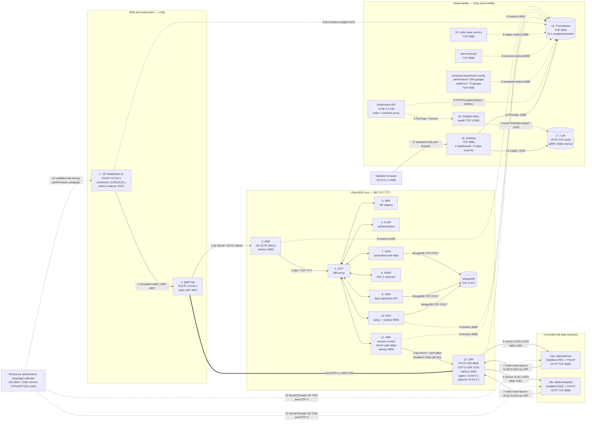
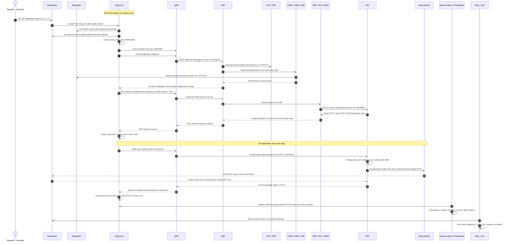

# Complete Accepted-System Architecture

## Scope And Accepted State

This guide reconstructs the complete accepted local platform. It connects four
views that are often
confused:

1. **management:** Helm submits versioned Kubernetes objects;
2. **execution:** Kubernetes controllers create Pods and containers inside one
   kind node;
3. **service behavior:** UERANSIM and Open5GS implement 5G registration,
   session establishment, and user traffic; and
4. **evidence:** Prometheus, Loki, Alloy, kube-state-metrics, and Grafana
   observe the service without becoming part of the 5G packet path.

The accepted end state is:

| Boundary | Accepted state |
| --- | --- |
| Host | one Ubuntu workstation; existing unrelated host labs remain outside this project boundary |
| Cluster | Kubernetes v1.36.1; single control-plane kind node `cn5g-control-plane` at `172.18.0.2`; containerd 2.3.1 inside Docker |
| Core release | Helm release `cn5g`, namespace `cn5g`; the revision is runtime-assigned |
| Observability release | Helm release `cn5g-observability`, namespace `cn5g-observability` |
| Subscribers | five synthetic UEs: ordinals 0-2 on `internet`, ordinals 3-4 on `enterprise` |
| Data networks | two isolated controlled endpoint Pods |
| Persistent state | one 2 GiB MongoDB PVC, one 2 GiB Prometheus PVC, one 2 GiB Loki PVC |
| Experiment overlays | absent from the default runtime; reviewed performance and resilience results remain queryable |
| External exposure | no workload NodePort, LoadBalancer, host network, or host port; Grafana is available only through an explicit loopback port-forward |

This is a local integration platform, not a production reference
topology. Addresses beginning with `10.244` and ordinary Service ClusterIPs
are runtime allocations. They are included as an accepted snapshot so the
reader can connect the diagram to a real cluster, but software must use stable
Service DNS names instead of copying those numeric values.

## How To Read The Three Diagrams

The architecture is split into three diagrams because one “everything” image
would hide the relationships it is meant to teach:

- **Diagram 1 — ownership and execution:** who creates each Kubernetes object,
  which controller owns the Pods, and which containers share a Pod.
- **Diagram 2 — network and evidence paths:** which protocol crosses which
  port and address domain.
- **Diagram 3 — one complete UE lifecycle:** how a powered-off simulated UE
  becomes registered, receives a PDU session, sends an ICMP echo request, and
  receives the response.

Numbered arrows in Diagrams 2 and 3 are explained immediately below each
diagram. Solid arrows carry management or service traffic. Dotted arrows carry
telemetry or represent the temporary performance campaign overlay.

## Diagram 1 — Management, Kubernetes Objects, Pods, And Containers

```mermaid
flowchart TB
    OP["Operator and lifecycle command\ncn5g-platform.sh / helm / kubectl"]

    subgraph HOST["Ubuntu host"]
        DOCKER["Docker Engine"]
        APIHOST["kind API forward\n127.0.0.1:runtime-assigned port"]
        GRAFHOST["optional Grafana forward\n127.0.0.1:13000 -> Service:3000"]
    end

    subgraph NODE["Docker container: cn5g-control-plane — observed 172.18.0.2"]
        subgraph CONTROL["Kubernetes control plane"]
            API["kube-apiserver\nService 10.96.0.1:443"]
            ETCD["etcd"]
            SCHED["scheduler"]
            CM["controller manager"]
        end
        KUBELET["kubelet + containerd"]
        NET["kindnet CNI + kube-proxy\nPod CIDR 10.244.0.0/16\nService CIDR 10.96.0.0/16"]
        DNS["CoreDNS\n10.96.0.10:53 TCP/UDP"]
        STORAGE["local-path provisioner\nStorageClass standard"]

        subgraph CORENS["namespace cn5g — Helm release cn5g"]
            CORECFG["ConfigMaps\nOpen5GS / gNB / UE probe"]
            CORESEC["pre-created Secret\nfive synthetic subscribers"]
            SA["ServiceAccount cn5g-workload\nautomount token disabled"]

            NFPODS["10 Open5GS Deployment Pods\nNRF, SCP, AMF, AUSF, UDM, UDR, PCF, NSSF, SMF, UPF\neach: render-config init + one NF container\nUPF also: configure-dnn-network init"]
            GNBPOD["gNB Deployment Pod\nrender-config init + gnb container"]
            UEPODS["UE StatefulSet — 5 Pods\nwait-for-subscriber init\nrender-config init\nue main container\nuser-plane-metrics sidecar"]
            DNNPODS["2 DNN Deployment Pods\nrender-content init + data-network container"]
            MONGOPOD["MongoDB StatefulSet Pod\nmongodb container"]
            JOB["revision-scoped subscriber Job\nwait-for-mongodb init + subscriber-init container"]
            MONGOPVC["PVC mongodb-data-cn5g-mongodb-0\n2 GiB / standard / RWO"]

            CORESVC["16 internal Services\nClusterIP or headless DNS"]
        end

        subgraph OBSNS["namespace cn5g-observability — Helm release cn5g-observability"]
            PROMPOD["Prometheus StatefulSet Pod\nprometheus container"]
            LOKIPOD["Loki StatefulSet Pod\nloki container"]
            GRAFPOD["Grafana Deployment Pod\ngrafana container"]
            ALLOYPOD["Alloy Deployment Pod\nalloy container"]
            KSMPOD["kube-state-metrics Deployment Pod\nkube-state-metrics container"]
            ALERTPOD["alert-exercise Deployment Pod\nexporter container"]
            RESULTSPOD["performance campaign reviewed-results Deployment Pod\ntoken-free static metrics exporter"]
            PROMPVC["Prometheus PVC\n2 GiB / 24 h and 1 GB retention limits"]
            LOKIPVC["Loki PVC\n2 GiB / 24 h retention"]
            GRAFSEC["pre-created Grafana admin Secret"]
            OBSCFG["ConfigMaps\nscrapes / alerts / Alloy / Loki / 6 dashboards\nreviewed performance + resilience gauges"]
            OBSSVC["6 ClusterIP Services"]
            RBAC["project-scoped ServiceAccounts and RBAC\nPrometheus / KSM / Alloy"]
        end
    end

    OP -->|"Helm render, revision, rollback"| APIHOST --> API
    DOCKER --> NODE
    API --> ETCD
    API --> SCHED --> KUBELET
    API --> CM --> KUBELET
    KUBELET --> NFPODS
    KUBELET --> GNBPOD
    KUBELET --> UEPODS
    KUBELET --> DNNPODS
    KUBELET --> MONGOPOD
    KUBELET --> JOB
    KUBELET --> PROMPOD
    KUBELET --> LOKIPOD
    KUBELET --> GRAFPOD
    KUBELET --> ALLOYPOD
    KUBELET --> KSMPOD
    KUBELET --> ALERTPOD
    KUBELET --> RESULTSPOD
    NET --- CORENS
    NET --- OBSNS
    DNS --- CORESVC
    DNS --- OBSSVC
    CORECFG --> NFPODS
    CORECFG --> GNBPOD
    CORECFG --> UEPODS
    CORESEC --> UEPODS
    CORESEC --> JOB
    JOB --> MONGOPOD
    STORAGE --> MONGOPVC --> MONGOPOD
    STORAGE --> PROMPVC --> PROMPOD
    STORAGE --> LOKIPVC --> LOKIPOD
    GRAFSEC --> GRAFPOD
    OBSCFG --> PROMPOD
    OBSCFG --> LOKIPOD
    OBSCFG --> GRAFPOD
    OBSCFG --> ALLOYPOD
    OBSCFG --> RESULTSPOD
    RBAC --> PROMPOD
    RBAC --> KSMPOD
    RBAC --> ALLOYPOD
    GRAFHOST --> GRAFPOD
```



### What Diagram 1 means

Helm does not run containers. Helm renders templates and submits Kubernetes
objects to the API server. Controllers and the kubelet then reconcile those
objects into Pods. A Deployment owns replaceable Pods; a StatefulSet owns Pods
with stable ordinal names; a Job owns a finite Pod that should complete.

The UE is the clearest example of the difference:

```text
StatefulSet cn5g-ue
└── Pod cn5g-ue-3 — one Pod IP and one network namespace
    ├── init: wait-for-subscriber
    ├── init: render-config
    ├── main: ue                     creates uesimtun0
    └── sidecar: user-plane-metrics  uses that same uesimtun0
```

The main container and sidecar are separate processes and filesystems, but
they share the Pod's network namespace. This is why the sidecar can originate
a request from the UE session address without receiving `NET_ADMIN` or the
subscriber Secret.

The supporting Kubernetes components have distinct jobs:

| Component | Responsibility |
| --- | --- |
| kube-apiserver | validates and stores desired-state objects; front door for Helm, kubectl, controllers, and authorized telemetry clients |
| etcd | persistent key-value database for Kubernetes API state, not application subscriber data |
| scheduler | assigns unscheduled Pods to the single node |
| controller manager | runs Deployment, StatefulSet, Job, EndpointSlice, and other reconciliation controllers |
| kubelet | node agent that asks containerd to create and monitor assigned Pod sandboxes and containers |
| containerd | container runtime inside the kind node; separate from the host Docker daemon that runs the node container |
| kindnet | Container Network Interface implementation that gives Pods `10.244.0.0/16` addresses and routes Pod traffic |
| kube-proxy | implements ClusterIP forwarding from a Service virtual IP to a selected endpoint |
| CoreDNS | resolves Service names; for headless Services it returns endpoint Pod addresses directly |
| local-path provisioner | supplies `standard` storage claims from storage inside the kind node |

A normal ClusterIP Service has a stable name and virtual IP. Its selector and
EndpointSlices identify Ready Pods, and kube-proxy sends traffic to one of
those endpoints. A headless Service has `clusterIP: None`; CoreDNS returns the
endpoint Pod IP instead. platform deliberately uses headless discovery for
PFCP, gNB, UE metrics, and both DNN endpoints where the real peer address
matters. Headless DNS normally follows endpoint readiness; `cn5g-ue` explicitly
sets `publishNotReadyAddresses` so each stable ordinal can be discovered while
its startup and readiness gates are still converging.

## Diagram 2 — Complete 5G, Data, Metrics, And Log Paths



### Reading the numbered paths

1. UERANSIM represents the radio connection between a UE process and the gNB
   over the Pod network on UDP/4997. It is a user-space simulation, not an RF
   physical layer.
2. The gNB carries Non-Access Stratum messages inside NGAP over SCTP/38412 to
   the Access and Mobility Management Function (AMF).
3. Open5GS Network Functions communicate over the Service-Based Interface
   (SBI) on TCP/7777. The Service Communication Proxy (SCP) routes service
   requests; the Network Repository Function (NRF) holds the registered NF
   profiles.
4. The Session Management Function (SMF) programs the User Plane Function
   (UPF) with Packet Forwarding Control Protocol (PFCP) over UDP/8805. The
   headless `cn5g-upf-pfcp` Service resolves directly to the UPF Pod and avoids
   ClusterIP translation of the PFCP peer tuple.
5. The gNB and UPF carry encapsulated UE packets over N3 GPRS Tunnelling
   Protocol User Plane (GTP-U), UDP/2152.
6. The UPF decapsulates the UE packet. Source rules select table 1060 for
   `10.60.0.0/24` or table 1061 for `10.61.0.0/24`. Each table contains only
   its allowed endpoint plus an unreachable default.
7. Two ownership-marked routes inside the kind node send endpoint responses
   for the UE pools back through the current UPF Pod. These routes are not
   installed in the Ubuntu host namespace.
8. Prometheus pulls numeric metrics. The reviewed-results targets serve
   immutable gauges generated from accepted performance and resilience
   summaries; unlike UE and NF targets, they describe completed experiments
   rather than current service state. Prometheus does not carry registration
   or user traffic and cannot make the service healthy.
9. Alloy reads Pod logs and Events through project-scoped Kubernetes API
   permissions, then pushes them to Loki.
10. Grafana queries Prometheus with PromQL and Loki with LogQL. Its dashboards
    are provisioned from Git; Grafana is not the source of the measurements.
11. The browser reaches Grafana only while `kubectl port-forward` binds
    `127.0.0.1:13000` to the internal Grafana Service on port 3000.
12. performance campaign temporarily added benchmark sidecars. The final rollback removed
    them, so the dotted benchmark nodes describe the accepted experiment
    mechanism rather than a currently running container.

## Address Model

### Stable address domains and identities

| Domain | Address or identity | Stability and purpose |
| --- | --- | --- |
| Host loopback | `127.0.0.1` | kind API and explicit operator port-forwards only |
| kind Docker network | `172.18.0.0/16`; node observed at `172.18.0.2` | node-container transport; node address can change after cluster recreation |
| Kubernetes Pod network | `10.244.0.0/16` | replaceable Pod IPs assigned by kindnet |
| Kubernetes Service network | `10.96.0.0/16` | virtual ClusterIP addresses |
| Kubernetes API Service | `10.96.0.1:443/TCP` | stable in-cluster API endpoint |
| CoreDNS Service | `10.96.0.10:53/UDP,TCP`; metrics `9153/TCP` | cluster DNS and DNS metrics |
| Internet UE pool | `10.60.0.0/24` | session addresses for UE ordinals 0-2 |
| Internet UPF gateway | `10.60.0.1` on `ogstun` | UPF side of the Internet DNN session network |
| Enterprise UE pool | `10.61.0.0/24` | session addresses for UE ordinals 3-4 |
| Enterprise UPF gateway | `10.61.0.1` on `ogstun2` | UPF side of the Enterprise DNN session network |
| UE tunnel | `uesimtun0`, MTU 1400 | created in each UE Pod network namespace |
| Synthetic PLMN | MCC `999`, MNC `70`, TAC `1` | reserved lab mobile-network identity |
| Slice | SST `1` | one accepted slice; DNNs differ, slice treatment does not |
| gNB identity | NCI `0x000000010`, ID length 32 | tracked UERANSIM configuration |
| Configured UE DNS | `8.8.8.8`, `8.8.4.4` | supplied by SMF; accepted tests use controlled DNN endpoints, not public Internet |

There are two IP addresses inside every active UE Pod:

- `eth0` has a `10.244.0.0/16` Pod-network address and is used for Kubernetes
  transport, simulated radio, and metrics scraping;
- `uesimtun0` has a `10.60.0.x` or `10.61.0.x` PDU-session address and is used
  for subscriber user traffic.

Confusing these addresses produces the most dangerous false result in the
project: direct `eth0` traffic can reach another Pod without traversing the
gNB, GTP-U, or UPF.

### Validated Service snapshot

The DNS names are the stable contracts. Numeric ClusterIPs below are one
validated snapshot and may change whenever the cluster or a Service is
recreated.

| Namespace | Service DNS label | Snapshot ClusterIP | Ports |
| --- | --- | --- | --- |
| `cn5g` | `cn5g-nrf` | `10.96.132.43` | 7777/TCP |
| `cn5g` | `cn5g-scp` | `10.96.85.102` | 7777/TCP |
| `cn5g` | `cn5g-amf` | `10.96.223.178` | 7777/TCP, 38412/SCTP, 9090/TCP |
| `cn5g` | `cn5g-ausf` | `10.96.55.210` | 7777/TCP |
| `cn5g` | `cn5g-udm` | `10.96.7.208` | 7777/TCP |
| `cn5g` | `cn5g-udr` | `10.96.87.111` | 7777/TCP |
| `cn5g` | `cn5g-pcf` | `10.96.13.0` | 7777/TCP, 9090/TCP |
| `cn5g` | `cn5g-nssf` | `10.96.247.100` | 7777/TCP |
| `cn5g` | `cn5g-smf` | `10.96.110.206` | 7777/TCP, 9090/TCP |
| `cn5g` | `cn5g-upf` | `10.96.174.245` | 8805/UDP, 2152/UDP, 9090/TCP |
| `cn5g` | `cn5g-upf-pfcp` | headless | 8805/UDP; direct UPF Pod DNS |
| `cn5g` | `cn5g-mongodb` | `10.96.181.0` | 27017/TCP |
| `cn5g` | `cn5g-gnb` | headless | 4997/UDP; direct gNB Pod DNS |
| `cn5g` | `cn5g-ue` | headless | 9101/TCP; five UE metric endpoints |
| `cn5g` | `cn5g-data-internet` | headless | 8080/TCP |
| `cn5g` | `cn5g-data-enterprise` | headless | 8080/TCP |
| `cn5g-observability` | `cn5g-observability-prometheus` | `10.96.255.204` | 9090/TCP |
| `cn5g-observability` | `cn5g-observability-loki` | `10.96.135.73` | 3100/TCP |
| `cn5g-observability` | `cn5g-observability-grafana` | `10.96.149.234` | 3000/TCP |
| `cn5g-observability` | `cn5g-observability-kube-state-metrics` | `10.96.13.72` | 8080/TCP |
| `cn5g-observability` | `cn5g-observability-alert-exercise` | `10.96.228.244` | 8080/TCP |
| `cn5g-observability` | `cn5g-observability-performance-results` | `10.96.38.108` | 8080/TCP |
| `cn5g-observability` | `cn5g-observability-resilience-results` | runtime-assigned | 8080/TCP |

`cn5g-nrf.cn5g.svc.cluster.local` is an example fully qualified Service name.
The other Services use the same `<service>.<namespace>.svc.cluster.local`
pattern. Headless Services have no virtual IP; DNS returns selected Pod IPs.

### Validated Pod and UE-session snapshot

Pod names containing a ReplicaSet hash and every `10.244` address are
replaceable. StatefulSet ordinal names are stable. This table exists to make
the architecture concrete, not to define configuration inputs.

| Namespace | Logical Pod | Snapshot Pod IP | Containers | UE session IP |
| --- | --- | --- | --- | --- |
| `cn5g` | NRF | `10.244.0.81` | `nrf` | — |
| `cn5g` | SCP | `10.244.0.82` | `scp` | — |
| `cn5g` | UDR | `10.244.0.83` | `udr` | — |
| `cn5g` | UDM | `10.244.0.84` | `udm` | — |
| `cn5g` | AUSF | `10.244.0.85` | `ausf` | — |
| `cn5g` | PCF | `10.244.0.86` | `pcf` | — |
| `cn5g` | NSSF | `10.244.0.87` | `nssf` | — |
| `cn5g` | UPF | `10.244.0.88` | `upf` | gateways `10.60.0.1`, `10.61.0.1` |
| `cn5g` | SMF | `10.244.0.89` | `smf` | — |
| `cn5g` | AMF | `10.244.0.90` | `amf` | — |
| `cn5g` | gNB | `10.244.0.91` | `gnb` | — |
| `cn5g` | `cn5g-ue-0` | `10.244.0.92` | `ue`, `user-plane-metrics` | `10.60.0.4/24` |
| `cn5g` | `cn5g-ue-1` | `10.244.0.93` | `ue`, `user-plane-metrics` | `10.60.0.2/24` |
| `cn5g` | `cn5g-ue-2` | `10.244.0.94` | `ue`, `user-plane-metrics` | `10.60.0.3/24` |
| `cn5g` | `cn5g-ue-3` | `10.244.0.95` | `ue`, `user-plane-metrics` | `10.61.0.3/24` |
| `cn5g` | `cn5g-ue-4` | `10.244.0.96` | `ue`, `user-plane-metrics` | `10.61.0.2/24` |
| `cn5g` | Internet endpoint | `10.244.0.74` | `data-network` | — |
| `cn5g` | Enterprise endpoint | `10.244.0.73` | `data-network` | — |
| `cn5g` | MongoDB | `10.244.0.141` | `mongodb` | — |
| `cn5g-observability` | Alloy | `10.244.0.105` | `alloy` | — |
| `cn5g-observability` | alert exercise | `10.244.0.106` | `exporter` | — |
| `cn5g-observability` | kube-state-metrics | `10.244.0.108` | `kube-state-metrics` | — |
| `cn5g-observability` | Loki | `10.244.0.109` | `loki` | — |
| `cn5g-observability` | Prometheus | `10.244.0.112` | `prometheus` | — |
| `cn5g-observability` | Grafana | `10.244.0.129` | `grafana` | — |

The Kubernetes system layer is part of the same node but is not owned by either
project Helm release:

| Namespace | System Pod(s) | Snapshot address | Network/port role |
| --- | --- | --- | --- |
| `kube-system` | kube-apiserver | node network `172.18.0.2` | secure API 6443/TCP; ClusterIP 443 forwards here |
| `kube-system` | etcd | node network `172.18.0.2` | client 2379/TCP, peer 2380/TCP, loopback metrics 2381/TCP |
| `kube-system` | controller manager | node network `172.18.0.2` | loopback secure endpoint 10257/TCP |
| `kube-system` | scheduler | node network `172.18.0.2` | loopback secure endpoint 10259/TCP |
| `kube-system` | kube-proxy | node network `172.18.0.2` | programs Service forwarding on the node |
| `kube-system` | kindnet | node network `172.18.0.2` | programs the `10.244.0.0/16` Pod network |
| `kube-system` | CoreDNS replica 1 | `10.244.0.3` | DNS 53/UDP,TCP; metrics 9153; health 8080/8181 |
| `kube-system` | CoreDNS replica 2 | `10.244.0.5` | DNS 53/UDP,TCP; metrics 9153; health 8080/8181 |
| `local-path-storage` | local-path provisioner | `10.244.0.4` | provisions `standard` local-path PVCs; no Service |

Subscriber initialization runs as a revision-scoped finite Job. Completed Job
Pods can remain temporarily as lifecycle evidence, but they are not
long-running service endpoints and their Pod IPs are never configuration
inputs.

To refresh replaceable values without modifying the cluster:

```bash
kubectl --kubeconfig artifacts/kubernetes/cn5g.kubeconfig get pods -A -o wide
kubectl --kubeconfig artifacts/kubernetes/cn5g.kubeconfig get services -A
```

## Port And Interface Inventory

| Port/interface | Protocol | Listener or owner | Purpose |
| --- | --- | --- | --- |
| 443 | TCP/TLS | Kubernetes API Service | object management and authenticated node/cAdvisor proxy |
| 6443 | TCP/TLS | kube-apiserver on the node network | API backend reached by the Service and kind host forward |
| 2379/2380 | TCP/TLS | etcd on the node network | API-state client and single-member peer traffic |
| 2381 | TCP | etcd loopback | control-plane metrics and health |
| 10250 | TCP/TLS | kubelet on the node | API-proxied node and cAdvisor metrics |
| 10257/10259 | TCP/TLS | controller manager / scheduler loopback | control-plane health and secure endpoints |
| 53 | UDP/TCP | CoreDNS | Service and Pod DNS |
| 9153 | TCP | CoreDNS | DNS metrics |
| 7777 | TCP, HTTP/2 SBI | NRF, SCP, AMF, AUSF, UDM, UDR, PCF, NSSF, SMF | 5G service-based control-plane APIs |
| 38412 | SCTP | AMF | N2 NGAP from gNB |
| 4997 | UDP | gNB | UERANSIM simulated radio link from UEs |
| 8805 | UDP | SMF and UPF sockets; UPF Service | N4 PFCP association and session programming |
| 2152 | UDP | gNB and UPF | N3 GTP-U encapsulated UE packets |
| 27017 | TCP | MongoDB | subscriber and policy data |
| 8080 | TCP | each DNN data container | controlled HTTP identity/health response |
| 9090 | TCP | AMF, PCF, SMF, UPF | native Open5GS metrics |
| 9101 | TCP | each UE metric sidecar | bounded per-ordinal probe metrics |
| 9090 | TCP | Prometheus | PromQL, targets, rules, and stored metrics |
| 3100 | TCP | Loki | log ingestion and LogQL HTTP API |
| 9096 | TCP | Loki Pod only | internal Loki gRPC listener; not exposed by a Service |
| 3000 | TCP | Grafana | dashboard HTTP API and web interface |
| 8080 | TCP | kube-state-metrics | Kubernetes object-state metrics |
| 8081 | TCP | kube-state-metrics Pod only | readiness telemetry listener |
| 12345 | TCP | Alloy Pod only | Alloy health/readiness HTTP server |
| 8080 | TCP | alert-exercise | controlled metric fixture for alert lifecycle tests |
| 8080 | TCP | performance campaign reviewed-results exporter | immutable accepted experiment gauges |
| 5201-5205 | TCP and UDP | performance campaign DNN benchmark sidecars | one temporary iperf3 port per UE ordinal; absent after rollback |
| `ogstun` | TUN | UPF Pod | Internet DNN gateway `10.60.0.1/24` |
| `ogstun2` | TUN | UPF Pod | Enterprise DNN gateway `10.61.0.1/24` |
| `uesimtun0` | TUN | every UE Pod | assigned PDU-session address; MTU 1400 |

Temporary host loopback ports used by lifecycle helpers are not Services:

| Loopback port | Forward target | When used |
| --- | --- | --- |
| `127.0.0.1:13000` | Grafana Service `:3000` | interactive dashboard command |
| `127.0.0.1:19090` | Prometheus Service `:9090` | observability stack validation and alert lifecycle |
| `127.0.0.1:13100` | Loki Service `:3100` | observability stack log validation |
| `127.0.0.1:19097` | Prometheus Service `:9090` | performance campaign time-aligned range queries |

## Workload, Container, Init, And Sidecar Inventory

| Controller | Replicas/Pods | Init containers | Long-running containers | Persistent storage |
| --- | ---: | --- | --- | --- |
| 10 Open5GS Deployments | 1 each | `render-config`; UPF also `configure-dnn-network` | one matching NF container | none |
| gNB Deployment | 1 | `render-config` | `gnb` | none |
| UE StatefulSet | 5 | `wait-for-subscriber`, `render-config` | `ue`, `user-plane-metrics` sidecar | none |
| Internet DNN Deployment | 1 | `render-content` | `data-network` | none |
| Enterprise DNN Deployment | 1 | `render-content` | `data-network` | none |
| MongoDB StatefulSet | 1 | none | `mongodb` | 2 GiB PVC |
| subscriber Job | finite | `wait-for-mongodb` | `subscriber-init` | none |
| Prometheus StatefulSet | 1 | none | `prometheus` | 2 GiB PVC |
| Loki StatefulSet | 1 | none | `loki` | 2 GiB PVC |
| Grafana Deployment | 1 | none | `grafana` | no PVC; provisioned config and bounded `emptyDir` runtime data |
| Alloy Deployment | 1 | none | `alloy` | no PVC; bounded `emptyDir` state |
| kube-state-metrics Deployment | 1 | none | `kube-state-metrics` | none |
| alert-exercise Deployment | 1 | none | `exporter` | none |
| performance campaign reviewed-results Deployment | 1 | none | token-free static metrics `exporter` | none; generated ConfigMap and 2 MiB memory `emptyDir` |
| resilience campaign reviewed-results Deployment | 1 | none | token-free static metrics `exporter` | none; generated ConfigMap and 2 MiB memory `emptyDir` |
| performance campaign temporary UE extension | up to 5 | unchanged | adds `benchmark-client` sidecar | none; 16 MiB memory `/tmp` |
| performance campaign temporary DNN extension | 2 | unchanged | adds `benchmark-server` sidecar | none; 16 MiB memory `/tmp` |

An init container must finish before long-running containers start. A sidecar
runs beside the main container for the Pod's lifetime. This distinction is why
`render-config` can prepare a file and exit, while `user-plane-metrics` keeps
probing throughout UE operation.

### Container image inventory

Every released third-party image is version- and digest-pinned; project images
are versioned, built from pinned inputs, identity-checked, and loaded into the
kind node. The exact digests and expected runtime IDs live in the chart values
and `versions/` manifests.

| Image | Used by |
| --- | --- |
| `cn5g/open5gs:2.7.7` | all ten Open5GS NF containers and their config/network init containers |
| `cn5g/ueransim:3.2.8` | gNB, five UE containers, and UERANSIM config init containers |
| `cn5g/data-network:0.1.0` | two controlled DNN endpoints, alert-exercise fixture, and reviewed performance campaign results exporter |
| `mongo:8.0.28-noble` with pinned digest | MongoDB, subscriber Job, and subscriber wait init containers |
| `python:3.13.7-alpine3.22` with pinned digest | five UE user-plane metric sidecars |
| `prom/prometheus:v3.13.1` with pinned digest | Prometheus |
| `grafana/grafana:13.1.0` with pinned digest | Grafana |
| `grafana/loki:3.7.2` with pinned digest | Loki |
| `grafana/alloy:v1.18.0` with pinned digest | Alloy |
| `kube-state-metrics:v2.18.0` with pinned digest | kube-state-metrics |
| `cn5g/benchmark:0.1.0` | temporary performance campaign benchmark client/server sidecars; not running after rollback |

## 5G Core Function Responsibilities

| Function | Expanded name | Responsibility in this platform |
| --- | --- | --- |
| NRF | Network Repository Function | registers and discovers the nine stable SBI NF profiles |
| SCP | Service Communication Proxy | stable SBI routing point for service requests among NFs |
| AMF | Access and Mobility Management Function | terminates N2 NGAP, drives registration, mobility, NAS security, and session requests |
| AUSF | Authentication Server Function | coordinates 5G authentication |
| UDM | Unified Data Management | owns subscriber identity/authentication logic and reads subscriber data |
| UDR | Unified Data Repository | exposes stored subscriber/policy data to SBI consumers |
| PCF | Policy Control Function | supplies session/access policy and exposes metrics |
| NSSF | Network Slice Selection Function | selects the accepted SST 1 slice context |
| SMF | Session Management Function | allocates UE addresses, manages PDU sessions, and programs the UPF over PFCP |
| UPF | User Plane Function | terminates GTP-U, owns UE TUN gateways, and forwards isolated N6 traffic |

Open5GS is configured for a maximum of 32 UEs, but the accepted automated
topology contains five. A configuration ceiling is not a measured capacity.

## Observability Component Responsibilities

| Component | Reads from | Writes/serves | Important boundary |
| --- | --- | --- | --- |
| Prometheus | itself; AMF/PCF/SMF/UPF; five UE sidecars; kube-state-metrics; alert fixture; reviewed performance campaign exporter; Kubernetes node and cAdvisor proxy | time series, PromQL API, and local alert states on 9090 | pulls metrics every 15 seconds; does not send external notifications |
| kube-state-metrics | selected Pods, Deployments, StatefulSets, Jobs, and PVCs in the two project namespaces | object-state metrics on 8080 | translates API fields; does not measure CPU or understand 5G |
| Grafana Alloy | project Pod log streams and Kubernetes Events | pushes labeled streams to Loki | mounts no host log directory or runtime socket |
| Loki | Alloy pushes | LogQL API and retained log chunks on 3100 | 24-hour local retention; diagnostic logs are separate from metrics |
| Grafana | Prometheus and Loki Services | five provisioned dashboards on 3000 | stores no source-of-truth measurement; UI changes are disabled for provisioned dashboards |
| alert exercise | controlled in-memory metric values | Prometheus text metrics on 8080 | tests firing/resolution without stopping a real 5G workload |
| performance campaign reviewed results | generated, tracked metrics ConfigMap | 556 bounded Prometheus text gauges on 8080 | describes one completed reviewed campaign; does not run traffic or emit live capacity |

The accepted Stage B installation gives Prometheus 15 active scrape targets: itself,
four native Open5GS metric endpoints, five UE endpoints, kube-state-metrics,
the alert fixture, the reviewed-results exporter, the node API proxy, and the
cAdvisor proxy. The results target is required for the fifth dashboard; the
alert fixture exists only for bounded alert exercises.

The five Git-controlled Grafana dashboards are:

1. **platform overview:** service health, 5G counts, user-plane status, target
   health, alerts, and cross-dashboard navigation;
2. **5G service:** per-UE/DNN probes, procedure and session evidence, TUN
   counters, and related logs;
3. **Kubernetes resources:** normalized requests/limits, CPU, memory, restarts,
   Out-of-Memory evidence, and scrape health; and
4. **project logs:** bounded Loki panels for component logs, Kubernetes Events,
   and procedure-oriented troubleshooting; and
5. **performance and capacity experiments:** reviewed performance campaign throughput,
   procedure, fairness, packet, and resource evidence with explicit local-lab
   limitations.

## Probe And Health Model

Kubernetes health probes and the UE synthetic user-plane probe answer
different questions. Startup/readiness/liveness affect Pod lifecycle;
`user-plane-metrics` performs an application request and exports evidence.

| Workload | Startup probe | Readiness probe | Liveness probe |
| --- | --- | --- | --- |
| Open5GS NFs | rendered config exists and PID 1 lives | component-specific `open5gs-healthcheck`; UPF uses its local UPF check | PID 1 lives |
| gNB | rendered config exists and PID 1 lives | newest log state says NG Setup succeeded | same NG Setup state remains current |
| UE main | rendered config exists and PID 1 lives | registration, PDU session, connection setup, valid `uesimtun0`, source rule, and default TUN route | PID 1 lives |
| UE metric sidecar | HTTP `/metrics` | HTTP `/metrics` | HTTP `/metrics` |
| DNN endpoint | TCP/8080 listener exists | HTTP `/healthz` | PID 1 lives |
| MongoDB | data directory and database ping | database ping | database ping |
| Prometheus | HTTP `/-/ready` | HTTP `/-/ready` | HTTP `/-/healthy` |
| Loki | HTTP `/ready` | HTTP `/ready` | HTTP `/ready` |
| Grafana | HTTP `/api/health` | HTTP `/api/health` | HTTP `/api/health` |
| Alloy | none | HTTP `/-/ready` on 12345 | HTTP `/-/healthy` on 12345 |
| kube-state-metrics | `/healthz` on 8080 | `/readyz` on 8081 | `/livez` on 8080 |
| alert-exercise | none | HTTP `/metrics` | none |
| performance campaign reviewed results | HTTP `/metrics` | HTTP `/metrics` | HTTP `/metrics` |
| performance campaign benchmark client | none; image executables are verified before install | `uesimtun0` exists in the shared network namespace | PID 1 lives |
| performance campaign benchmark server | all five TCP listeners exist | all five TCP listeners exist | supervisor PID 1 lives |

A Ready UE is stronger than a running process but still not the complete
acceptance result. Repository validation additionally checks live PFCP/GTP-U
session evidence, endpoint identity, cross-DNN denial, tunnel counters, and
real request/response behavior.

## Configuration, Secrets, Storage, And Security

### Configuration flow

Helm renders non-secret ConfigMaps. Init containers substitute the current Pod
IP or resolved peer IP into a memory-backed runtime copy. This lets a tracked
template remain stable while transport listeners bind to the current Pod.

Synthetic subscriber authentication material is generated locally into
ignored mode-0600 files, then copied into a pre-created Secret. Helm receives
only the Secret name. The Job mounts the provisioning script; each UE ordinal
mounts its matching configuration. No secret value appears in this guide,
metrics, labels, dashboards, or Git.

### Storage boundaries

| Claim | Mounted by | Purpose | Retention boundary |
| --- | --- | --- | --- |
| `mongodb-data-cn5g-mongodb-0` | MongoDB | subscribers and policy data | retained across Pod replacement and tested Helm lifecycle |
| `data-cn5g-observability-prometheus-0` | Prometheus | time-series blocks and write-ahead log | 24 h and 1 GB logical limits; retained PVC |
| `data-cn5g-observability-loki-0` | Loki | log chunks and index | 24 h retention; retained PVC |

The `standard` local-path StorageClass stores these volumes inside the kind
node. They survive tested Pod and release operations, but deleting the kind
node is outside that persistence guarantee.

### Privilege boundaries

| Container | Effective special capability/API access |
| --- | --- |
| UPF main and DNN-network init | `NET_ADMIN`, `/dev/net/tun`; no privileged mode |
| UE main | `NET_ADMIN` + `NET_RAW`, `/dev/net/tun`; no privileged mode |
| Open5GS control functions, gNB, DNN endpoints, probe/benchmark sidecars | all capabilities dropped |
| `cn5g-workload` ServiceAccount | token automount disabled; no Role/RoleBinding |
| Prometheus | token enabled; read-only node metrics/proxy discovery |
| kube-state-metrics | token enabled; list/watch selected objects in the two project namespaces |
| Alloy | token enabled; get/list/watch project Pods, logs, and Events |
| Grafana, Loki, alert exercise | token automount disabled |

All Pods use `RuntimeDefault` seccomp. Privilege escalation is disabled, and
root filesystems are read-only where the application permits. Writable
locations are explicit PVCs or bounded `emptyDir` volumes.

## Diagram 3 — Example: From A Stopped UE To A Returned Ping

This sequence uses UE ordinal 0 on the `internet` DNN. Its exact session
address can vary within `10.60.0.0/24`; `10.60.0.4` is used as a concrete
validated example.



### The same process in plain language

1. **Kubernetes creates an identity slot, not a subscriber.** The StatefulSet
   name `cn5g-ue-0` gives the Pod ordinal 0. The init container uses that
   ordinal to select ordinal 0's already prepared synthetic configuration.
2. **The database gate runs before the UE.** `wait-for-subscriber` confirms
   that exactly one matching MongoDB record exists. A missing or duplicate
   record prevents startup.
3. **The radio and AMF transport form.** The UE discovers the gNB over the
   simulated UDP/4997 link. The gNB already has an SCTP association to the AMF
   on N2/38412.
4. **Registration is a distributed core operation.** The AMF coordinates
   authentication and data access through SBI services. AUSF performs the
   authentication role; UDM/UDR obtain the subscriber information backed by
   MongoDB. The AMF establishes NAS security and accepts registration.
5. **A PDU session creates the user path.** The UE requests `internet`. The
   SMF allocates an address from `10.60.0.0/24`, obtains policy/slice context,
   and programs the UPF through PFCP. The UE creates `uesimtun0` only after the
   session is accepted.
6. **The ping request is an inner packet.** Its source is the UE session
   address. UERANSIM carries it to the gNB, which wraps it in an outer GTP-U
   packet whose endpoints are gNB and UPF Pod addresses.
7. **The UPF removes the outer tunnel.** Linux now sees the original ICMP
   packet. The `10.60.0.0/24` source rule chooses table 1060, which permits the
   current Internet endpoint and rejects other destinations.
8. **The reply needs a node route.** The data endpoint's ordinary default route
   sends the response to the kind node. The ownership-marked `10.60.0.0/24`
   route sends it to the current UPF Pod, which re-encapsulates it for the gNB.
9. **Success is observed independently.** `ping` receives the response, TUN
   counters rise, the UE sidecar's source-bound HTTP probe succeeds, native
   Open5GS session gauges remain at five, and logs from each component become
   queryable in Loki.

If a Pod is merely Running but any of these protocol steps is missing, the
full validator fails. Kubernetes process health, 5G signalling, session state,
user-plane traffic, isolation, and telemetry are related but distinct facts.

## Experiment overlays in the whole-system picture

Performance campaign temporarily changed only the measurement boundary:

```text
accepted observability stack UE Pod
  ue + user-plane-metrics

temporary performance campaign UE Pod
  ue + user-plane-metrics + benchmark-client

accepted observability stack DNN Pod
  data-network

temporary performance campaign DNN Pod
  data-network + benchmark-server (ports 5201-5205)
```

It did not add a new 5G function, bypass the gNB, replace Prometheus, expose a
host port, or persist benchmark state. The experiment runner temporarily
scaled UE replicas, reset session state, invoked the clients, queried existing
Prometheus telemetry, restored five UEs, and retained raw evidence under an
ignored path. The deterministic analyzer converted only a complete accepted
campaign into tracked CSV, JSON, SVG, and Markdown outputs.

Campaign rollback removes benchmark sidecars and reruns both the platform and
Observability validators. Therefore the diagram's solid topology is the
accepted default system; the dotted performance overlay is a reproducible
tool applied only for a controlled experiment. resilience campaigns do not
add a workload overlay: they delete one exact AMF, SMF, or UPF Pod, measure the
replacement and service recovery, and restore the accepted baseline.

## Compact Mental Model

```text
Helm owns revisions and renders Kubernetes objects.
Kubernetes owns desired state and Pod replacement.
Services/CoreDNS own stable discovery; Pod IPs remain replaceable.
Open5GS owns 5G control and user-plane state.
UERANSIM owns the simulated UE/gNB radio behavior.
Linux TUN, policy routing, kindnet, and node routes carry UE packets.
Prometheus and Loki retain numeric and diagnostic evidence.
Grafana presents that evidence; it does not create service truth.
Performance campaign temporarily applies controlled load, then removes itself.
Repository validators decide whether the combined system is accepted.
```

This separation is the key to reading the platform correctly. A green Grafana
panel is not a PDU session, a Ready Pod is not a successful ping, a Service IP
is not a Pod IP, and direct Pod connectivity is not proof of GTP-U traffic.
