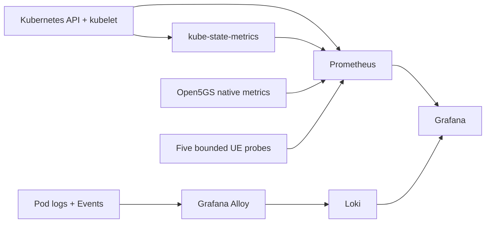
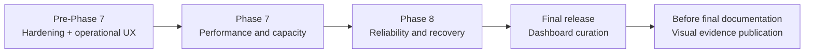

# Observability Dashboard Evolution Plan

## Status And Purpose

Status: Stages A and B accepted on 2026-08-06. Phase 7 measurement, analysis,
reviewed-results export, and the fifth Grafana dashboard passed their live
runtime gates. Stage C remains gated on Phase 8 recovery evidence.

This document defines how the CN5G dashboards will evolve from the accepted
Phase 6 operational baseline into a realistic monitoring, performance, and
reliability interface. It deliberately separates improvements that can use
real telemetry now from panels that must wait for measured Phase 7 or Phase 8
evidence.

The objective is not to maximize the number of graphs. The objective is to
make each dashboard answer a clear operational question, guide investigation
from symptom to cause, and remain reproducible from version-controlled files.

## Non-Negotiable Rules

1. Every panel must query a real, documented data source.
2. No dashboard may contain fabricated, manually entered, or stale
   demonstration values.
3. Performance and recovery values appear only after their experiment
   methodology and evidence pass the appropriate phase gate.
4. Subscriber identities, authentication material, and unbounded network
   values must not become metric labels or published evidence.
5. Dashboard JSON, data sources, Prometheus rules, and relevant recording
   rules remain version controlled and reproducible.
6. Visual polish must reduce cognitive load; it must not hide limitations or
   convert a local measurement into a production-scale claim.
7. Every observability change must preserve the complete accepted Phase 5
   five-UE/two-DNN validation result.

These rules follow the Prometheus guidance that every unique label set creates
another time series and therefore consumes memory, CPU, disk, and network
resources. They also follow Grafana's guidance that dashboards should tell a
story, move from general to specific, use consistent meaning and units, and
provide variables and drill-down links rather than uncontrolled dashboard
duplication.

## Current Accepted Baseline

Phase 6 currently provisions four dashboards:

| Dashboard | Current purpose | Current panel count |
| --- | --- | ---: |
| CN5G Service Overview | service contract, telemetry, alerts, NF health, pressure, and errors | 13 |
| CN5G Control, Sessions, UEs, And DNNs | AMF/PFCP state, bounded per-UE evidence, and DNN comparison | 11 |
| CN5G Kubernetes Resources | workload contract, normalized pressure, OOMs, targets, and scrape cost | 13 |
| CN5G Logs And Troubleshooting | bounded procedure, component, severity, Event, and pipeline views | 11 |

The accepted data path is:



The baseline already proves five AMF sessions, five PFCP sessions, five
successful source-bound UE probes, bounded custom cardinality, recent log
ingestion, and tested Prometheus alert transitions. It is intentionally
sparse because Phase 6 did not fabricate performance or recovery evidence.

## Observed Hardening Defect

Interactive use exposed one real defect that must be corrected before adding
dashboard load:

| Observation | Evidence |
| --- | --- |
| Symptom | the loopback `kubectl port-forward` exited while a dashboard was open |
| Kubernetes cause | Grafana container terminated as `OOMKilled`, exit code 137 |
| Original memory limit | 384 MiB |
| State before remediation | Kubernetes restarted Grafana; the Pod became Ready with restart count 1 |
| Last activity before termination | project-log dashboard queries were being processed |

The port-forward did not cause the failure. It lost its backend when the
Grafana process stopped listening on port 3000. Because a port-forward is tied
to the live Pod connection, it exited and did not reconnect after Kubernetes
restarted the container.

The Grafana logs also show background plugin installation/update attempts,
including attempts incompatible with the read-only root filesystem. This
behavior adds resource use and weakens the intended immutable runtime model;
it must be disabled or otherwise explicitly controlled using supported Grafana
configuration.

## Evolution Strategy



The implementation is divided into five stages. Stages are activated only
when their required evidence exists; this prevents attractive panels from
silently becoming claims the project has not measured.

## Stage A — Pre-Phase-7 Hardening And Operational UX

### A.1 Stabilize Grafana

The first change is operational, not visual.

Planned work:

1. verify the supported Grafana settings that disable automatic/background
   plugin installation and update checks;
2. preserve the read-only root filesystem and avoid runtime-downloaded plugin
   dependencies;
3. inspect retained Prometheus memory samples around the OOM event where
   available;
4. increase the Grafana request and limit using an explicit, reviewed values
   change—initial candidate request 192 MiB and limit 768 MiB;
5. ensure expensive Loki panels use bounded time ranges and line limits;
6. perform a minimum 30-minute interactive soak across all dashboards,
   including repeated log exploration;
7. require zero Grafana restarts, zero OOM events, and memory headroom during
   the soak; and
8. record the accepted request, limit, peak, query scope, and limitations.

The candidate was accepted on 2026-08-06. The 2,568-second interactive soak
kept the same Grafana Pod with zero restart increase and measured a 473.2 MiB
peak under the 768 MiB limit. That is 61.6% of the limit and remains below the
80% acceptance ceiling. The complete Phase 5/6 validators and all three alert
firing-resolution cycles also passed.

### A.2 Create A Strong Service Overview

The Platform Overview should answer “is the service operating?” within a few
seconds.

Top status row:

| Panel | Source | Intended interpretation |
| --- | --- | --- |
| Core Helm/workload state | kube-state-metrics and current release validation | requested core workloads are available |
| Observability state | Prometheus target health and workload state | telemetry pipeline is operating |
| Active alerts | Prometheus | unresolved conditions requiring attention |
| Registered UEs | AMF metric | current value versus five-UE contract |
| PFCP sessions | UPF metric | current value versus five-session contract |
| User-plane paths | UE probe metric | successful paths versus five expected |

Additional overview rows:

- network-function health matrix;
- per-component restart and OOM status;
- normalized memory pressure;
- normalized CPU use;
- recent warning/error volume; and
- links to the control-plane, Kubernetes, and logs dashboards.

### A.3 Add A Network-Function Health Matrix

One table should correlate the major components instead of forcing the viewer
to compare several unrelated charts.

Proposed columns:

```text
component | desired | ready | restarts | scrape health | CPU | memory | last termination
```

The matrix should cover MongoDB, NRF, SCP, AMF, AUSF, UDM, UDR, PCF, NSSF,
SMF, UPF, gNB, both data endpoints, and the UE StatefulSet at an appropriate
aggregation level. Values must use consistent units and semantic thresholds.

### A.4 Add A Per-UE Operational Table

The table must use only fixed ordinal and DNN labels:

```text
UE ordinal | DNN | probe status | probe duration | TUN RX rate | TUN TX rate
```

It must not display IMSI, authentication material, Pod IP as a durable
identity, or other unbounded subscriber attributes. The five fixed ordinals
remain the correlation key.

### A.5 Add A DNN Comparison Row

The `internet` and `enterprise` contracts should be visually comparable:

| Signal | `internet` | `enterprise` |
| --- | ---: | ---: |
| expected UEs | 3 | 2 |
| successful probes | derived from fixed DNN label | derived from fixed DNN label |
| probe duration | aggregate over selected window | aggregate over selected window |
| TUN receive/transmit rate | derived from counters | derived from counters |
| endpoint state | Kubernetes and probe evidence | Kubernetes and probe evidence |

Cross-DNN denial remains acceptance-test evidence rather than a continuously
generated traffic panel unless a safe, bounded runtime isolation probe is
designed and approved.

### A.6 Normalize Resource Views

Raw byte and CPU values remain available, but the primary operational panels
should show pressure relative to the declared contract:

- current memory divided by Kubernetes memory limit;
- current CPU relative to request and limit, clearly labeled;
- restart count and last termination reason;
- desired versus available replicas;
- Prometheus and Loki storage usage where the kubelet exposes valid volume
  metrics; and
- target scrape duration and scrape health.

Percentages must use a 0-100% display while their PromQL calculation remains a
0-1 ratio. “No limit” must not be rendered as zero or as a healthy percentage.

### A.7 Improve Logs And Correlation

The logs dashboard should gain:

- warning/error volume over time by component;
- component and severity variables;
- bounded views for registration/authentication signals;
- bounded PFCP/session signals;
- Kubernetes restart and scheduling Events;
- direct links from component/resource panels to the matching log filter; and
- clear instructions explaining time-range and line-limit effects.

Raw message content remains in Loki only. Published documentation and
screenshots must be sanitized.

### A.8 Add Variables, Navigation, And Explanations

Planned fixed or query-backed variables:

- `component`;
- `ue_ordinal` from the fixed set 0-4;
- `dnn` from the fixed set `internet` and `enterprise`; and
- data source only if it materially improves reuse without weakening the
  fixed deployment contract.

Every dashboard should contain:

- a short text panel stating its purpose and limitations;
- consistent dashboard links for Overview, 5G, Kubernetes, and Logs;
- panel descriptions defining the query and healthy interpretation;
- correct units for seconds, bytes, bytes/second, packets/second, and ratios;
- consistent thresholds and value mappings;
- a sensible default time range and refresh interval; and
- no browser-only edits—the checked-in JSON remains authoritative.

### A.9 Pre-Phase-7 Dashboard Set

Stage A retains four dashboards but strengthens their roles:

```text
1. CN5G Service Overview
2. CN5G Control, Sessions, UEs, And DNNs
3. CN5G Kubernetes Resources
4. CN5G Logs And Troubleshooting
```

Avoiding premature dashboard sprawl is deliberate. New dashboards are added
only when a new phase creates a distinct operational question and evidence
model.

## Stage B — Phase 7 Performance And Capacity Dashboard

This dashboard must not be created with placeholder values. It is added only
after Phase 7 defines the traffic generator, topology, offered load, warm-up,
measurement window, repetition count, failure criteria, and summary format.

Planned evidence:

- idle versus active baseline;
- concurrent UE/load level;
- registration attempts, successes, failures, and success ratio;
- PDU-session attempts, successes, failures, and success ratio;
- registration and session-establishment duration distributions;
- throughput and goodput;
- packet loss, ICMP round-trip time, and jitter where measured;
- per-component CPU and memory aligned to the traffic window;
- UPF saturation and bottleneck indicators;
- median, percentile, variance, and outlier views across repetitions; and
- links to the exact experiment definition and reviewed report.

Proposed name: **CN5G Performance And Capacity Experiments**.

Dashboard panels should consume reviewed machine-readable summaries or
time-aligned experiment metrics. They must not silently mix separate runs or
present a best run as a general result.

Phase 7 has now supplied that evidence. The accepted campaign contains nine
conditions: three repetitions at each of 1, 3, and 5 concurrent synthetic UEs.
The benchmark overlay was intentionally rolled back and Prometheus retains
only 24 hours, so Stage B uses a deterministic exporter generated from the
tracked, reviewed `benchmarks/phase-07/results/summary.json`. It exposes 556
bounded gauges under the `cn5g_phase07_reviewed_` prefix. These are immutable
historical experiment facts, not live benchmark samples and not capacity
promises.

The Stage B dashboard therefore uses instant-value comparisons rather than
fake time trends. It covers campaign identity and completeness, throughput,
target attainment, fairness, retransmissions, ICMP round-trip time, UDP loss
and jitter, registration/PDU-session success and latency, component CPU and
memory peaks, repetition distributions, and explicit publication limits. A
fixed `ue_level` selector allows only 1, 3, or 5. The exporter runs without a
Kubernetes token, Linux capabilities, writable root filesystem, subscriber
data, or network-specific identity labels.

Stage B acceptance requires:

- deterministic regeneration from the reviewed summary with no diff;
- exactly 556 reviewed series under a hard limit of 600;
- one healthy `phase07-reviewed-results` Prometheus target;
- the reviewed campaign marker, nine accepted conditions, three repetitions,
  and six procedure-success series returning the declared values;
- all five exact dashboard titles provisioned from Git;
- every Performance dashboard panel rendering data or an intentional explained
  empty state, with the 1/3/5 UE selector and all evidence links working;
- the full Phase 5 and Phase 6 regressions and alert lifecycles still passing;
- a fresh 30-minute interactive Grafana soak across the new dashboard passing
  with zero restarts, unchanged Pod identity, and at least 20% memory headroom;
- no subscriber material, local identity, raw benchmark evidence, or secret
  entering the chart or published screenshots.

Stage B passed this gate on 2026-08-06 as observability revision 6. Runtime
validation found one healthy reviewed-results target, exactly 556 reviewed
series, all five dashboard definitions, and the intact five-UE/two-DNN service.
All three alert scenarios fired and resolved. The 2,101-second interactive
Grafana soak retained one Ready Pod with zero restarts and measured a 407.2 MiB
peak, 53.0% of the 768 MiB limit.

Two guarded upgrade attempts exposed lifecycle defects without losing the
accepted release. First, the server-side dry run used a field manager different
from Helm while the chart-version label changed. Second, the chart-version
label inside the retained Loki and Prometheus `volumeClaimTemplates` attempted
to change an immutable StatefulSet field. Helm rolled the release back each
time. The accepted correction uses Helm's manager identity, adds Helm's native
server dry run, prohibits force-conflict takeover, and preserves the original
`0.1.0` label only inside the immutable claim-template lineage while current
workload labels correctly report chart `0.2.0`.

## Stage C — Phase 8 Reliability And Recovery Dashboard

This dashboard is added only after controlled AMF, SMF, UPF, and selected
stateful recovery experiments pass.

Planned evidence:

- experiment and fault identifier;
- healthy baseline timestamp;
- fault injection timestamp;
- Prometheus alert/detection timestamp;
- Kubernetes restart and readiness transitions;
- UE registration and session behavior during the fault;
- user-plane interruption start and end;
- recovery validation timestamp;
- Mean Time To Detect (MTTD);
- Mean Time To Recover (MTTR);
- blast radius and affected DNN/UE count; and
- baseline-restoration result.

Proposed name: **CN5G Reliability And Recovery**.

Annotations should mark controlled experiment boundaries so that an operator
can correlate metrics and logs without guessing when the fault occurred.

## Stage D — Final Dashboard Curation

After the later phase gates, perform one final curation pass:

- ensure the Service Overview remains understandable in under one minute;
- remove redundant or unused panels;
- use consistent layout, typography, units, colors, and naming;
- ensure dashboard-to-runbook and dashboard-to-report links resolve;
- preserve sanitized screenshots for selected accepted states;
- document how each screenshot was generated and what it proves;
- include explicit local-lab limitations; and
- confirm a clean-clone deployment recreates the same dashboards.

The final expected family is:

```text
CN5G Dashboards
├── Service Overview
├── Control, Sessions, UEs, And DNNs
├── Kubernetes Resources
├── Logs And Troubleshooting
├── Performance And Capacity Experiments       (Phase 7 evidence)
└── Reliability And Recovery                   (Phase 8 evidence)
```

## Stage E — Visual Evidence Publication Before Final Documentation

This is the final dashboard step. It is performed only after every planned
implementation phase is accepted and immediately before the main final
documentation pass. Its purpose is to give a repository visitor visual proof
of the working interface without treating screenshots as the source of truth.

### E.1 Controlled capture session

1. Revalidate the final service and observability releases.
2. Start the loopback-only Grafana forward with
   `sudo ./scripts/phase06-lab.sh grafana`.
3. Select a declared time window and stable variable values for each view.
4. Exercise only documented, bounded scenarios. Healthy overview and Phase 7
   reviewed-results views are mandatory; Phase 8 recovery views are captured
   only after their fault lifecycle is accepted.
5. Capture the browser viewport without credentials, local file paths,
   bookmarks, unrelated tabs, usernames, raw subscriber values, or accidental
   host details.
6. Record the dashboard UID, Git commit, capture time, selected variables,
   scenario, and what the view does and does not prove.

The user will identify the local screenshot paths or attach the images. Before
publication, each image is visually inspected, cropped only when needed,
privacy-checked, and copied into `docs/images/dashboards/`. The original local
captures remain outside Git. Selected images receive descriptive filenames;
for example `service-overview-healthy.png` and
`phase07-performance-reviewed.png`.

### E.2 Repository presentation

Create `docs/dashboard-gallery.md` as the complete visual walkthrough. Each
image receives alt text, a short interpretation, capture metadata, a link to
the version-controlled dashboard JSON, and a link to the validation/report
that supports the displayed state. Add only two or three high-value images to
the root README so the landing page stays fast and focused; link from those
images to the full gallery.

The recommended final set is:

| View | Why it earns a place |
| --- | --- |
| Service Overview in a healthy accepted state | communicates the whole platform in seconds |
| Control/session or DNN view | proves telecom-specific depth beyond generic Kubernetes monitoring |
| Phase 7 reviewed performance dashboard | shows repeatable experiment design and measured results |
| Phase 8 recovery timeline | added only after controlled recovery evidence exists |
| selected logs/troubleshooting view | optional; include only if legible and fully sanitized |

### E.3 Visual acceptance gate

- images are readable at normal repository width and use a web-suitable PNG
  or WebP size;
- no image contains credentials, subscriber identities, local usernames,
  private paths, tokens, kubeconfigs, or unrelated host/application content;
- filenames, alt text, dashboard UIDs, variables, commit, and evidence meaning
  are recorded in the gallery;
- README and gallery image links work from a clean clone;
- screenshots agree with the checked-in JSON and accepted reports;
- no panel implies production scale, carrier capacity, high availability, or
  unmeasured reliability; and
- repository link, privacy, secret, and cleanliness checks pass after the
  binary assets are added.

Screenshots demonstrate that the provisioned interface rendered and was
usable. The dashboard JSON, generated metrics, experiment summary, and
validation reports remain the reproducible evidence chain.

## Visual Design Standard

### Information hierarchy

Each operational dashboard follows this order:

```text
summary status -> affected scope -> trend -> resource/context -> logs/runbook
```

### Color semantics

- green: healthy or within an accepted bound;
- amber: warning, pressure, or degraded state;
- red: failed, unavailable, or breached accepted bound;
- neutral blue/gray: informational values without pass/fail meaning.

Color must never be the only carrier of meaning. Text, value mappings, or
icons must state the condition.

### Units and axes

- duration: seconds or milliseconds, selected consistently per panel;
- memory/storage: IEC bytes (MiB/GiB);
- throughput: bits/second or bytes/second, explicitly labeled;
- packet rate: packets/second;
- ratios: percent in the UI, ratio in metrics/PromQL; and
- counters: rates for operational trends, raw totals only when the total is
  itself meaningful.

Avoid mixing unrelated units on one axis and avoid stacking series where the
stack could hide an individual failure.

### Refresh and query bounds

- default refresh should reflect the 15-second scrape interval and avoid
  unnecessary backend load;
- Loki queries must use explicit time and line bounds;
- expensive panels should not refresh faster than their data changes;
- overview panels should prefer bounded aggregations or reviewed recording
  rules; and
- dashboard variables must not generate unbounded query combinations.

## Implementation Sequence For Stage A

After explicit approval, Stage A was implemented in this order:

1. capture the current Grafana Pod identity, restart/OOM state, resources, and
   relevant Prometheus memory history;
2. update Grafana runtime settings and candidate resource values;
3. add or revise only the Prometheus queries/recording rules required by the
   approved panels;
4. redesign the Service Overview;
5. add the component matrix, per-UE table, and DNN comparison;
6. normalize the Kubernetes resource dashboard;
7. improve bounded log correlation;
8. add variables, links, descriptions, units, and thresholds;
9. extend static tests for every required panel, query, UID, variable,
   cardinality boundary, and security constraint;
10. run strict Helm lint, deterministic render, YAML/JSON parsing, shell
    syntax, links, and privacy checks;
11. perform server-side dry-run and controlled Helm upgrade;
12. run complete Phase 5 and Phase 6 validation plus all alert lifecycles;
13. perform the interactive Grafana soak and verify zero restarts/OOMs;
14. capture a sanitized summary and selected screenshot evidence; and
15. update the Phase 6 documentation with the accepted hardening result.

## Stage A Acceptance Gate

Stage A passed the following acceptance gate on 2026-08-06:

- Grafana remains Ready with zero new restarts during the interactive soak;
- background plugin installation/update activity is disabled or explicitly
  controlled and reproducible;
- all four dashboards are recreated from Git-controlled JSON;
- every required panel returns live data or an intentional, clearly rendered
  empty state;
- five AMF/PFCP sessions and five UE probes remain visible;
- the per-UE and DNN views use only bounded labels;
- custom metric cardinality remains within the accepted bound;
- Prometheus, Loki, and Grafana validation passes;
- all tested alerts still fire and resolve;
- the full Phase 5 five-UE/two-DNN validator passes;
- no subscriber material, local identity, raw log, or kubeconfig enters Git;
  and
- the post-change working tree and published documentation are clean.

## Rollback

Before the Stage A Helm upgrade, record the core and observability release
revisions and current resource settings. If acceptance fails:

1. preserve scoped diagnostics from the exact failed workload;
2. roll back only the observability release to its recorded revision;
3. restore the previous core overlay only if the UE probe configuration
   changed;
4. verify both retained observability PVC identities;
5. rerun the complete Phase 5 validator; and
6. confirm that no host route, service, package, Docker resource, subscriber
   Secret, or MongoDB claim changed.

No broad Kubernetes, Docker, volume, image, or host cleanup is part of this
rollback.

## Source Guidance

- [Grafana dashboard best practices](https://grafana.com/docs/grafana/latest/visualizations/dashboards/build-dashboards/best-practices/)
  describes story-driven dashboards, reduced cognitive load, variables,
  drill-downs, consistent design, and version-controlled JSON.
- [Grafana variables](https://grafana.com/docs/grafana/latest/visualizations/dashboards/variables/)
  documents query-backed dashboard controls and reusable views.
- [Prometheus instrumentation practices](https://prometheus.io/docs/practices/instrumentation/)
  explains counters, gauges, rates, default series, and cardinality control.
- [Prometheus metric and label naming](https://prometheus.io/docs/practices/naming/)
  documents base units and the cost of high-cardinality labels.
- [Kubernetes resource monitoring](https://kubernetes.io/docs/tasks/debug/debug-cluster/resource-usage-monitoring/)
  distinguishes basic resource metrics from a richer monitoring pipeline.

## Approval Boundary

Stages A and B were implemented only after explicit approval and are accepted.
Stages C through E retain their evidence and timing boundaries.
