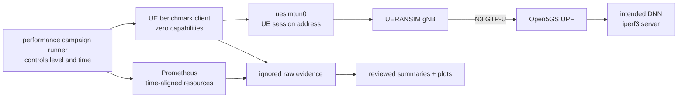

# Performance And Capacity Experiment Methodology

Status: accepted. The repeated matrix, deterministic analysis, scoped rollback,
and platform and observability regression gates passed on 2026-08-06.

## Purpose

Performance campaign turns “the platform works” into a narrower, evidence-backed question:
how does this exact single-node local platform behave under controlled load?
It does not estimate carrier capacity or production sizing.

## Mental Model

The client is a **sidecar**, a second container inside each UE Pod. Containers
in the same Pod share one network namespace, so the client can use the real
`uesimtun0` interface created by UERANSIM without receiving `NET_ADMIN`,
`NET_RAW`, a host mount, or a Kubernetes API token. The two DNN Pods each gain
an equally restricted iperf3 server sidecar.

Each benchmark container keeps a read-only root filesystem. A dedicated
memory-backed `/tmp` volume is capped at 16 MiB because iperf3 needs writable
scratch space when it creates a test stream; this does not grant host storage
access or broaden Linux capabilities.

Each DNN sidecar runs five independent iperf3 server processes on ports 5201
through 5205. UE ordinal 0 uses port 5201, ordinal 1 uses 5202, and so on. This
keeps simultaneous UE trials truly concurrent instead of accidentally queuing
multiple clients behind one single-test server process.

Before traffic begins, `ip route get` must prove that the selected destination
uses `uesimtun0` and source-policy table 1000. UERANSIM names this same table
`rt_uesimtun0` inside the UE container, but the benchmark sidecar has a separate
read-only `/etc` and therefore reports the kernel number. The matching source
rule is checked independently. Ordinary `eth0` Pod-to-Pod traffic would bypass
the 5G path and is therefore a failed experiment, not a result.

## New Concepts

- **Independent variable:** the factor intentionally changed. The first matrix
  changes concurrent UE count: 1, 3, then 5.
- **Controlled variable:** a setting kept constant, such as image versions,
  topology, MTU, warm-up, traffic rate, duration, and stream count.
- **Dependent variable:** what is measured, including throughput, loss,
  jitter, latency, registration/session success, CPU, memory, and restarts.
- **Warm-up:** traffic discarded before measurement so startup transients do
  not dominate the result.
- **Repetition:** a complete rerun of the same condition. Three repetitions
  expose run-to-run variation instead of presenting one favorable sample.
- **Median:** the middle result after sorting. It resists one extreme value
  better than an average.
- **Percentile:** the value below which a percentage of observations fall. A
  95th percentile highlights the slower tail without claiming a maximum.
- **Outlier:** an unusual observation. performance campaign retains and explains it; the
  runner never silently deletes a bad run.
- **Throughput:** delivered bits per second at the measured layer. It is not
  automatically application goodput because protocol overhead still exists.
- **Jitter:** variation in packet arrival timing, reported by UDP iperf3.
- **Saturation:** a resource approaches its limit and additional offered load
  no longer yields proportional delivered work.

## Controlled Contract

The machine-readable source of truth is
[`benchmarks/performance/experiment.json`](../../benchmarks/performance/experiment.json).
The initial concurrency levels are 1, 3, and 5 because the accepted platform
has exactly five deterministic synthetic identities. Each condition uses
three repetitions, a fixed warm-up, a 15-second measurement, and a cool-down.

The traffic set includes:

1. ICMP for packet loss and round-trip time;
2. unbounded forward TCP iperf3 for local saturation behavior and
   retransmits;
3. reverse TCP at a declared 10 Mbit/s offered load per UE for delivered
   throughput and retransmits;
4. fixed-rate UDP iperf3 for delivered throughput, loss, and jitter;
5. UERANSIM log timestamps for registration and PDU-session procedure success;
6. aligned Prometheus range queries for CPU, memory, restarts, and network use.

Forward and reverse TCP intentionally answer different questions. Forward TCP
is allowed to seek the local path's available throughput. Reverse TCP is a
fixed service-load check: the matrix asks whether every active UE can sustain
10 Mbit/s for the full interval. It must not be described as maximum downlink
capacity. An exploratory unbounded reverse run at the one-UE condition sent an
initial burst, collapsed to the minimum congestion window, made no further
progress, and timed out. That failed evidence is retained. Repeatedly extending
the timeout or excluding the failure would be misleading, while a declared
offered rate creates a bounded, reproducible workload appropriate to this
UERANSIM lab, whose radio link is a partial user-space simulation rather than
a complete 5G New Radio physical layer.

The first runtime action is a one-UE mechanism pilot using the same 15-second
measurement interval and bounded reverse offered rate as the matrix. The
full matrix becomes available only after the pilot proves route enforcement,
valid iperf3 JSON, zero ICMP loss at the low-load control, no new restarts, and
clean restoration of all five UEs.
The pilot records the experiment hash, benchmark image identity, and Helm
revision; the matrix refuses pilot evidence from a different mechanism.

The matrix runner is resumable. Every repetition and level writes into its own
numbered attempt directory; a failed attempt remains intact, while an accepted
marker prevents successful conditions from being repeated. Before each
condition the UE StatefulSet is taken to zero and then raised to the requested
level, which produces a fresh registration and PDU-session timing sample. The
runner restores five UEs afterward even when a traffic command fails or the
operator interrupts the campaign.

Every condition is independent. Before each load-level/repetition pair, the
runner first restarts both DNN benchmark servers and then uses the accepted
dependency-ordered platform repair to clear SBI, PFCP, GTP-U, NGAP, and
UE-address allocation state. This ordering is required because a DNN Pod
restart changes its Pod address, while the UPF resolves that address at startup
and installs it as the only permitted `/32` in fail-closed policy table 1060 or
1061. Starting the UPF after the DNNs therefore makes the policy tables refer
to the current endpoints. The reset prevents a prior level or repetition from
becoming a hidden confounding variable. A retry receives the same reset, while
successful prior conditions remain accepted and do not need to be repeated.

## Safety And Rollback

The runner aborts before traffic if available host memory is below 3 GiB,
Docker free space is below 6 GiB, the 5G route is wrong, a workload is not
Ready, or the exact benchmark image identity is unverified. Any new restart or
Out Of Memory (OOM) event makes the run fail. Raw failures remain ignored but
retained for diagnosis.

The benchmark image is local and project-owned. It is built from digest-pinned
Alpine with exact packages, loaded only into `cn5g-control-plane`, and never
published by the lifecycle. performance campaign records the exact pre-change Helm revision
and MongoDB claim identity. Confirmed rollback restores that revision,
preserves the claim, repairs the session chain, and reruns platform and observability validation.

## Evidence Boundary

Raw iperf3 JSON, ICMP output, Prometheus samples, and runtime identities stay
under ignored `benchmarks/raw/`. After all expected runs—including retained
failures—were present, the deterministic analyzer produced the reviewed
summary JSON/CSV, plots, and limitations report. The accepted outputs are
tracked under `benchmarks/performance/results/` and summarized in
`reports/performance-results.md`. A later dashboard stage may ingest these
reviewed summaries, but the dashboard is not part of this acceptance boundary.
