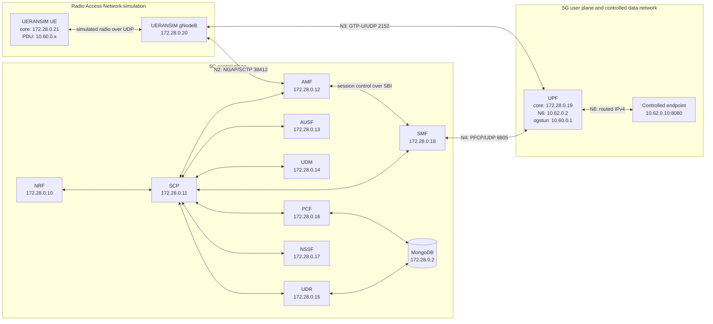
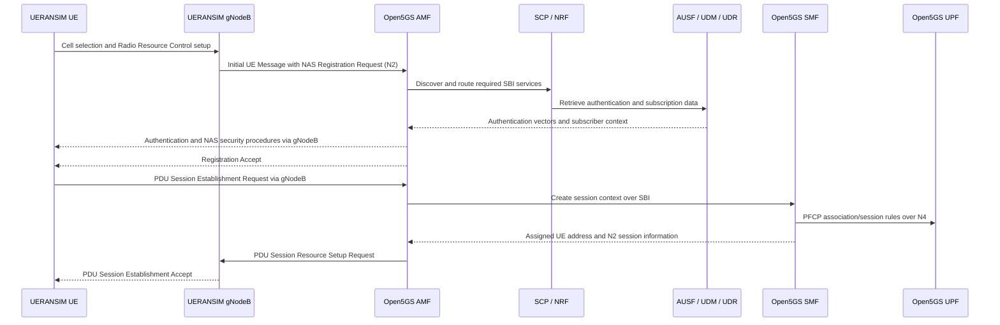
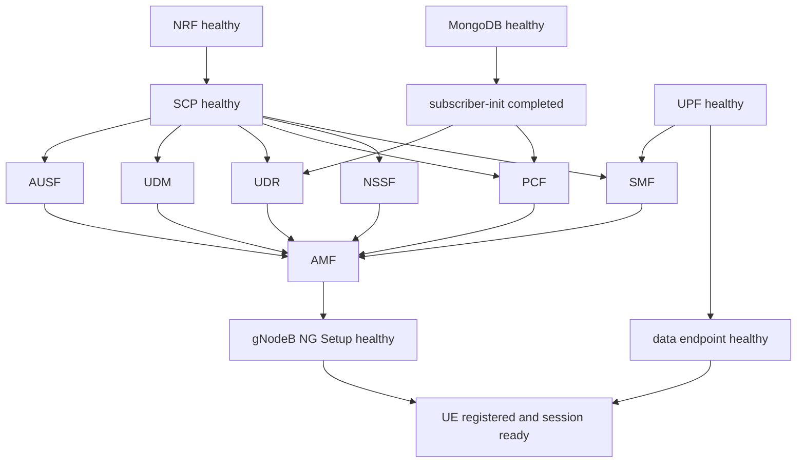

# Phase 2 Docker Compose Architecture

## Purpose And Scope

The Phase 2 baseline proves a complete containerized 5G Standalone (5G SA)
system before Kubernetes is introduced. Docker Compose is used as a controlled
integration environment so that image, configuration, process, protocol,
capability, addressing, routing, persistence, and health-check problems can be
resolved independently of a Container Network Interface (CNI) implementation
or Kubernetes scheduler.

The verified scope is one synthetic User Equipment (UE), one UERANSIM gNodeB,
one Data Network Name (DNN) named `internet`, one Single Network Slice
Selection Assistance Information (S-NSSAI) value with Slice/Service Type (SST)
`1`, the required Open5GS control-plane functions, one User Plane Function
(UPF), MongoDB, and one controlled data-network endpoint. The configuration
ceiling of 32 UEs is not a scale claim; Phase 2 validates one UE only.

## Key Design Decisions

| Decision | Rationale | Trade-off |
| --- | --- | --- |
| Prove Compose before Kubernetes | Establishes a known-good application/protocol baseline, so later failures can be attributed to cluster networking or security | Adds an intermediate deployment model that must later be translated to Helm/Kubernetes |
| Build telecom images from pinned source | Avoids unreviewed community images and records exact upstream code and license | Local compilation consumes time and BuildKit cache |
| Do not reuse host 5G binaries or database | Prevents version/library coupling and protects the working host lab's subscriber state | Retains duplicate but isolated image layers |
| Use separate core and N6 Docker networks | Makes the UPF the explicit boundary between control/access traffic and the controlled data network | Requires a deliberate endpoint return route |
| Model the UE pool as a routed subnet, not a bridge | Matches the mobile user-plane concept: UE addresses exist behind the UPF tunnel | Requires TUN devices, policy routing, forwarding, and bidirectional validation |
| Use one Open5GS image for multiple NFs | Guarantees one pinned binary set while configuration and command select each role | A defect in the shared image can affect several services and requires dependency-aware diagnosis |
| Use protocol-aware health gates | Prevents startup order from being mistaken for readiness | Some gates require retained success evidence and component-specific logic |
| Use a controlled N6 endpoint | Produces deterministic HTTP/ICMP evidence without depending on external Internet, DNS, or firewall policy | Phase 2 does not prove public-network access |
| Preserve database volumes on `down` | Separates routine recreation from destructive data removal | Operators must use the explicit confirmed destroy action for a clean database |
| Publish no host ports | Minimizes collision and exposure on a host already running Open5GS | Inspection occurs through `docker compose exec` rather than host sockets |

## Terminology Reference

| Term | Meaning in this platform |
| --- | --- |
| 5G SA | Fifth Generation Standalone: a 5G radio-access and 5G Core architecture without an LTE/Evolved Packet Core anchor |
| UE | User Equipment: the synthetic mobile endpoint implemented by UERANSIM |
| RAN / gNodeB | Radio Access Network / next-generation NodeB: the access node connecting UE signalling and traffic to the core |
| NF | Network Function: one logical 5G Core service such as AMF, SMF, or UPF |
| AMF | Access and Mobility Management Function: terminates access signalling and manages registration, reachability, and mobility |
| AUSF | Authentication Server Function: participates in subscriber authentication |
| UDM | Unified Data Management: manages authentication and subscriber context |
| UDR | Unified Data Repository: exposes subscriber data persisted in MongoDB |
| NRF | Network Repository Function: NF registration and service discovery directory |
| SCP | Service Communication Proxy: routes Service-Based Interface requests between NFs |
| PCF | Policy Control Function: provides session policy decisions |
| NSSF | Network Slice Selection Function: resolves the requested network slice |
| SMF | Session Management Function: creates PDU sessions, allocates UE addresses, selects/programs the UPF, and controls N4 |
| UPF | User Plane Function: forwards UE packets between N3 tunnels and N6 data networks |
| SBI | Service-Based Interface: HTTP/2 application interfaces among 5G control-plane NFs |
| NAS / N1 | Non-Access Stratum / logical UE-to-AMF interface carried through the gNodeB |
| NGAP / N2 | Next Generation Application Protocol / gNodeB-to-AMF control interface over SCTP |
| GTP-U / N3 | GPRS Tunnelling Protocol User Plane / gNodeB-to-UPF user-plane tunnel over UDP |
| PFCP / N4 | Packet Forwarding Control Protocol / SMF-to-UPF control interface over UDP |
| N6 | Routed IP interface between the UPF and a data network |
| PDU session | Protocol Data Unit session: the UE's logical IP connectivity service through the mobile core |
| DNN | Data Network Name: selects a session's target data network; `internet` in Phase 2 |
| S-NSSAI / SST | Single Network Slice Selection Assistance Information / Slice/Service Type: identifies the requested slice; SST `1` in Phase 2 |
| PLMN | Public Land Mobile Network identity formed from Mobile Country Code and Mobile Network Code |
| SCTP | Stream Control Transmission Protocol: message-oriented transport used by NGAP on N2 |
| TUN | Linux layer-3 virtual network device used for UE and UPF IP packets |
| MTU | Maximum Transmission Unit: largest IP packet sent without fragmentation on an interface |
| ICMP | Internet Control Message Protocol: used here for deterministic ping reachability evidence |

## Architecture Mind Map

```mermaid
flowchart TB
    ROOT(("Phase 2\nCompose baseline"))

    ROOT --> SUPPLY["Reproducible supply chain"]
    SUPPLY --> SRC["Pinned source commits\nand archive checksums"]
    SUPPLY --> BASE["Digest-pinned bases\nand multi-stage builds"]
    SUPPLY --> OCI["Open Container Initiative\nmetadata and output IDs"]

    ROOT --> CONTROL["5G control plane"]
    CONTROL --> ACCESS["Access and mobility\nAMF · N2 NGAP/SCTP"]
    CONTROL --> AUTH["Authentication and data\nAUSF · UDM · UDR · MongoDB"]
    CONTROL --> DISCOVERY["Discovery and routing\nNRF · SCP · HTTP/2 SBI"]
    CONTROL --> SESSION["Session and policy\nSMF · PCF · NSSF · N4 PFCP"]

    ROOT --> USERPLANE["5G user plane"]
    USERPLANE --> UEPATH["UE uesimtun0\nSimulated radio · gNodeB"]
    USERPLANE --> COREPATH["N3 GTP-U\nUPF ogstun"]
    USERPLANE --> DATAPATH["N6 routed network\nControlled HTTP endpoint"]

    ROOT --> OPS["Container operations"]
    OPS --> HEALTH["Health-gated startup"]
    OPS --> SECURITY["Read-only filesystems\nand narrow capabilities"]
    OPS --> STATE["Internal networks\nnamed volumes · scoped teardown"]

    ROOT --> EVIDENCE["Evidence"]
    EVIDENCE --> PROTOCOL["Registration and\nPDU-session logs"]
    EVIDENCE --> TRAFFIC["HTTP/ICMP traffic and\nbidirectional tunnel counters"]
    EVIDENCE --> SAFETY["Persistence marker and\nhost before/after snapshots"]
```

## Logical Topology

The Non-Access Stratum (NAS) N1 relationship is logically between the UE and
the Access and Mobility Management Function (AMF), but NAS messages are carried
through the gNodeB and transported to the AMF inside Next Generation
Application Protocol (NGAP) messages on N2. There is therefore no direct UE-to-
AMF IP connection.

## Component Responsibilities

| Compose service | 5G or platform responsibility | Verified readiness signal |
| --- | --- | --- |
| `mongodb` | Persistent subscriber, authentication, and policy data store | MongoDB `ping` command succeeds |
| `subscriber-init` | Idempotently replaces one deterministic synthetic subscriber and verifies uniqueness | One-shot process exits with status zero |
| `nrf` | Network Repository Function: registers and discovers Network Functions (NFs) | Local Service-Based Interface (SBI) listener on TCP/7777 |
| `scp` | Service Communication Proxy: routes SBI requests among control-plane NFs | Local SBI listener on TCP/7777 |
| `ausf` | Authentication Server Function: performs 5G authentication procedures | Local SBI listener on TCP/7777 |
| `udm` | Unified Data Management: manages subscriber and authentication context | Local SBI listener on TCP/7777 |
| `udr` | Unified Data Repository: exposes subscriber data backed by MongoDB | Local SBI listener on TCP/7777 after subscriber initialization |
| `pcf` | Policy Control Function: supplies session policy | Local SBI listener on TCP/7777 after subscriber initialization |
| `nssf` | Network Slice Selection Function: resolves the requested S-NSSAI | Local SBI listener on TCP/7777 |
| `smf` | Session Management Function: allocates the UE address, selects the UPF, and programs it over N4 | Local SBI listener on TCP/7777 after UPF readiness |
| `amf` | Access and Mobility Management Function: terminates N2/N1 signalling, registration, reachability, and mobility procedures | Local SBI listener after all required control functions are healthy |
| `upf` | User Plane Function: terminates N3 tunnels, applies Packet Forwarding Control Protocol (PFCP) rules, and routes UE traffic to N6 | `ogstun` exists with `10.60.0.1/24`; UDP/8805 and UDP/2152 listen |
| `data-network` | Deterministic N6 HTTP and Internet Control Message Protocol (ICMP) target | Local `/healthz` returns the expected fixed body |
| `gnb` | UERANSIM gNodeB: simulated Radio Access Network endpoint for N2 and N3 | Log contains a successful NG Setup procedure |
| `ue` | UERANSIM UE: performs registration, session establishment, policy routing, and test traffic | Registration, PDU session, native connection, UE address, source rule, and tunnel-route checks all pass |

The SBI health checks deliberately inspect the local listening socket rather
than sending an arbitrary HTTP request. Open5GS SBI endpoints expect valid 3rd
Generation Partnership Project (3GPP) service paths; a generic probe can be
transport-reachable while still generating misleading parser errors.

## Protocol And Interface Map

| Interface or path | Endpoints | Protocol and port | Responsibility |
| --- | --- | --- | --- |
| Simulated radio | UE ↔ gNodeB | UERANSIM-specific UDP transport | Carries emulated radio signalling and UE payloads; it is not a real New Radio air interface |
| N1, logical | UE ↔ AMF through gNodeB | NAS carried inside N2 | Registration, authentication, security, and PDU-session requests |
| N2 | gNodeB ↔ AMF | NGAP over Stream Control Transmission Protocol (SCTP), port 38412 | Radio-access control signalling and UE context |
| SBI | Open5GS control functions | Cleartext HTTP/2 over TCP/7777 | Service registration, discovery, authentication, policy, and session APIs inside the private network |
| MongoDB | UDR/PCF and database | MongoDB wire protocol over TCP/27017 | Persistent subscriber and policy data |
| N4 | SMF ↔ UPF | PFCP over UDP/8805 | Installs and removes packet-detection, forwarding, and usage rules in the UPF |
| N3 | gNodeB ↔ UPF | General Packet Radio Service (GPRS) Tunnelling Protocol User Plane (GTP-U) over UDP/2152 | Encapsulates UE user-plane packets between access and core |
| UE tunnel | UE process ↔ container kernel | `uesimtun0`, IPv4 `10.60.0.x/24`, Maximum Transmission Unit (MTU) 1400 | Presents the PDU session as a Linux IP interface and policy-routing target |
| UPF tunnel | UPF process ↔ container kernel | `ogstun`, IPv4 `10.60.0.1/24` | Transfers decapsulated UE packets between Open5GS and Linux routing |
| N6 | UPF ↔ controlled endpoint | Routed IPv4 on `10.62.0.0/24` | Connects the mobile core user plane to the controlled data network |
| Validation endpoint | UE ↔ endpoint through UPF | HTTP/TCP 8080 and ICMP | Provides deterministic application and network reachability evidence |
| Metrics listeners | Selected Open5GS functions | HTTP/TCP 9090 | Exposes metrics endpoints; collection begins in a later observability phase |

Cleartext SBI is acceptable only within this isolated local baseline. It is
not presented as a production security design.

## Addressing And Configuration Contract

| Domain | Value | Meaning |
| --- | --- | --- |
| Synthetic Public Land Mobile Network (PLMN) | Mobile Country Code `999`, Mobile Network Code `70` | Non-production network identity shared by UE, gNodeB, and AMF |
| Tracking area | Tracking Area Code `1` | Identifies the simulated radio tracking area |
| Slice | S-NSSAI SST `1` | Common requested and supported slice selector |
| DNN | `internet` | Session name shared by subscriber, UE, SMF, and UPF |
| Compose core network | `172.28.0.0/24` | SBI, N2, N3, N4, MongoDB, and simulated-radio connectivity |
| UE PDU-session pool | `10.60.0.0/24` | Addresses assigned by the SMF and routed through `ogstun`; not a Docker bridge |
| UPF UE gateway | `10.60.0.1` | UE-subnet gateway configured on `ogstun` |
| Controlled N6 network | `10.62.0.0/24` | Private data network between UPF and endpoint |
| UPF N6 address | `10.62.0.2` | Next hop used by the endpoint's UE-pool return route |
| Endpoint address | `10.62.0.10` | Deterministic HTTP/ICMP validation destination |
| PDU MTU | `1400` bytes | Leaves headroom for transport and GTP-U encapsulation |
| Periodic registration timer | `T3512 = 540` seconds | Explicit mandatory AMF timer used by the pinned Open5GS release |
| Advertised DNS servers | `8.8.8.8`, `8.8.4.4` | PDU-session parameters required by the SMF configuration; external reachability is not enabled or claimed |

The range preflight checks host routes and existing Docker networks before
every `up`. It protects the host lab's `10.45.0.0/16`, LXC's `10.0.3.0/24`,
Docker's default `172.17.0.0/16`, and the host Local Area Network (LAN). Static
service addresses make protocol traces deterministic in this integration
baseline; later Kubernetes service discovery will use cluster-native names and
addresses where technically valid.

## Cross-Component Configuration Ownership

| Contract | Files that must agree | Failure if inconsistent |
| --- | --- | --- |
| Subscriber identity and authentication | `configs/compose/ueransim/ue.yaml` and `configs/compose/mongodb/subscriber-init.js` | Authentication rejection or resynchronization failure |
| PLMN and tracking area | UE, gNodeB, and AMF YAML | Cell is unsuitable, NG registration is rejected, or the UE cannot select the network |
| Slice selector | UE, gNodeB, AMF, NSSF, SMF, and subscriber document | Requested S-NSSAI is unsupported or no session policy matches |
| DNN `internet` | UE session, subscriber document, SMF session, and UPF session | PDU-session establishment is rejected or no UPF session matches |
| N2 endpoint | gNodeB `amfConfigs` and AMF `ngap.server` | SCTP association or NG Setup fails |
| N3 endpoint | gNodeB `gtpIp` and UPF `gtpu.server` | Registration can pass while user-plane packets fail |
| N4 endpoint | SMF PFCP client and UPF PFCP server | SMF cannot install forwarding state |
| UE address pool/gateway | SMF and UPF session configuration plus UPF entrypoint | Address allocation, TUN routing, or return traffic fails |
| N6 return path | Compose N6 addresses and data-network entrypoint route | Uplink reaches the endpoint but replies cannot reach the UE |
| Static service addresses | `compose.yaml` and each Open5GS SBI/PFCP/GTP configuration | A process binds or connects to an address not owned by its container |

`tests/test_phase02_static.py` checks the most important shared values and
safety properties before runtime. Dynamic validation then proves that the
combined configuration works as a protocol system.

## Control-Plane Sequence

The Network Repository Function (NRF) and Service Communication Proxy (SCP)
support service discovery and routing. The sequence groups several SBI calls
to keep the diagram readable; it does not imply that all authentication logic
runs in one process.

## User-Plane Packet Walk

```mermaid
flowchart LR
    APP["curl or ping"]
    UETUN["UE kernel\nuesimtun0\n10.60.0.x"]
    UEP["UERANSIM UE process"]
    GNBP["UERANSIM gNodeB"]
    GTP["N3 GTP-U tunnel"]
    UPFP["Open5GS UPF process"]
    UPFTUN["UPF kernel\nogstun\n10.60.0.1"]
    N6["N6 interface\n10.62.0.2"]
    ENDPOINT["HTTP endpoint\n10.62.0.10"]

    APP -->|"source interface uesimtun0"| UETUN
    UETUN --> UEP
    UEP -->|"simulated radio"| GNBP
    GNBP --> GTP
    GTP --> UPFP
    UPFP --> UPFTUN
    UPFTUN --> N6
    N6 --> ENDPOINT
    ENDPOINT -->|"return route 10.60.0.0/24 via 10.62.0.2"| N6
```

The UE entrypoint seeds a private writable copy of `/etc/iproute2/rt_tables`
because UERANSIM creates a source-specific routing table for `uesimtun0`.
Validation binds HTTP and ICMP traffic to that interface, preventing an
accidental pass over the UE container's ordinary Compose address. On the
return path, the controlled endpoint routes `10.60.0.0/24` to the UPF's N6
address. The UPF then applies the installed PFCP state and sends the packet back
through N3 and the simulated radio path.

## Health-Gated Startup Graph

Compose `depends_on` conditions gate startup on health or successful one-shot
completion. They do not replace protocol validation: a listener can be ready
before a subscriber registers, so `scripts/validate-compose.sh` separately
checks the completed 5G procedures and data path.

## Container And Security Boundaries

- No service publishes a host port or uses host networking.
- No service uses Docker privileged mode.
- All services drop the default Linux capability set before adding a reviewed
  exception.
- Open5GS control-plane functions and the gNodeB run as numeric user/group
  `65532:65532` with read-only root filesystems.
- The UPF runs as container root with `NET_ADMIN` and `/dev/net/tun` so it can
  create and configure `ogstun`. It does not receive the full privileged
  capability set.
- The UE runs as container root with `NET_ADMIN`, `NET_RAW`, and
  `/dev/net/tun` so UERANSIM can create its TUN interface, policy rule, and
  routes.
- The controlled endpoint starts with `NET_ADMIN`, `SETGID`, and `SETUID`, adds
  one container-local return route, and immediately drops to `65532:65532` for
  the HTTP server.
- MongoDB receives only the filesystem and identity-change capabilities needed
  by its official entrypoint. The one-shot subscriber client runs directly as
  numeric `999:999` with no added capability.
- `no-new-privileges` prevents processes from gaining additional privilege
  through set-user-ID or set-group-ID executables.
- Configuration bind mounts are read-only. Temporary logs and routing-table
  state use container-private `tmpfs` mounts.
- MongoDB data and configuration use two named volumes. `down` preserves them;
  `destroy --confirm` removes only those exact project volumes.

Container root shares the host kernel and is not equivalent to a virtual
machine boundary. Device mounts and `NET_ADMIN` remain sensitive; their minimum
requirements must be re-evaluated under Kubernetes security contexts.

## Reproducible Image Model

Open5GS and UERANSIM are compiled from immutable upstream commits whose source
archives are checked during the build. Ubuntu, Alpine, and MongoDB inputs use
Linux/AMD64 manifest digests rather than floating tags. Multi-stage builds keep
compilers, headers, and source trees out of runtime images. Open Container
Initiative (OCI) labels identify upstream source, version, revision, license,
and project ownership.

The host's existing Open5GS, MongoDB, and UERANSIM installations are not copied
or mounted into the containers. This deliberate isolation prevents the Compose
baseline from mutating the host subscriber database or depending on local
library versions. Build cache is retained for repeatability and disk efficiency
because broad pruning could remove cache owned by another project.

## Persistence And Lifecycle

```mermaid
stateDiagram-v2
    [*] --> ImagesVerified
    ImagesVerified --> Running: up
    Running --> Validated: validate
    Validated --> VolumesRetained: prepare-persistence + down
    VolumesRetained --> Running: up
    Running --> PersistenceVerified: verify-persistence
    PersistenceVerified --> Destroyed: destroy --confirm
    Destroyed --> ImagesVerified: images retained; resources absent
```

The persistence test writes one synthetic marker to a dedicated MongoDB
collection, removes containers and networks while retaining volumes, recreates
the topology, proves the marker survived, and drops the evidence collection.
This demonstrates stored data continuity rather than merely re-running the
subscriber initializer.

## Verified Evidence And Limits

Phase 2 verified meaningful health for all services, one synthetic subscriber,
NG Setup, registration, one IPv4 PDU session, HTTP and ICMP traffic through the
UPF, the N6 return route, positive receive/transmit packet deltas on `ogstun`,
MongoDB persistence, recreation without manual repair, exact cleanup, and an
unchanged host network after cleanup.

Phase 2 does not claim multi-UE scale, multiple DNNs or slices, external
Internet access, production-grade transport security, Kubernetes feasibility,
high availability, performance, or failure-recovery behavior. Those claims
remain gated by later measured phases.

## Relationship To Phase 3

The Compose baseline establishes the application and protocol reference that
Phase 3 must preserve. The Kubernetes feasibility spike must independently
prove SCTP on N2, PFCP on N4, GTP-U on N3, `/dev/net/tun`, required Linux
capabilities, N6 return routing, Maximum Transmission Unit behavior, and clean
cluster deletion. A failure in Phase 3 can then be attributed to cluster
networking or workload security rather than an unverified 5G configuration.
