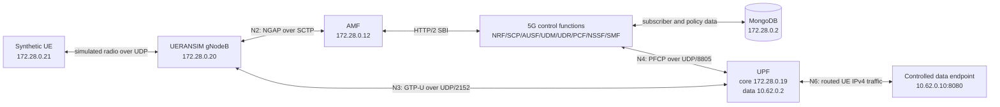

# Phase 2 Compose Topology

## Purpose

The Docker Compose baseline proves the complete 5G Standalone path before
Kubernetes is introduced. This isolates container-image, process, protocol,
capability, address, and routing problems from later cluster networking.

AMF is the Access and Mobility Management Function. NRF is the Network
Repository Function. SCP is the Service Communication Proxy. AUSF is the
Authentication Server Function. UDM is Unified Data Management. UDR is the
Unified Data Repository. PCF is the Policy Control Function. NSSF is the
Network Slice Selection Function. SMF is the Session Management Function. UPF
is the User Plane Function.

## Networks

| Network | Range | Purpose |
| --- | --- | --- |
| Compose core | `172.28.0.0/24` | Service-Based Interface, N2, N3, N4, and simulated radio traffic |
| UE address pool | `10.60.0.0/24` | IPv4 Protocol Data Unit session addresses behind `ogstun` in the UPF |
| Controlled data network | `10.62.0.0/24` | N6 traffic between the UPF and the test endpoint |

Both Docker networks are internal. The UE pool is not a Docker bridge; it is
routed through the UPF tunnel. The endpoint has one container-local return
route for `10.60.0.0/24` through UPF address `10.62.0.2`.

The ranges preserve the host lab's `10.45.0.0/16`, LXC's `10.0.3.0/24`,
Docker's built-in `172.17.0.0/16`, and the host Local Area Network. A helper
rechecks host routes and existing Docker networks before every creation.

## Host Boundary

The Compose file publishes no host ports and uses no host networking. Docker
still creates named bridges, routes, and firewall chains for its two private
networks. `scripts/compose-lab.sh down` removes the named containers and
networks; `destroy --confirm` also removes only the two project database
volumes.

MongoDB drops all default capabilities, then adds only `CHOWN`,
`DAC_OVERRIDE`, `FOWNER`, `SETGID`, and `SETUID` for its official entrypoint to
prepare the named data directories and switch to its database user. The
subscriber initializer masks the image-declared data paths with temporary
filesystems so it cannot create unintended anonymous volumes.
