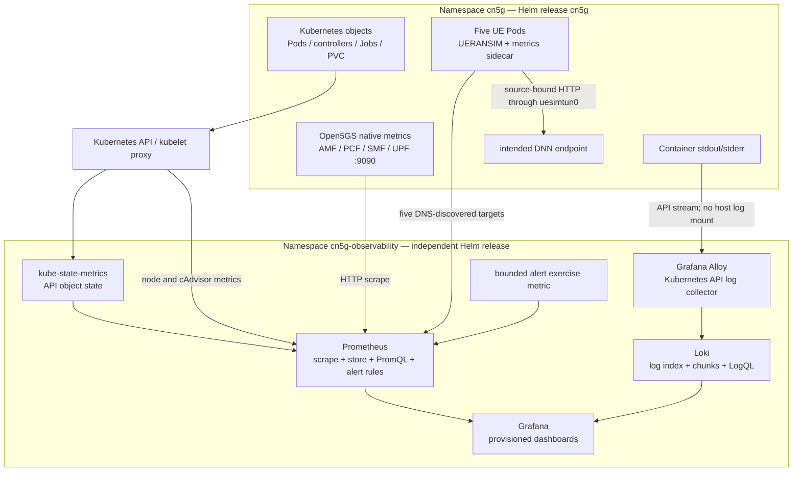
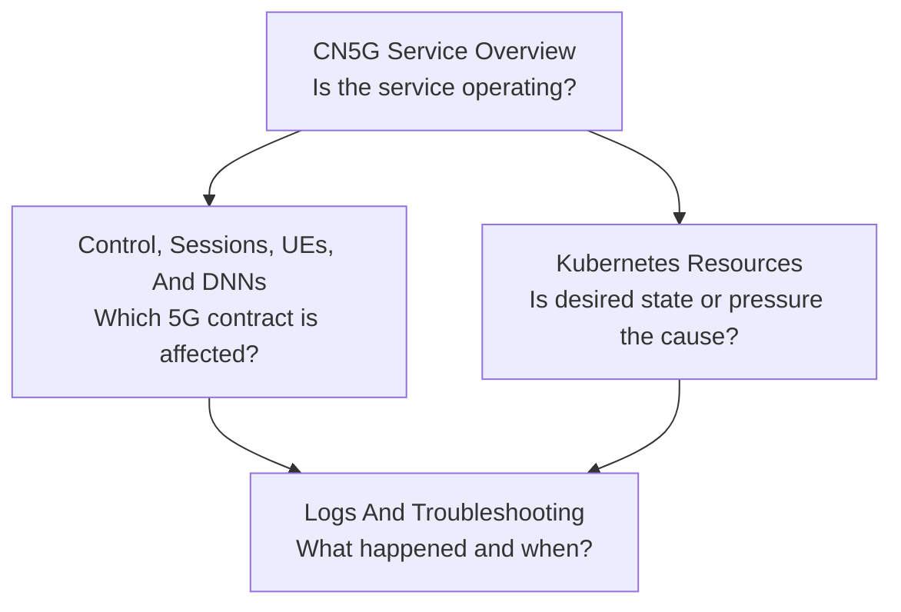
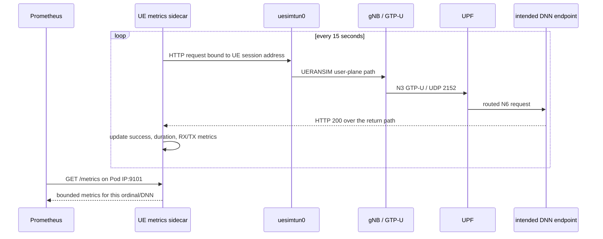
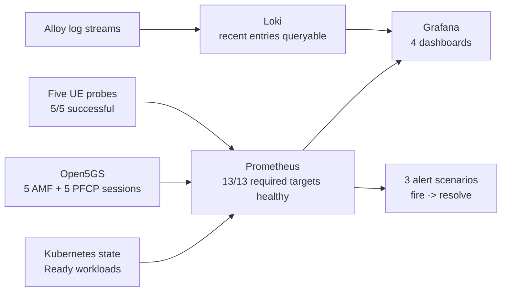

# Phase 6 Observability Architecture

## Purpose And Acceptance Boundary

Phase 6 adds operational visibility without changing the accepted 5G service
contract. The implementation answers four different questions with four
different evidence types:

| Question | Evidence source | Backend |
| --- | --- | --- |
| Is Kubernetes running the requested workloads? | Kubernetes API object state and kubelet container metrics | Prometheus |
| Is the 5G control/session plane healthy? | Native Open5GS AMF, PCF, SMF, and UPF metrics | Prometheus |
| Does each accepted UE still have an operational user-plane path? | Five bounded synthetic UE probes through each UE TUN | Prometheus |
| What happened inside a component before or during a failure? | Container standard-output logs and Kubernetes Events | Loki |

Kubernetes readiness is not treated as proof of registration, PFCP session
creation, or user-plane reachability. The dashboards show these signals beside
each other so an operator can distinguish platform health from 5G health.

This document preserves the accepted Phase 6 four-dashboard boundary. After
Phase 7 analysis, the same observability chart gained a fifth reviewed-results
dashboard and a static exporter generated from the accepted performance
summary. That extension is explained in
[Section 33.23](../README.md#3323-turning-the-accepted-report-into-a-reproducible-dashboard)
and the [dashboard evolution plan](observability-dashboard-evolution-plan.md);
it does not rewrite what Phase 6 originally measured.

## System Mind Map



The arrows into Prometheus are pulls: Prometheus initiates each metrics
request. The arrow into Loki is a push: Alloy reads project log streams and
sends batches to Loki.

## Components And Concepts

### Prometheus And PromQL

Prometheus is a time-series database and monitoring engine. A time series is a
sequence of numeric samples identified by a metric name and labels:

```text
cn5g_ue_user_plane_probe_success{ordinal="3",dnn="enterprise"} 1
```

The value `1` means the last probe succeeded. The fixed `ordinal` and `dnn`
labels let queries group the results without exposing subscriber identity.
Prometheus Query Language (PromQL) selects and computes over time series for
dashboards and alerts.

Prometheus scrapes every 15 seconds, evaluates alert rules every 15 seconds,
and retains at most 24 hours and 1 GB in a dedicated 2 GiB
PersistentVolumeClaim (PVC). Both time and size bounds prevent an unattended
local run from filling the node disk.

### kube-state-metrics

`kube-state-metrics` converts Kubernetes API objects into Prometheus metrics.
It reports desired and observed object state—such as requested replicas,
available replicas, Pod readiness, Job status, and PVC phase. It does not
measure CPU/memory and does not inspect 5G protocols.

The deployment is configured for only `cn5g` and `cn5g-observability`. Its
RoleBindings grant read-only `list` and `watch` access to the exact object
types used by dashboards and alerts.

### kubelet And cAdvisor

The kubelet is the node agent that manages Pods. Its node endpoint exposes
node-agent metrics, while its embedded cAdvisor endpoint exposes container
CPU, memory, network, and filesystem measurements. Prometheus accesses both
through the authenticated Kubernetes API node proxy; no kubelet port is
published on the Ubuntu host.

### Grafana

Grafana queries Prometheus with PromQL and Loki with LogQL, then presents the
results as dashboards. Both data sources and all four dashboards are
provisioned from Git-managed files. Recreating Grafana therefore recreates the
same views without manual UI configuration.

Grafana remains a ClusterIP Service. It is exposed only through an explicit
temporary port-forward bound to `127.0.0.1:13000`.

### Pre-Phase-7 Grafana Hardening And Dashboard Model

Interactive use after the original Phase 6 acceptance exposed a real resource
boundary: the Grafana container was terminated as `OOMKilled` (Out Of Memory)
at its original 384 MiB limit. Retained cAdvisor samples showed a working-set
peak of approximately 341 MiB before termination and approximately 153 MiB
after restart. The port-forward then exited because its backend process had
stopped; the port-forward itself did not cause the failure.

The accepted Stage A change raises the Grafana scheduling request from
96 MiB to 192 MiB and the test limit from 384 MiB to 768 MiB. It also disables
default plugin preinstallation, automatic preinstalled-plugin updates, plugin
administration in the user interface, version checks, and anonymous reporting.
This keeps the runtime aligned with the immutable, provisioned deployment
model. Loki-backed dashboard queries are capped at 500 lines and default to a
short time range to limit interactive query load.

The values were not accepted merely because they rendered and deployed. The
lifecycle recorded the exact Grafana Pod identity and restart count when the
dashboard was opened. The separate acceptance gate required:

- the same Grafana Pod identity;
- zero restart-count increase;
- no runtime plugin installation/update activity;
- a 30-minute peak below 80% of the 768 MiB limit; and
- the complete Phase 5, Phase 6, and alert-lifecycle validations.

The accepted run lasted 2,568 seconds. Grafana kept the same Pod identity,
added zero restarts, attempted no runtime plugin installation/update, and
peaked at 473.2 MiB—61.6% of its 768 MiB limit and below the 80% ceiling. The
complete Phase 5 and Phase 6 validators and all three alert lifecycles passed.

The cardinality gate evaluates the currently active UE telemetry vector. It
does not mistake retained time-series history from a replaced UE Pod for live
label growth; historical series remain available for post-event investigation.

The four dashboards now follow a general-to-specific investigation path:



The Service Overview correlates workload availability, telemetry targets,
active alerts, AMF sessions, PFCP sessions, user-plane probes, resource
pressure, restarts, and recent warning/error volume. The 5G dashboard adds a
bounded table for ordinals `0` through `4` and compares the `internet` and
`enterprise` Data Network Names (DNNs). The Kubernetes dashboard normalizes
CPU and memory against declared requests and limits. The log dashboard uses
component and message filters, bounded procedure views, and Kubernetes Event
correlation. No Phase 7 performance or Phase 8 recovery number is inserted
before its experiment produces real evidence.

### Loki And LogQL

Loki is a log store optimized around a small label index. It indexes stream
labels and stores compressed log content in chunks. LogQL selects streams by
labels, then filters or aggregates their contents.

The accepted stream context is bounded:

```text
cluster, namespace, pod, container, component
```

Subscriber identities, authentication values, UE addresses, and message text
are not labels. They therefore cannot create unbounded index series and are
never included in published raw evidence.

Loki uses single-binary mode, filesystem storage, schema `v13`, a dedicated
2 GiB PVC, and 24-hour retention. This is suitable for the local single-node
baseline; it is not a highly available production topology.

### Grafana Alloy

Grafana Alloy is the collector that sends logs to Loki. It replaces the
end-of-life Promtail agent. Alloy discovers Pods and Events only in the two
project namespaces and reads logs through the Kubernetes API. It does not
mount `/var/log`, the container runtime socket, or an Ubuntu host directory.

### Alerts And Alertmanager

An alert rule is a PromQL condition with a required duration, severity, and
operator-facing description. Prometheus evaluates the rule and tracks
`pending` and `firing` states. Phase 6 installs four actionable rules:

| Alert | Meaning |
| --- | --- |
| `Cn5gPrometheusTargetDown` | A required metrics endpoint cannot be scraped |
| `Cn5gWorkloadUnavailable` | A CN5G Deployment has fewer available replicas than requested |
| `Cn5gRegisteredUeMismatch` | The AMF active-session count differs from the five-UE contract |
| `Cn5gUserPlaneProbeFailed` | A UE cannot reach its assigned DNN endpoint through its TUN |

Alertmanager is the separate Prometheus component that groups alerts and
routes notifications to email, Slack, PagerDuty, or another receiver. It is
intentionally absent because this phase has no approved external receiver or
credential. Prometheus proves rule firing and resolution; notification routing
can be added later without changing metric semantics.

## UE User-Plane Probe Model

Each UE Pod gains one non-root Python sidecar. Containers in one Pod share the
same network namespace, so the sidecar can see the `uesimtun0` interface that
UERANSIM creates. The sidecar discovers its address, binds the HTTP client
socket to that source, and requests only the endpoint assigned to the Pod
ordinal's DNN.



The sidecar runs as UID/GID 65532, drops all Linux capabilities, has a
read-only root filesystem, mounts no subscriber Secret, and receives no API
token. Labels come from a fixed set of five ordinals, two DNNs, and two packet
directions. Validation rejects more than 30 custom UE series.

## Storage, Identity, And Lifecycle

```text
Helm release cn5g
└── Phase 6 UE probe ConfigMap, sidecars, and headless metrics port

Helm release cn5g-observability
├── Prometheus StatefulSet -> retained 2 GiB PVC
├── Loki StatefulSet       -> retained 2 GiB PVC
├── Grafana Deployment     -> dashboards recreated from ConfigMaps
├── Alloy Deployment       -> disposable collector state
├── kube-state-metrics     -> no persistence
└── alert exercise         -> bounded, zero-valued normal state

Ignored local material
└── Grafana admin user/password -> pre-created Kubernetes Secret
```

Normal uninstall removes the observability release and UE sidecars but
retains both observability PVCs, the namespace, and Grafana Secret. Confirmed
destroy is separate and removes only the exact Phase 6 PVCs, Secret, and the
then-empty namespace. Neither action touches the kind cluster, MongoDB claim,
subscriber Secrets, host services, images, or unrelated Docker resources.

## Production-Relevant And Local-Only Properties

Production-relevant practices include independent telemetry lifecycle,
immutable image references, configuration-as-code dashboards, least-privilege
collectors, bounded labels and retention, persistent backends, and tested
alert state transitions.

Local constraints remain: one kind node; one replica per telemetry component;
local-path storage; API-based log collection instead of a per-node DaemonSet;
and no external Alertmanager receiver, authenticated ingress, Transport Layer
Security endpoint, object storage, or long-term metrics backend. Phase 6 proves
the observability model—not production high availability, retention capacity,
or security certification.

## Runtime Acceptance Results

Phase 6 was accepted on 2026-08-05 against the five-UE, two-DNN Phase 5
baseline. That original acceptance state was core Helm revision 12 and
independent observability revision 2.

| Acceptance area | Measured result |
| --- | --- |
| Workloads | Grafana, Alloy, kube-state-metrics, and alert-exercise Deployments plus Prometheus and Loki StatefulSets were Ready with zero restarts |
| Persistent storage | Prometheus and Loki claims were both Bound at 2 GiB |
| Prometheus discovery | 14 active targets; all 13 required non-exercise targets healthy; five distinct UE targets |
| 5G state | AMF active-session gauge `5`; UPF PFCP active-session gauge `5` |
| User plane | Five source-bound UE probe success series summed to `5` |
| Cardinality | 20 custom UE series against the enforced maximum of 30 |
| Logs | Loki returned recent entries from the project namespaces during acceptance |
| Grafana | Exactly two provisioned data sources and four provisioned dashboards |
| Alerts | Three scenarios each fired and resolved; zero exercise alerts remained firing |

The scoped Stage A upgrade was accepted on 2026-08-06 as observability
revision 3 without reapplying the already-active core overlay. It preserved
both telemetry claims, passed the same functional and alert gates, and added
the measured 2,568-second Grafana stability result documented above.
| Regression boundary | The complete five-UE/two-DNN Phase 5 validator passed after the telemetry overlay |



## Telemetry Interpretation And Measurement Boundary

The following distinctions prevent dashboard data from being interpreted as
evidence it cannot support:

| Signal | What it establishes | What it does not establish |
| --- | --- | --- |
| Deployment/Pod/PVC metrics | requested and observed Kubernetes state | 5G protocol correctness |
| CPU and memory series | resource use over the retained local window | production capacity or sizing |
| AMF and PFCP gauges | current registered/session state reported by Open5GS | long-term availability or procedure success rate |
| UE probe success/duration | current end-to-end reachability and probe latency | maximum throughput, packet loss, or radio latency |
| Centralized logs | searchable registration, session, and failure events | durable numeric counters unless converted through an approved recording rule |
| Alert transitions | rule expressions can detect and clear controlled faults | external notification delivery, because Alertmanager is intentionally absent |

PromQL can calculate rates from counters that exist, but Phase 6 does not
generate a fixed offered load or define a throughput/loss experiment. Those
measurements belong to Phase 7, where the traffic generator, sampling window,
warm-up, repetitions, percentile method, and failure criteria can be recorded
before any performance claim is made.
