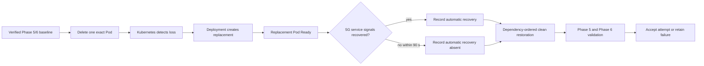

# Phase 8 Reliability And Recovery Methodology

## Objective And Claim Boundary

Phase 8 measures how the accepted local platform detects and recovers from one
AMF, SMF, or UPF Pod deletion. Each network function has one replica on one
kind node, so the experiment measures **single-replica recovery**. It does not
demonstrate High Availability (HA), zero downtime, node-failure tolerance, or
a production Recovery Time Objective (RTO).

The tracked contract is
[`benchmarks/phase-08/experiment.json`](../../benchmarks/phase-08/experiment.json).
ADR-0011 records why ordinary Kubernetes reconciliation is used instead of a
cluster-wide chaos framework.

## One Attempt



The clean restoration after measurement standardizes the next attempt. It is
not a second injected fault: it is explicit operator remediation after the
observation window. Automatic and operator-assisted recovery remain separate
results.

## Fault Hypotheses

| Component | State at risk | Primary signals | Likely visible symptom |
| --- | --- | --- | --- |
| AMF | N2 and UE registration context | replacement readiness, AMF target, five AMF sessions, five UE probes | registration or gNB signalling may need to reconnect while established user-plane state may continue |
| SMF | PDU-session and PFCP control context | replacement readiness, SMF target, five PFCP sessions, five UE probes | existing UPF forwarding may continue, but session control may require reconstruction |
| UPF | PFCP rules, GTP-U tunnels, and N6 policy routes | replacement readiness, UPF target, five PFCP sessions, five UE probes | both DNN user-plane paths are expected to interrupt until forwarding state returns |

The hypotheses are not accepted results. Runtime evidence determines whether
each path recovered automatically or required remediation.

## Timing Model

```text
t0  healthy baseline accepted
t1  Pod delete request                fault boundary
t2  old UID absent / replicas zero    Kubernetes detection
t3  different Pod UID created
t4  replacement Pod Ready             infrastructure recovery
t5  required 5G signals restored      automatic service recovery, if observed
t6  session repair begins             operator remediation boundary
t7  Phase 5 and Phase 6 pass          complete baseline restoration
```

- **Mean Time to Detect (MTTD)** is aggregated from `t2 - t1` across three
  repetitions.
- **Pod readiness time** is `t4 - t1` and is deliberately not called MTTR.
- **Mean Time to Recover (MTTR)** uses `t5 - t1` when recovery is automatic,
  otherwise the validated assisted boundary at `t7 - t1`.
- User-plane disruption is derived from the first post-fault sample below five
  successful source-bound UE probes until the next five-path sample. No
  observed failure is recorded as zero disruption at the telemetry resolution,
  not as proof that no packet was ever lost.

## Correlated Evidence

Each ignored attempt directory contains:

- the old and replacement Pod names, UIDs, readiness, and timestamps;
- Kubernetes namespace events and final Pod state;
- a two-second runner timeline;
- Prometheus range queries for target health, Deployment availability, AMF
  sessions, PFCP sessions, user-plane probes, and alerts;
- a bounded Loki query for AMF, SMF, UPF, gNB, and UE logs;
- baseline, repair, and restored Phase 5/6 validation logs; and
- a permission-restricted machine-readable manifest.

Prometheus instant-query responses carry the query evaluation timestamp. That
timestamp does not prove that the selected metric sample was collected after
the fault. Recovery therefore uses `timestamp(metric)` and requires the
underlying source-sample time to cross the fault boundary. For the five UE
probes, the minimum source timestamp is used so all five paths must have a new
post-fault observation.

The analyzer accepts only nine conditions: AMF, SMF, and UPF across three
repetitions. It rejects a changed experiment hash, missing accepted marker,
changed Helm revision, changed MongoDB PersistentVolumeClaim (PVC), incomplete
restoration, negative timing, or an unrecovered observed user-plane failure.

## Secondary Safety Tests

MongoDB recreation is kept outside the timing matrix. It proves that a new
MongoDB Pod receives the same PVC and that five synthetic subscriber records
remain usable. Invalid-configuration testing separately proves two prevention
layers: Helm values-schema rejection and Kubernetes API server dry-run
rejection. Neither negative test is allowed to change the active Helm
revision.

## Reviewed Outputs

After a complete campaign, deterministic analysis generates:

- per-attempt and per-component CSV summaries;
- one reviewed JSON summary;
- recovery-time, recovery-mode, and user-plane-disruption SVG charts; and
- a sanitized reliability report.

Campaign `20260807T050635Z-matrix` passed that review gate with nine accepted
conditions. The resulting **CN5G Reliability And Recovery** Grafana dashboard
uses 75 bounded gauges from the reviewed summary and never reads ignored raw
events, logs, local paths, or runtime identities. ADR-0012 records this
projection and its limitations.

## References

- [Kubernetes workloads](https://kubernetes.io/docs/concepts/workloads/)
- [Kubernetes liveness, readiness, and startup probes](https://kubernetes.io/docs/concepts/workloads/pods/probes/)
- [Prometheus HTTP API](https://prometheus.io/docs/prometheus/3.5/querying/api/)
