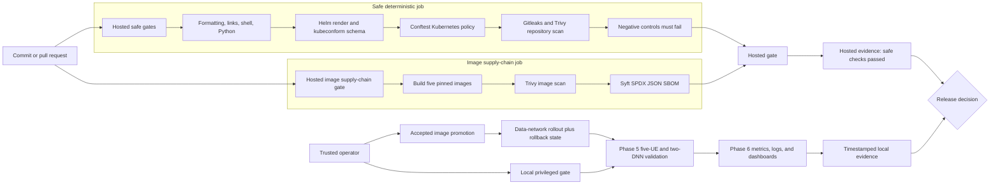

# Phase 9 Continuous Integration And Supply-Chain Security

## Objective And Claim Boundary

Phase 9 turns the repository's manual checks into repeatable release gates. It
adds hosted Continuous Integration (CI), Kubernetes policy-as-code, secret and
vulnerability scanning, container image scanning, and Software Bills of
Materials (SBOMs). The phase improves evidence and prevention; it does not make
the single-node lab production-secure or Highly Available (HA).

The workflow is intentionally split at the privilege boundary. Hosted GitHub
Actions can safely inspect source, render manifests, build images, and scan
artifacts. Real 5G validation still needs the local kind cluster, Tunnel (TUN)
devices, Stream Control Transmission Protocol (SCTP), and narrowly scoped
Linux network capabilities, so it remains an explicit local gate.

## Release-Gate Topology

No GitHub-hosted job deploys the platform, pushes an image, reads repository
secrets, or reaches the personal lab. A hosted pass and a local integration
pass are distinct facts; one never impersonates the other.

The Alpine security rebuild is promoted only by a trusted local operator.
Before Helm changes the active data-network Pods, the lifecycle records the
previous release revision and retains the exact previous image under an
ignored rollback tag. Changing the expected image identity annotates the Pod
template, so Kubernetes performs an observable rollout instead of silently
reusing a mutable tag.

## What Each Gate Proves

| Gate | Main tools | Evidence | What it does not prove |
| --- | --- | --- | --- |
| Repository quality | actionlint, rumdl, lychee, ShellCheck, Hadolint, Python tests | workflow, documentation, shell, Dockerfile, and regression checks | live Kubernetes behavior |
| Manifest acceptance | Helm, kubeconform, Conftest | deterministic render, Kubernetes 1.36 schema, project security policies | API admission or runtime readiness |
| Repository security | Gitleaks, Trivy | Git-history secret scan and fixed high/critical source findings | absence of every possible defect |
| Image supply chain | Docker, Trivy, Syft | reproducible builds, image findings, SPDX JSON package inventories | cryptographic signing or registry provenance |
| Local integration | Phase 5 and Phase 6 validators | five UE sessions, two DNNs, isolation, metrics, logs, dashboards | multi-node resilience or zero downtime |

An SBOM is a machine-readable inventory of packages contained in an image. It
does not declare an image safe; it makes later auditing, vulnerability matching,
and incident response more precise.

## Policy-As-Code Boundary

Conftest evaluates rendered Kubernetes objects with Open Policy Agent (OPA)
Rego rules. The default is least privilege: no privileged container, host
namespace sharing, arbitrary host path, unexpected service-account token, or
unreviewed capability. Exact exceptions reflect real 5G requirements:

- the User Equipment (UE) and User Plane Function (UPF) may use `/dev/net/tun`
  and `NET_ADMIN` for tunnel configuration;
- UE also retains `NET_RAW` for its source-bound packet probes;
- MongoDB retains only the identity and file-ownership capabilities required
  by its pinned image; and
- Prometheus, Alloy, and kube-state-metrics receive API credentials only where
  their configured collection path requires them.

Prometheus retains GET-only Kubernetes `nodes/proxy` access for kubelet and
cAdvisor metrics. The kind kubelet's serving certificate uses a node-local
Certificate Authority (CA) that is unavailable inside the Prometheus Pod;
direct scraping would otherwise disable Transport Layer Security (TLS) name
verification. The authenticated API proxy preserves certificate verification,
while Conftest rejects this permission for any other role or broader verb.

## Tool And Workflow Integrity

All eleven downloaded Linux tools have explicit versions, official release
URLs, and SHA-256 checksums in `versions/phase-09.env`. The three third-party
GitHub Actions use full 40-character commit identities. Checkout disables
credential persistence, workflow permissions are exactly `contents: read`,
jobs have timeouts, and the workflow does not use `pull_request_target`.

The scanners use narrow, documented exceptions rather than blanket disabling.
Each Trivy infrastructure exception identifies one exact file, explains the 5G
reason, and expires. Gitleaks exceptions match only two known synthetic project
values, including their rule and path context.

## Failure Is Useful Evidence

Phase 9 includes four negative controls. It deliberately supplies an unpinned
Action, a floating Docker base, a privileged Pod, and a generated synthetic
GitHub-like token. The gate passes only when all four are rejected. This proves
that the controls can detect representative bad inputs, not merely that the
current repository happens to be clean.

## Artifact Handling

Raw scans and SBOMs are written to ignored `artifacts/phase-09/`. GitHub keeps
equivalent job artifacts for 14 days. Reports may contain package or file
metadata, so they are review material rather than public documentation. The
repository publishes concise sanitized conclusions only after the complete
gate is accepted.

## References

- [GitHub Actions secure use](https://docs.github.com/en/actions/reference/security/secure-use)
- [Kubernetes application security checklist](https://kubernetes.io/docs/concepts/security/application-security-checklist/)
- [Open Policy Agent](https://www.openpolicyagent.org/docs/)
- [SPDX specification](https://spdx.dev/learn/handling-license-info/)
