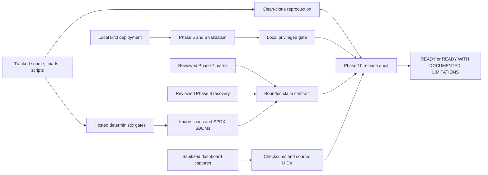

# Phase 10 Release Readiness Architecture

## Purpose

Phase 10 turns the accepted engineering work into an auditable release. It
does not add another telecom feature. It proves that a reader can understand
the system, trace bounded claims to evidence, reproduce the repository gates,
and distinguish hosted checks from local privileged 5G validation.

## Evidence Model

The hosted workflow cannot access the TUN device, Stream Control Transmission
Protocol association, Packet Forwarding Control Protocol state, or local kind
network. Those checks remain local and produce ignored restricted evidence.
Conversely, a local live pass cannot replace clean source, workflow, secret,
policy, vulnerability, and Software Bill of Materials gates.

## Visual Proof Boundary

Grafana dashboard JSON is the reproducible source. Four selected PNG captures
make the accepted state easy to inspect, while a tracked manifest binds each
image to its dashboard UID, exact Git commit, UTC time, scenario, and SHA-256.
The release checker rejects undersized images, checksum mismatches, unknown
dashboard identities, and PNG text or EXIF metadata.

## Reproduction Boundary

The clean-clone gate creates a new local clone from the exact committed branch
without hard-linked Git objects, runs the deterministic quality and manifest
gates there, and records the tested commit under ignored artifacts. It does
not claim a clean cluster deployment. The separate live gate validates the
existing project-owned cluster. A full destructive clean deployment and
teardown is a distinct acceptance exercise because deleting the kind node also
deletes its project-owned local-path storage.

## Release Decision

The final audit is fail-closed. It requires accepted public claims and visuals,
clean-clone evidence for the current commit, local privileged evidence for the
same commit, a privacy-safe repository, and a readiness report with an explicit
decision. A Git tag or GitHub release remains a separately authorized
publication action after these gates pass.
