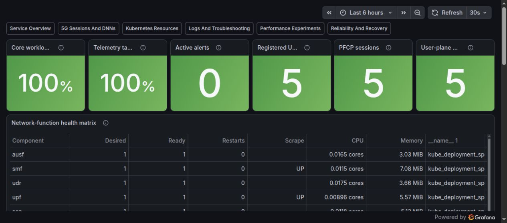
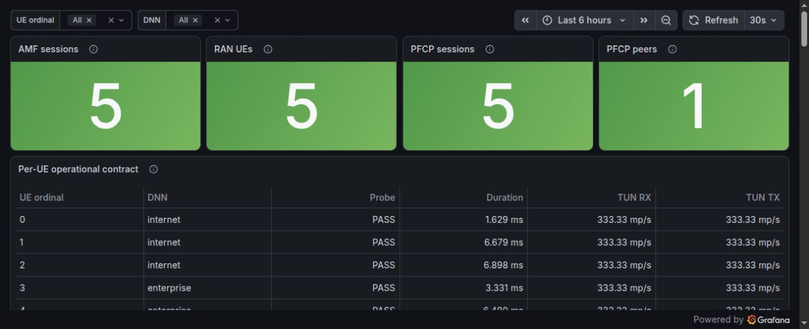
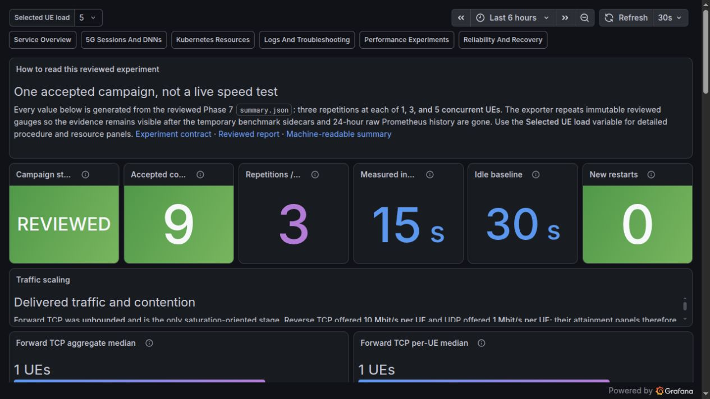
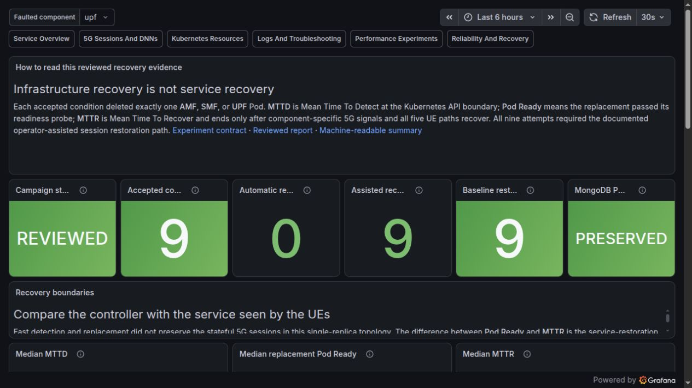

# Dashboard Evidence Gallery

These screenshots are privacy-reviewed visual summaries of the accepted local
lab. The Grafana dashboards themselves are provisioned from tracked JSON, and
the exact image checksums, dashboard identities, capture commit, variables,
and limitations are recorded in
[`release/dashboard-evidence.json`](../release/dashboard-evidence.json).
Machine-readable validation and reviewed reports remain the source of truth.

## Healthy Service Baseline

The service-first row combines infrastructure and telecom outcomes: all core
workloads and telemetry targets are healthy, no alert is firing, and the five
synthetic UEs have five AMF sessions, five Packet Forwarding Control Protocol
(PFCP) sessions, and five successful user-plane paths. The table below the
headline row helps an operator move from a failed service indicator to the
responsible Kubernetes workload.

## Five UEs Across Two DNNs

This view follows the 5G service chain rather than only Pod health. The top row
shows Access and Mobility Management Function (AMF), Radio Access Network
(RAN), PFCP session, and PFCP peer state. The bounded table correlates each UE
ordinal with its Data Network Name (DNN), successful source-bound probe,
duration, and tunnel counters. Three UEs use `internet`; two use `enterprise`.
Synthetic subscriber identities and credentials never enter telemetry.

## Reviewed Performance Experiment

This is a durable projection of the accepted 1, 3, and 5 concurrent-UE
campaign—not a live speed test. The capture makes the experiment contract
visible: nine accepted conditions, three repetitions per load, a 15-second
measurement interval, a 30-second idle baseline, and zero new workload
restarts. Detailed panels compare aggregate and per-UE traffic with procedure
and resource evidence.

## Reviewed Recovery Experiment

The recovery dashboard keeps Kubernetes replacement time separate from actual
5G service restoration. All nine AMF, SMF, and UPF fault conditions were
accepted and required the documented operator-assisted restoration path;
MongoDB persistence remained preserved. This is measured single-replica
recovery evidence, not a high-availability or automatic-failover claim.

## Evidence Boundary

The captures were taken after the release qualification local privileged gate revalidated
the five-UE/two-DNN service and observability stack. Each PNG is at least
1200 by 600 pixels, stripped of textual and EXIF metadata, and checksum-bound
to its manifest. They intentionally exclude browser chrome, terminal output,
local paths, usernames, credentials, and raw subscriber data.
