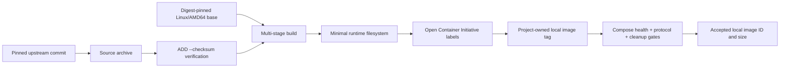

# Phase 2 Image Provenance

## Scope

The Compose baseline uses two locally built telecom images, one locally built
test endpoint, and the reviewed MongoDB Docker Official Image. No unreviewed
community telecom image is used.

The host's installed Open5GS, UERANSIM, and MongoDB software is deliberately
not reused. Container images must be rebuildable from declared inputs and must
not inherit an unrecorded host library, patch, configuration, or database.

## Build And Trust Chain

The source checksum detects an altered or incomplete archive before
compilation. The base manifest digest prevents a tag from silently selecting a
different platform image. Multi-stage builds separate build-time tools from
runtime dependencies. The final identity is accepted only after the complete
Compose and cleanup gate passes.

## Immutable Inputs

| Role | Upstream input | Immutable identity | License |
| --- | --- | --- | --- |
| Open5GS Network Functions | [Open5GS v2.7.7](https://github.com/open5gs/open5gs/releases/tag/v2.7.7) | Commit `318eeb49a7dcdff733dec60e02d9c60aefca2fb9`; archive SHA-256 `a1b47110982a00fa66b639e08ad124803c72fc8228c0f7fb886abbb059752c58` | GNU Affero General Public License 3.0 |
| UERANSIM gNodeB and UE | [UERANSIM v3.2.8](https://github.com/aligungr/UERANSIM/releases/tag/v3.2.8) | Commit `ca1a66fffe282767bb08618af9f848e3b68ea47b`; archive SHA-256 `69c3162cd6f325b97b494f29a6510af14e039ce26193b7cdbc14df831a664ece` | GNU Affero General Public License 3.0 or commercial license |
| Build/runtime base | Ubuntu 24.04 | Linux/AMD64 manifest `sha256:52df9b1ee71626e0088f7d400d5c6b5f7bb916f8f0c82b474289a4ece6cf3faf` | Ubuntu package licenses |
| Controlled endpoint base | Alpine 3.22.1 | Linux/AMD64 manifest `sha256:eafc1edb577d2e9b458664a15f23ea1c370214193226069eb22921169fc7e43f` | Alpine package licenses |
| Controlled endpoint HTTP applet | Alpine `busybox-extras` | Package version `1.37.0-r20` from the Alpine 3.22 main repository | GNU General Public License 2.0 only |
| Subscriber database | [MongoDB Docker Official Image](https://hub.docker.com/_/mongo) 8.0.28 Noble | Linux/AMD64 manifest `sha256:0b9ff6be307c4860f66d9555cd951c9fa13fdb6536d9dd808c137dcdc6d888a5` | Server Side Public License plus component licenses |

The Dockerfiles verify downloaded telecom source archives with Dockerfile
`ADD --checksum`. Base and database images use architecture-specific image
manifests rather than moving tags. The verified local output identities are
recorded below. A future public image release would additionally require an
installed-package inventory and registry digest for each published artifact.

## Identity Terminology

| Identifier | Example | Guarantee |
| --- | --- | --- |
| Human-readable tag | `cn5g/open5gs:2.7.7` | Convenient local reference; mutable and not sufficient evidence by itself |
| Upstream source commit | `318eeb49...` | Exact Open5GS source tree selected for compilation |
| Source archive SHA-256 | `a1b47110...` | Exact downloaded archive bytes accepted by the Dockerfile |
| Base-image manifest digest | `sha256:52df9b1e...` | Exact Linux/AMD64 Ubuntu input selected from the registry |
| Local OCI image ID | `sha256:56b1a5ae...` | Exact BuildKit export tested on this host, including provenance metadata |
| Registry digest | Assigned after a push | Immutable registry identity required if images are later published |

A local image ID is an output, not a portable build input. Re-exporting the
same runtime layers can produce another Open Container Initiative (OCI) index
identity when provenance attestations change. Reproducibility therefore rests
on the Dockerfile plus immutable source/base inputs and repeated functional
tests, while the accepted local output is recorded for auditability.

## Multi-Stage Image Design

### Open5GS

The build stage installs Meson, Ninja, compilers, headers, `git`, and protocol
development libraries. It compiles the pinned release into a staging prefix at
`/opt/open5gs`. The runtime stage copies only installed Open5GS artifacts and
installs the shared libraries and diagnostic tools required at runtime. A
single image serves multiple Network Functions; the entrypoint allowlists the
component name and selects `/etc/open5gs/COMPONENT.yaml`.

### UERANSIM

The build stage compiles `nr-gnb`, `nr-ue`, `nr-cli`, `nr-binder`, and the
required shared library from the pinned release. The runtime stage receives
those outputs plus SCTP, routing, ping, and HTTP-client utilities. The same
image runs the gNodeB as an unprivileged user and the UE with the narrowly
reviewed networking exception described below.

### Controlled Data Network

The endpoint is intentionally small and deterministic. It contains a fixed
health document, pinned `busybox-extras` HTTP server, `iproute2`, and `su-exec`.
Its entrypoint adds the UE-pool return route as container root, then replaces
itself with the HTTP server under numeric user/group `65532:65532`.

### MongoDB

MongoDB uses the digest-pinned Docker Official Image rather than a local
rebuild. The server uses named volumes. A separate one-shot container from the
same image invokes `mongosh` directly as numeric `999:999`; it does not start a
second database server or create anonymous database volumes.

## Runtime Boundaries

| Image | Default user | Elevated exception | Host ports |
| --- | --- | --- | --- |
| `cn5g/open5gs:2.7.7` | Numeric user/group `65532` | Only the UPF runs as root with `NET_ADMIN` and `/dev/net/tun` | None |
| `cn5g/ueransim:3.2.8` | Numeric user/group `65532` | Only the UE runs as root with `NET_ADMIN`, `NET_RAW`, and `/dev/net/tun` | None |
| `cn5g/data-network:0.1.0` | Starts as root to add one return route, then drops to `65532` | `NET_ADMIN` for the container-local route; `SETGID` and `SETUID` only for the immediate identity drop | None |
| MongoDB official image | Server entrypoint drops to its image-managed MongoDB user; subscriber client starts directly as numeric user/group `999` | Server receives only its entrypoint's filesystem and identity-change capabilities; subscriber client receives none | None |

All services drop the default Linux capability set before adding a narrow
exception. No service uses Docker privileged mode or host networking.

`NET_ADMIN` permits network-interface and route administration inside a
container namespace and is therefore granted only to the UPF, UE, and
route-initializing endpoint. `NET_RAW` permits the UE's raw network operations
and ICMP validation. `SETUID` and `SETGID` are retained only where an entrypoint
must immediately change numeric identity. `/dev/net/tun` is mounted only into
the UPF and UE containers that create TUN interfaces.

Read-only root filesystems prevent runtime mutation of image content.
Configuration is bind-mounted read-only; writable transient state is confined
to `tmpfs`; persistent state is confined to the two named MongoDB volumes.

## Verified Local Build

The Linux/AMD64 build completed on 2026-08-01 with the following local Open
Container Initiative image identities:

| Image | Local image ID | Unpacked image size |
| --- | --- | ---: |
| `cn5g/open5gs:2.7.7` | `sha256:56b1a5aec5f3736c819b5f2edbbb1c61357740136c09c7d253dcca03f0da6cc8` | 48,037,139 bytes |
| `cn5g/ueransim:3.2.8` | `sha256:60de10ecd55a9b96d4863319bd102d776622fcc3211f7f1b1c1a4d8026bc7f58` | 40,489,225 bytes |
| `cn5g/data-network:0.1.0` | `sha256:c4770c4c6934e6b4f207a00304131f805b9c214ac8c9b8c365306bb58cce2b18` | 5,649,954 bytes |

All three images carry the project ownership URL, target `linux/amd64`, and
passed the post-cleanup resource check. No Compose container, network, or
volume existed at final verification time.

These local IDs identify BuildKit-exported OCI indexes that include provenance
attestations. A later export can produce a different index ID even when its
pinned source, runtime layers, and reported runtime size are unchanged. A
release records the verified export used for its tests; source commits,
archive checksums, base manifests, configuration, and functional evidence
remain the reproducibility contract.

## Distribution Note

Open5GS and UERANSIM source distribution obligations apply if built images are
published. Dockerfiles, exact upstream source links, commits, checksums,
licenses, patches if any, and build instructions must remain available with a
public image release. Phase 2 does not publish container images.
